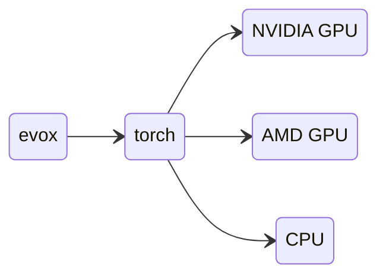

# Guide d'installation d'EvoX

## Installer EvoX

EvoX est disponible sur PyPI et peut être installé via :

```bash
# install pytorch first
# for example:
pip install torch

# then install EvoX
pip install "evox[default]"
```

Vous pouvez également spécifier des options supplémentaires lors de l'installation. Les extras actuellement disponibles sont `vis`, `neuroevolution`, `test`, `docs`, `default`. Par exemple, pour installer EvoX avec toutes les fonctionnalités, exécutez la commande suivante :

```bash
pip install "evox[vis,neuroevolution]"
```

## Installer PyTorch avec prise en charge de l'accélération

`evox` dépend de `torch` pour fournir l'accélération matérielle.
L'architecture globale de ces paquets Python ressemble à ceci :



En résumé, le fait qu'`evox` prenne en charge le CPU, les GPU Nvidia (CUDA) ou les GPU AMD (ROCm) dépend de la version de PyTorch installée. Veuillez vous référer au site officiel de PyTorch pour plus d'aide à l'installation : [`torch`](https://pytorch.org/)


## Prise en charge des GPU Nvidia sous Windows

EvoX prend en charge l'accélération GPU via PyTorch.
Il existe deux façons d'utiliser PyTorch avec l'accélération GPU sous Windows :

1. Utiliser WSL 2 (Windows Subsystem for Linux) et installer PyTorch côté Linux.
2. Installer directement PyTorch sous Windows.

Pour l'option 2, nous fournissons un [script en un clic](/_static/win-install.bat) pour un déploiement rapide sur une installation propre de Windows 10/11 64 bits avec des GPU Nvidia. Le script n'utilisera pas WSL 2 et installera la version native de PyTorch sous Windows. Il installera automatiquement les applications associées comme VSCode, Git et MiniForge3.

* Assurez-vous d'abord que le [pilote Nvidia](https://www.nvidia.com/Download/index.aspx?lang=en-us) est correctement installé. Sinon, le script basculera en mode cpu.
* Lors de l'exécution du script, assurez-vous d'avoir une connexion réseau stable (accès à `github.com`, etc.).
* Si le script échoue en raison d'une panne réseau, fermez-le et rouvrez-le pour poursuivre l'installation.

### Installation manuelle sous Windows

Si vous préférez installer PyTorch directement sous Windows manuellement, vous pouvez suivre les étapes ci-dessous :
1. Installez le pilote Nvidia comme mentionné ci-dessus.
2. Installez Python 3.10 ou supérieur depuis [python.org](https://www.python.org/downloads/).
3. Installez PyTorch.
4. (Facultatif) Installez [`triton-windows`](https://github.com/woct0rdho/triton-windows) pour la prise en charge de `torch.compile` sous Windows.
5. Installez EvoX.

### Windows WSL 2

Téléchargez le [dernier pilote GPU NVIDIA pour Windows](https://www.nvidia.com/Download/index.aspx?lang=en-us) et installez-le. Votre WSL 2 prendra alors en charge les GPU Nvidia dans ses environnements Linux.

> **Avertissement :**
> N'installez **PAS** de pilote Linux pour GPU NVIDIA dans WSL 2. Installez le pilote côté Windows.

> NVIDIA propose un [Guide de l'utilisateur CUDA sur WSL](https://docs.nvidia.com/cuda/wsl-user-guide/index.html) détaillé.

## Prise en charge des GPU AMD (ROCm)

Nous recommandons d'utiliser un conteneur Docker provenant de [`rocm/pytorch`](https://hub.docker.com/r/rocm/pytorch).

```shell
docker run -it --network=host --device=/dev/kfd --device=/dev/dri --group-add=video --ipc=host --cap-add=SYS_PTRACE --security-opt seccomp=unconfined --shm-size 8G -v $HOME/dockerx:/dockerx -w /dockerx rocm/pytorch​:latest
```

## Vérifier l'installation

Ouvrez un terminal Python et exécutez ce qui suit :

```python
from torch.utils.collect_env import get_pretty_env_info
import evox

print(get_pretty_env_info())
```