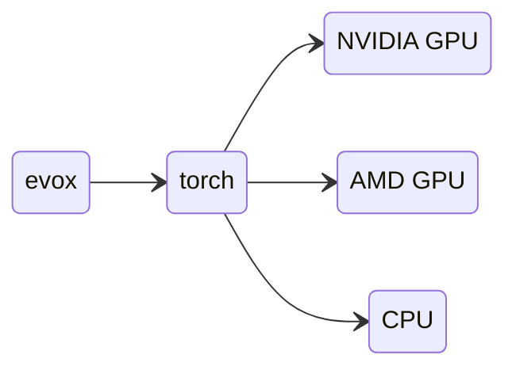

# Guida all'Installazione di EvoX

## Installare EvoX

EvoX è disponibile su PyPI e può essere installato tramite:

```bash
# install pytorch first
# for example:
pip install torch

# then install EvoX
pip install "evox[default]"
```

Puoi anche assegnare opzioni extra durante l'installazione, gli extra attualmente disponibili sono `vis`, `neuroevolution`, `test`, `docs`, `default`. Per esempio, per installare EvoX con tutte le funzionalità, esegui il seguente comando:

```bash
pip install "evox[vis,neuroevolution]"
```

## Installare PyTorch con supporto per acceleratori

`evox` si affida a `torch` per fornire l'accelerazione hardware.
L'architettura generale di questi pacchetti Python appare così:



In sintesi, se `evox` ha supporto CPU, supporto Nvidia GPU (CUDA) o supporto AMD GPU (ROCm) dipende dalla versione di PyTorch installata. Si prega di fare riferimento al sito ufficiale di PyTorch per ulteriore aiuto sull'installazione: [`torch`](https://pytorch.org/)


## Supporto Nvidia GPU su Windows

EvoX supporta l'accelerazione GPU tramite PyTorch.
Ci sono due modi per utilizzare PyTorch con accelerazione GPU su Windows:

1. Utilizzando WSL 2 (Windows Subsystem for Linux) e installando PyTorch sul lato Linux.
2. Installando direttamente PyTorch su Windows.

Per l'opzione 2, forniamo uno [script one-click](/_static/win-install.bat) per una distribuzione rapida su installazioni pulite di Windows 10/11 64bit con GPU Nvidia. Lo script non utilizzerà WSL 2 e installerà la versione nativa di PyTorch su Windows. Installerà automaticamente applicazioni correlate come VSCode, Git e MiniForge3.

* Assicurati prima che il [driver Nvidia](https://www.nvidia.com/Download/index.aspx?lang=en-us) sia installato correttamente. Altrimenti lo script tornerà alla modalità cpu.
* Quando esegui lo script, assicurati di avere una rete stabile (accessibile a `github.com` ecc.).
* Se lo script fallisce a causa di un errore di rete, chiudilo e riaprilo per continuare l'installazione.

### Installazione manuale su Windows

Se preferisci installare PyTorch direttamente su Windows manualmente, puoi seguire i passaggi seguenti:
1. Installa il driver Nvidia come menzionato sopra.
2. Installa Python 3.10 o superiore da [python.org](https://www.python.org/downloads/).
3. Installa PyTorch.
4. (Opzionale) Installa [`triton-windows`](https://github.com/woct0rdho/triton-windows) per il supporto di `torch.compile` su Windows.
5. Installa EvoX.

### Windows WSL 2

Scarica l'[ultimo driver GPU NVIDIA per Windows](https://www.nvidia.com/Download/index.aspx?lang=en-us) e installalo. Successivamente, il tuo WSL 2 supporterà le GPU Nvidia nei suoi ambienti Linux.

> **Attenzione:**
> **NON** installare alcun driver Linux per GPU NVIDIA all'interno di WSL 2. Installa il driver sul lato Windows.

> NVIDIA dispone di una dettagliata [Guida utente CUDA su WSL](https://docs.nvidia.com/cuda/wsl-user-guide/index.html)

## Supporto AMD GPU (ROCm)

Raccomandiamo l'uso di un container Docker da [`rocm/pytorch`](https://hub.docker.com/r/rocm/pytorch).

```shell
docker run -it --network=host --device=/dev/kfd --device=/dev/dri --group-add=video --ipc=host --cap-add=SYS_PTRACE --security-opt seccomp=unconfined --shm-size 8G -v $HOME/dockerx:/dockerx -w /dockerx rocm/pytorch​:latest
```

## Verificare l'installazione

Apri un terminale Python ed esegui quanto segue:

```python
from torch.utils.collect_env import get_pretty_env_info
import evox

print(get_pretty_env_info())
```