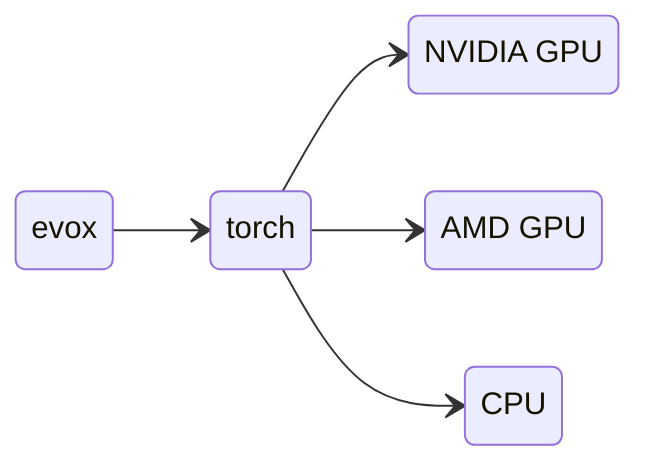

# EvoX インストールガイド

## EvoX のインストール

EvoX は PyPI で公開されており、以下の方法でインストールできます。

```bash
# install pytorch first
# for example:
pip install torch

# then install EvoX
pip install "evox[default]"
```

インストール時に追加オプションを指定することもできます。現在利用可能なオプションは `vis`, `neuroevolution`, `test`, `docs`, `default` です。例えば、すべての機能を備えた EvoX をインストールするには、以下のコマンドを実行します。

```bash
pip install "evox[vis,neuroevolution]"
```

## アクセラレータサポート付き PyTorch のインストール

`evox` はハードウェアアクセラレーションを提供するために `torch` に依存しています。
これらの Python パッケージの全体的なアーキテクチャは以下のようになります。



要約すると、`evox` が CPU サポート、Nvidia GPU サポート (CUDA)、または AMD GPU サポート (ROCm) のいずれを持つかは、インストールされている PyTorch のバージョンに依存します。インストールの詳細については、PyTorch の公式サイトを参照してください: [`torch`](https://pytorch.org/)


## Windows での Nvidia GPU サポート

EvoX は PyTorch を介して GPU アクセラレーションをサポートしています。
Windows 上で GPU アクセラレーションを使用して PyTorch を利用するには、2つの方法があります。

1. WSL 2 (Windows Subsystem for Linux) を使用し、Linux 側に PyTorch をインストールする。
2. Windows に直接 PyTorch をインストールする。

オプション 2 については、Nvidia GPU を搭載した新規インストールの Windows 10/11 64bit 環境向けに、高速デプロイ用の [ワンクリック・スクリプト](/_static/win-install.bat) を提供しています。このスクリプトは WSL 2 を使用せず、Windows 上にネイティブの PyTorch バージョンをインストールします。また、VSCode、Git、MiniForge3 などの関連アプリケーションも自動的にインストールします。

* まず、[Nvidia ドライバー](https://www.nvidia.com/Download/index.aspx?lang=en-us) が正しくインストールされていることを確認してください。そうでない場合、スクリプトは CPU モードにフォールバックします。
* スクリプトを実行する際は、ネットワークが安定していること（`github.com` などにアクセス可能であること）を確認してください。
* ネットワーク障害などでスクリプトが失敗した場合は、一度閉じてから再度開いてインストールを続行してください。

### Windows での手動インストール

Windows に直接 PyTorch を手動でインストールしたい場合は、以下の手順に従ってください。
1. 上記のように Nvidia ドライバーをインストールします。
2. [python.org](https://www.python.org/downloads/) から Python 3.10 以上をインストールします。
3. PyTorch をインストールします。
4. （オプション）Windows で `torch.compile` をサポートするために [`triton-windows`](https://github.com/woct0rdho/triton-windows) をインストールします。
5. EvoX をインストールします。

### Windows WSL 2

[最新の NVIDIA Windows GPU ドライバー](https://www.nvidia.com/Download/index.aspx?lang=en-us) をダウンロードしてインストールしてください。これにより、WSL 2 の Linux 環境で Nvidia GPU がサポートされるようになります。

> **警告:**
> WSL 2 内には NVIDIA GPU Linux ドライバーを**インストールしないでください**。ドライバーは Windows 側にインストールしてください。

> NVIDIA による詳細な [CUDA on WSL ユーザーガイド](https://docs.nvidia.com/cuda/wsl-user-guide/index.html) があります。

## AMD GPU (ROCm) サポート

[`rocm/pytorch`](https://hub.docker.com/r/rocm/pytorch) の Docker コンテナを使用することをお勧めします。

```shell
docker run -it --network=host --device=/dev/kfd --device=/dev/dri --group-add=video --ipc=host --cap-add=SYS_PTRACE --security-opt seccomp=unconfined --shm-size 8G -v $HOME/dockerx:/dockerx -w /dockerx rocm/pytorch​:latest
```

## インストールの確認

Python ターミナルを開き、以下を実行してください。

```python
from torch.utils.collect_env import get_pretty_env_info
import evox

print(get_pretty_env_info())
```