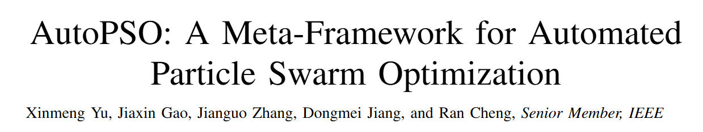
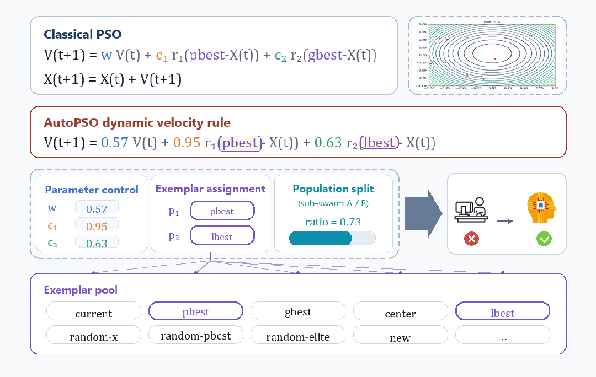
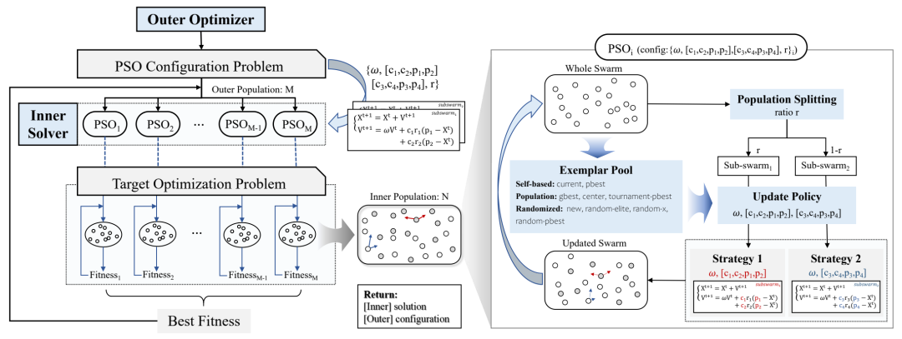
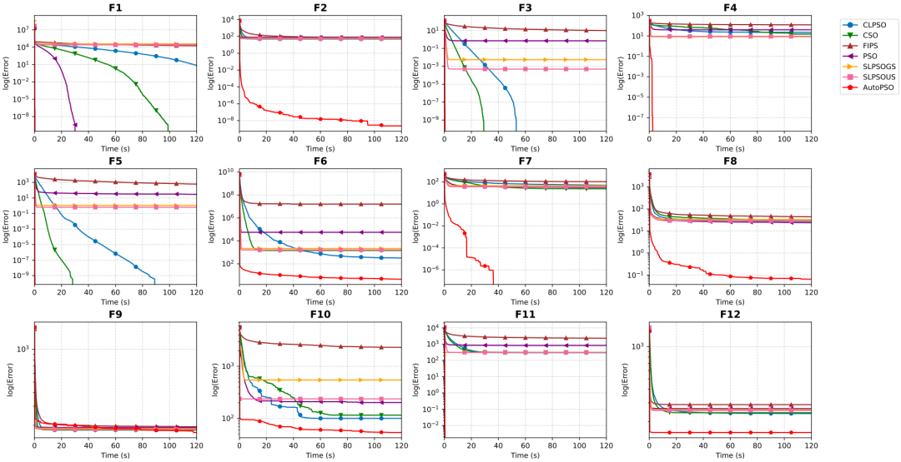
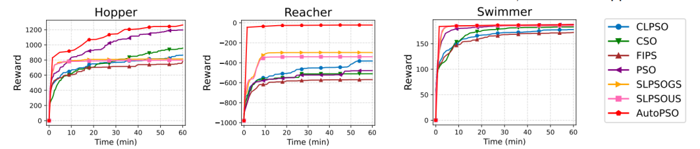
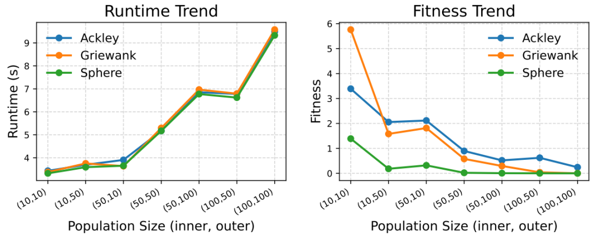

The development of particle swarm optimization (PSO) has, in essence, been a history of continuous "manual design." Over the past several decades, researchers have proposed a vast array of improvements concerning inertia weights, learning strategies, swarm topologies, subpopulation structures, and other components, gradually forming an expansive design space around PSO. However, the larger the space, the more difficult the choice. When confronted with a specific optimization task, which parameters to select, which learning mechanisms to adopt, and how to organize the particle swarm—these highly coupled design decisions remain, to this day, heavily dependent on researchers' expertise and trial-and-error experimentation. PSO has grown increasingly rich, yet it has also become increasingly difficult to "choose correctly." What if the very act of "choosing a PSO" were also delegated to algorithmic evolution?

**The AutoPSO framework, proposed by the EvoX team, uniformly encodes the parameter configuration, learning mechanisms, and swarm structure of PSO into a searchable evolutionary space, and automatically seeks the optimal PSO variant tailored to a given target problem through meta-evolution. This framework not only optimizes the solution to the problem but also, at a higher level, automatically optimizes "which PSO to use for solving."**

**Large-scale search in meta-evolution relies on massively parallel evaluations, and EvoX's tensorized computation, batch processing, and GPU parallelism precisely resolve this bottleneck—thousands of candidate variants can evolve simultaneously, rendering meta-level searches that were previously infeasible on CPUs practically achievable.**

**GPU computing power × meta-evolution propels PSO from "manual design" toward "automatic generation."**

## PSO Does Not Lack Methods; It Lacks the Ability to Automatically Combine Them

Over the past decades, PSO research has accumulated a rich set of mechanistic options: how parameters change over iterations, which individuals particles learn from, whether the swarm is divided into subgroups, and what update strategies different subgroups adopt.

The issue is not a shortage of mechanisms, but that most of these mechanisms exist as problem-specific, standalone algorithms. When facing a new task, researchers still have to manually select, combine, and verify from a large pool of mechanisms, and then re-tune them.

The philosophy of AutoPSO is not to discard this accumulated knowledge, but to reorganize it into a reusable component space. It decomposes the key design aspects of PSO into several modules:

- how parameters evolve;

- which exemplars particles learn from;

- how the swarm is partitioned into subgroups;

- what update strategies are employed by different subgroups.

In traditional approaches, these choices are mainly made by humans; in AutoPSO, they become searchable objects for the algorithm. In other words, AutoPSO is not about "manually reinventing a PSO," but about constructing a meta-framework that, before solving the current problem, can automatically configure a suitable PSO variant for it.

*Figure 1: AutoPSO organizes the key design elements of PSO into composable and searchable modules.*

## Handing Over the Outer-Level Optimization, Traditionally Performed by Researchers, to the Algorithm Itself

Conventional optimization research has always possessed a two-level structure. At the inner level, PSO is used to solve the target problem—be it function optimization, engineering design, or control policy. At the outer level, there exists a less explicit optimization: researchers are optimizing the algorithm itself.

Which update rules to choose, how to set parameters, which learning exemplars to adopt, whether to introduce subgroup mechanisms, which mechanisms can be combined, and which combinations are unstable—these decisions have typically been made by researchers based on experience and then refined through trial-and-error experimentation.

The key shift brought by AutoPSO is to delegate this outer-level process, previously carried out manually by researchers, to the algorithm. An outer-level particle no longer represents a candidate solution to the target problem, but rather a candidate PSO design, encoding parameters, learning exemplars, subgroup partitioning, and update strategies. The inner-level PSO, equipped with these configurations, solves the target problem and returns its performance as feedback to the outer level, which then continues to search for better algorithmic configurations accordingly.

**AutoPSO not only optimizes the solution to the problem, but also optimizes "which PSO to use for solving it."**

It transforms the algorithm design process, which used to rely on researchers' expertise, into an internal evolutionary process within the system that can be automatically searched, evaluated, and iterated upon.

*Figure 2: The outer level searches for algorithm configurations, while the inner level employs the selected configuration to solve the target problem.*

## EvoX and GPU: Making Automatic Algorithm Design Truly Feasible

Proposing an automatic search framework for algorithm structures is not particularly difficult; the real challenge lies in the computational cost. Evaluating a candidate PSO design requires running it through a complete solution process for the target problem. The more candidate designs there are, the greater the inner-level computational burden.

In traditional CPU-based serial environments, such costs are prohibitive. However, this type of computation is inherently parallelizable: candidate algorithms can be evaluated concurrently, and within each candidate algorithm, the particle updates can also be processed in batch. AutoPSO leverages EvoX to map the population structure of evolutionary computation onto the batch-processing capability of GPUs, enabling the outer-level configuration search and the inner-level problem solving to proceed simultaneously.

Here, GPU acceleration is not merely about shortening the runtime of a single execution; more importantly, it substantially increases the number of candidate designs that can be compared within a given time frame. Meta-evolution is essentially a search over the algorithm space, and the quality of that search directly depends on **how many candidate PSO designs have been evaluated**. The more thoroughly they are evaluated, the higher the chance of finding a configuration well suited to the current problem.

The value of EvoX lies precisely in providing this capability: it organizes the inner-level particle updates and fitness evaluations, as well as the outer-level comparison of candidate algorithms, into tensor operations on GPUs, allowing thousands of candidate designs to advance synchronously in each iteration. In other words, EvoX transforms meta-evolution from a "slow trial-and-error" process into a "large-scale parallel experimentation" one—and this is precisely the computational foundation on which AutoPSO is built.

## Not Only Faster, but Also Better at "Using Search"

What AutoPSO aims to demonstrate is not merely that it runs fast on GPUs, but rather that, once the design process of PSO is automated, the algorithm can genuinely discover a search strategy better suited to the target problem at hand.

On the CEC2022 numerical optimization benchmark, the EvoX team compared AutoPSO against the original PSO, CSO, CLPSO, FIPS, and several variants of social learning PSO. Under the same runtime budget, many fixed-structure PSO variants exhibited rapid initial decline in objective values but tended to stagnate prematurely. In contrast, AutoPSO was able to continuously adjust the configuration of its inner-level PSO during the run, maintaining a more stable improvement trend across multiple functions.

The team also conducted comparisons under the same number of function evaluations, and AutoPSO still achieved superior performance. This indicates that its advantage stems from more effectively organizing the search process, rather than merely consuming more computational resources.

*Figure 3: Experimental results on the CEC2022 numerical optimization benchmark.*

The research team further applied AutoPSO to neuroevolution-based robot control tasks. Compared with numerical function optimization, such tasks are much closer to real-world applications: they involve high-dimensional policy parameters, significant feedback noise, irregular objective landscapes, and gradient information that is not always available.

Across multiple Brax robot control environments, AutoPSO achieved faster reward improvement and better final performance. This suggests that AutoPSO is not merely a set of heuristics tailored to a specific class of functions, but rather a practical and transferable approach to automatic algorithm construction.

*Figure 4: Experimental results on the Brax robot control problems.*

The value of EvoX is most directly demonstrated in the scalability experiments. The bi-level structure of AutoPSO naturally entails a larger population size: the outer level hosts many candidate algorithms, and each candidate algorithm at the inner level has its own particle swarm. Under traditional serial execution, the required computation time would quickly become prohibitive.

On GPUs, however, when the total population size is increased by a factor of 100, the runtime increases by only about a factor of 3. In tests with 8192 dimensions, AutoPSO still maintains acceptable time overhead and achieves an order-of-magnitude speedup over CPU-based execution.

*Figure 5: Impact of population size scaling on runtime.*

## AutoPSO Wastes Neither Computing Power nor Historical Knowledge

Rather than replacing algorithmic research with raw computing power, AutoPSO transforms the long-accumulated research outcomes into operational design assets. The effective mechanisms that were previously scattered across different PSO variants are abstracted into reusable components, while the combinatorial decisions that once relied on human expertise are delegated to meta-evolution for validation on specific tasks.

Three elements are indispensable: historical knowledge provides the search space; automatic optimization handles the combinatorial search; and EvoX together with GPU parallelism supplies the evaluation capability at scale. Without historical knowledge, the search lacks promising candidates; without automatic optimization, knowledge can hardly be reorganized for the task at hand; without parallel computing, the search scale cannot be sustained.

AutoPSO frees researchers from repetitive parameter tuning and trial-and-error, redirecting their efforts towards more valuable work: defining components, designing search spaces, and establishing more reliable evaluation pipelines.

## From Modifying Algorithms to Constructing Systems That Generate Algorithms

The significance of AutoPSO extends beyond obtaining a stronger PSO variant. It demonstrates a new paradigm for evolutionary algorithms in the era of parallel computing:

- **In the past, we studied "how to design a better algorithm";**

- **now, we study "how to build a system that can automatically generate, select, and improve algorithms."**

As large-scale GPU-based candidate evaluation gradually becomes the norm in research, the boundaries of evolutionary computation are bound to change accordingly: parallel computing hardware is no longer merely a platform that hosts algorithm execution, but is also beginning to participate in reshaping the way algorithms are designed.

AutoPSO × EvoX: empowering evolutionary computation to transition from the manual era to the automatic era.

## Open Source Code / Community Resources

**Paper:**

https://arxiv.org/abs/2608.07539

**GitHub:**

https://github.com/EMI-Group/autopso

**Upstream Project (EvoX):**

https://github.com/EMI-Group/evox

**QQ Group:**

297969717

*QR code for the EvoX QQ community group.*
