# Codex for EvoX: Design Algorithms, Migrate Code, and Run Reproducible Experiments Through Conversation

Evolutionary computation is stepping into the AI-native era.

[EvoX](https://github.com/EMI-Group/evox) is a distributed, GPU-accelerated framework for scalable evolutionary computation. Through its unified `Algorithm`, `Problem`, and `Workflow` interfaces, EvoX brings population search, batched evaluation, experiment execution, and hardware acceleration into one cohesive computational architecture. It supports applications ranging from single- and multi-objective optimization to neuroevolution, reinforcement-learning environments, and complex system design.

Since its open-source release, EvoX has continued to evolve around a clear mission:

> **To build next-generation infrastructure for evolutionary computation, purpose-built for modern hardware and large-scale computing.**

## Prologue: Natural Language Becomes a New Entry Point for EvoX

Years of open-source development have made EvoX's interfaces, documentation, examples, and programming model public, structured, and executable. General-purpose AI coding agents with access to these resources and a runnable development environment can understand the framework and assist with environment setup, problem modelling, algorithm development, code migration, batch experimentation, and performance optimization.

This is what **native support** means in this article: Codex does not require a dedicated EvoX plugin to work with the framework. It can use EvoX's public documentation, source code, and project context directly.

In the past, researchers usually had to learn a framework first and then translate their problems into code that the framework could understand. Now that process can begin in the opposite direction. Across the examples below—from natural-language modelling and algorithm migration to backpropagation-free control and GPU tensorization—Codex translates human intent into implementation, while EvoX provides a unified foundation for algorithms, experiments, and parallel computation.

**Humans define the problem, Codex organizes the implementation, and EvoX runs the evolutionary process.**

## Starting Point: From Framework Installation to Direct Problem Description

### 1. Enter EvoX with One Sentence

Start with the simplest instruction:

> **Set up EvoX for me.**

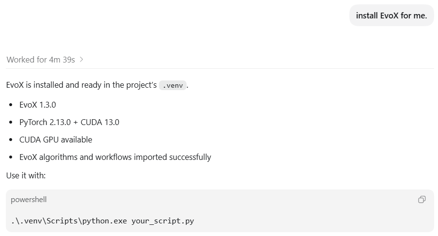

Codex can inspect the existing Python, PyTorch, and GPU environment, select an appropriate installation method, and perform basic verification. This substantially reduces the framework-specific knowledge and manual environment configuration required before users can focus on the problem they actually want to solve.

### 2. From Vague Requirements to a Complete Evolutionary-Computation Task

Real-world problems rarely arrive with predefined decision variables, objective functions, and constraints. More often, we only know what we have and what outcome we want:

> **Use EvoX to write an algorithm to solve the following problem: a warehouse robot moves from the entrance to the exit and needs to avoid shelves along the way. Construct a fixed, reproducible warehouse layout; find a route that is as short as possible, collision-free, and smooth; run the experiment; and visualize the optimization process.**

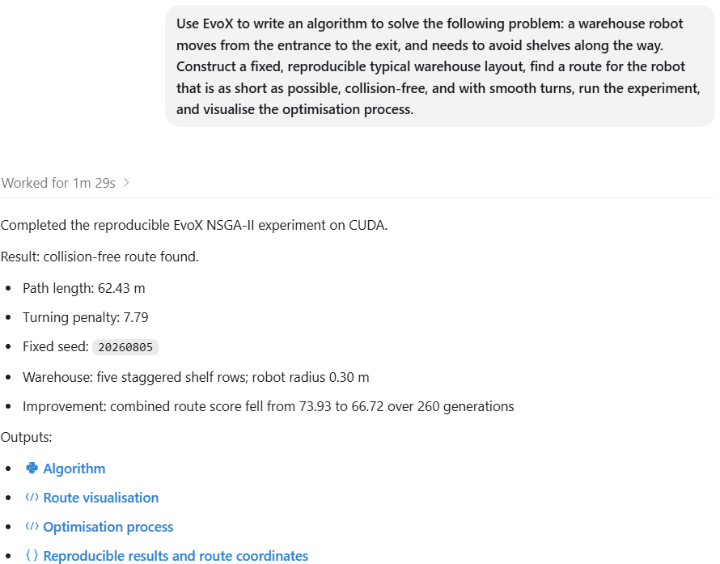

No mathematical model or specific algorithm is supplied. Codex constructs the warehouse layout, translates "short, collision-free, and smooth" into objectives and constraints, and implements the route encoding and experiment.

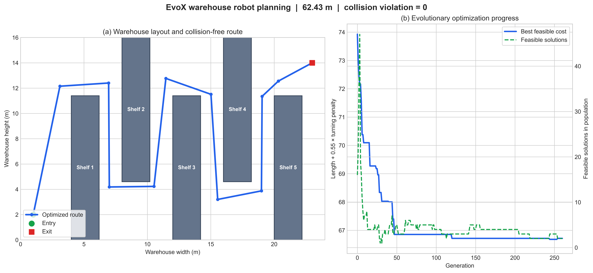

EvoX provides the execution backbone throughout this process:

- Candidate routes are represented as a population.
- Objective functions are evaluated in batches through the `Problem` interface.
- NSGA-II performs the iterative search.
- `Workflow` connects the algorithm, problem, and monitoring process.

The result is a reproducible, measurable, and visualized collision-free route. But translating intent into one runnable EvoX experiment is only the beginning; research scenarios require more structured experimentation.

## Going Deeper: From Code Generation to Reproducible Experimental Research

### 3. From a Single Run to a Reproducible Algorithm Comparison

A single successful run only shows that an implementation did not immediately fail. A credible comparison requires a common evaluation budget, independent runs, convergence records, standard metrics, statistical tests, and explicit limits on the conclusions:

> **Use EvoX to conduct a multi-objective algorithm comparison experiment with a unified budget and 30 independent runs, comparing NSGA-II, MOEA/D, HypE, AGE-MOEA, and random search. Follow common IEEE TEVC experimental practices for HV/IGD+, effect sizes, and non-parametric statistical analyses, and generate a visualization report with convergence curves, Pareto fronts, and clearly stated limitations.**

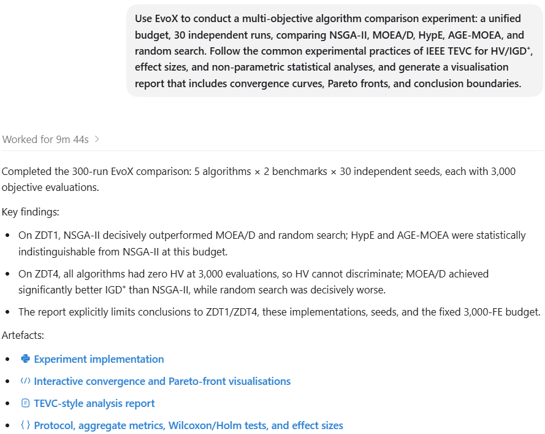

Codex organizes the protocol, while four EvoX-based evolutionary algorithms—NSGA-II, MOEA/D, HypE, and the local AGE-MOEA port—are evaluated under the same problem interface, population size, evaluation budget, and monitoring protocol. An independent random-search baseline is included for context. Metrics, convergence histories, final solution sets, and statistical analyses are recorded within the same experiment structure.

The upper panels show hypervolume convergence. Under the fixed 3,000-evaluation budget, all algorithms still obtain zero HV on the more challenging ZDT4 problem. The lower panels therefore provide an additional view of how the pooled final nondominated solutions relate to the reference Pareto front.

AI-generated experiments still require human review and verification. Nevertheless, this example shows how one continuous conversation can use EvoX to turn a single run into a comparable and reproducible algorithmic study.

### 4. From Understanding Existing Code to Reusing Research Assets

Research does not always start from scratch. Many valuable algorithms still live in MATLAB, NumPy, and legacy repositories. Moving them into EvoX requires understanding how the original implementation organizes state, population updates, operators, evaluations, and the experimental loop. Codex can assist when given the relevant source files:

> **Read the entry file and related helper functions in this directory, explain the algorithmic flow, migrate it to an EvoX implementation, and experimentally validate it on standard multi-objective benchmark problems.**

Codex reimplements extreme-point detection, objective normalization, Pareto-front geometry estimation, and survival scoring, then organizes population state, fitness evaluation, mating, and environmental selection according to EvoX interfaces. The migrated AGE-MOEA reuses EvoX crossover, mutation, and selection operators, connects to the standard `Problem` and `Workflow` interfaces, and shares the platform's execution and monitoring structure.

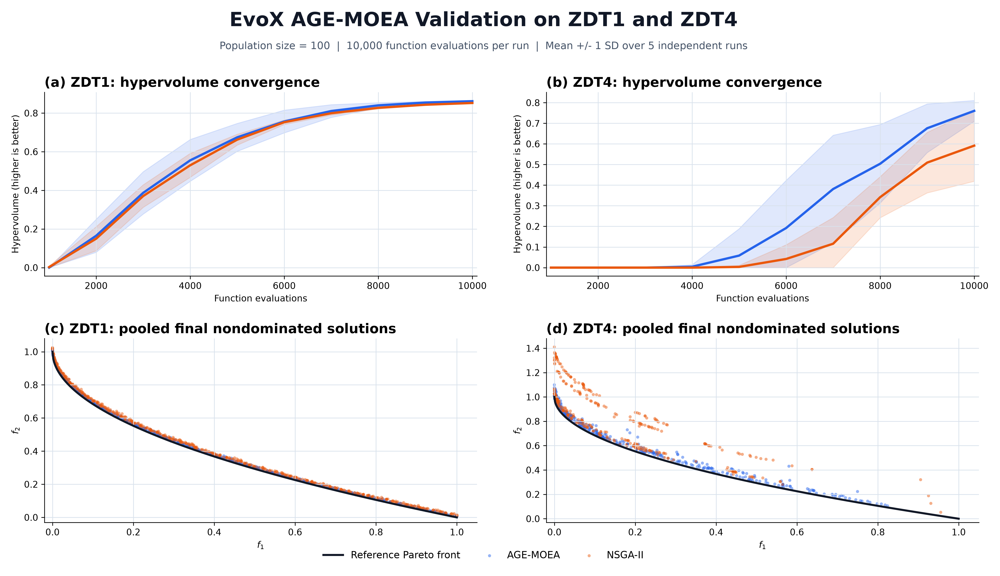

Standard benchmark validation shows that the migrated implementation runs correctly in EvoX and approaches the reference Pareto fronts. An algorithm that previously depended on MATLAB has therefore become an EvoX implementation that can be reproduced, compared, and extended within the PyTorch ecosystem, with a clear path toward further tensorization and hardware acceleration.

These examples show that Codex can help users operate EvoX, organize standardized experiments, and carry existing research assets into the framework. The possible objects of evolution, however, extend well beyond conventional optimization vectors.

## Beyond: Extending Evolvable Objects and Computational Boundaries

### 5. What to Evolve Is Up to You

EvoX's hierarchical, modular design allows tasks that follow the pattern "candidate solutions → batch evaluation → iterative update" to be incorporated into an evolutionary workflow. The evolved object might be a numerical vector, a route, a neural network, a control policy, or a design space characterized by diverse behaviours.

Consider a classic control task solved through neuroevolution:

> **Use EvoX to evolve a small neural-network controller without backpropagation, enabling it to balance an inverted pendulum. Complete a minimal runnable implementation, and output the training curve and final control animation.**

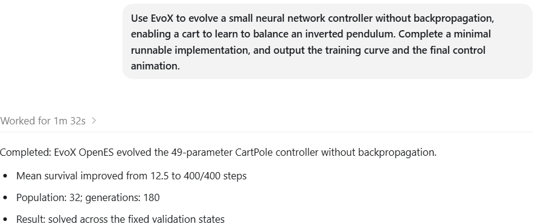

Codex builds the CartPole environment and a small network with only 49 parameters. EvoX uses OpenES to generate and update the population of candidate networks, lets each controller act in the environment, and evaluates it by how long the pole remains balanced. The training process computes no gradients and invokes no backpropagation.

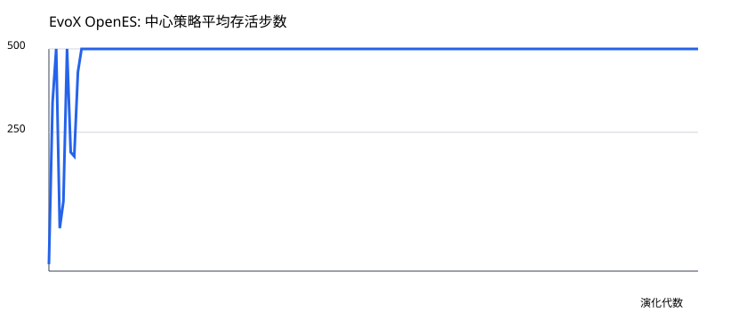

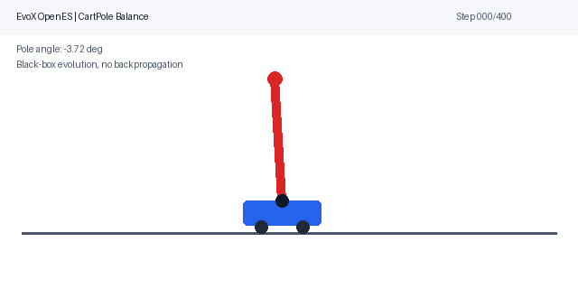

In this experiment, mean survival increases from about 12.5 steps to the configured limit of 400 steps. This shows that EvoX can incorporate model parameters, control policies, and external environments into an evolutionary workflow rather than being limited to conventional numerical test functions.

The same interface can also support quality-diversity tasks such as procedural maze generation:

> **Use EvoX and MAP-Elites to automatically generate a diverse set of solvable mazes, map the diversity landscape by route meandering and branch richness, and compare the results with random generation under the same budget.**

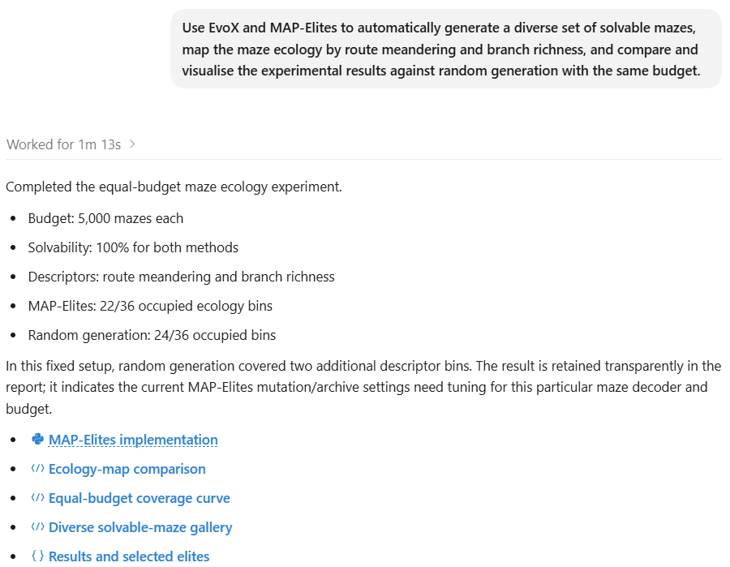

Codex designs the task, while EvoX handles the repeated generation, evaluation, and selection of candidate levels. MAP-Elites retains representatives of different styles according to route meandering and branch richness.

With a fixed budget of 5,000 candidate mazes, MAP-Elites occupied 22 of 36 predefined niches, compared with 24 for random generation; both methods achieved 100% solvability because the decoder guarantees solvable mazes. This small experiment does not establish a universal coverage advantage. Instead, it demonstrates how EvoX can maintain a structured archive of high-quality representatives across explicitly defined behavioural niches.

### 6. Computational Acceleration: Reorganizing Work Around the GPU

The previous cases focus on understanding problems, generating code, and organizing experiments. This final case reaches into the computation itself. When the inverted-pendulum evaluator was first moved to the GPU, it ran more slowly than the CPU version. The network was tiny, and each simulation step launched many small operations, so kernel-launch and Python scheduling overhead outweighed the arithmetic.

The follow-up request was direct:

> **The current inverted-pendulum experiment runs slower on GPU than on CPU. Analyze the performance bottleneck; tensorize population evaluation, controller inference, and environment simulation on the GPU; compare CPU and GPU performance before and after optimization; and visualize the results.**

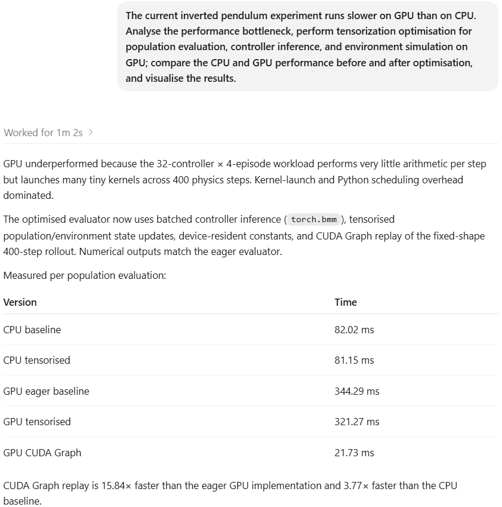

Codex uses EvoX and PyTorch to reorganize the evaluator. Controllers, episodes, and environment states remain in batched tensors, while batched matrix operations and CUDA Graph replay reduce fragmented GPU launches. The time for one population evaluation falls from **427.47 ms** with eager GPU execution to **22.10 ms** with CUDA Graph replay: approximately a **19.34×** speedup over the original GPU implementation, while keeping the evaluation results consistent.

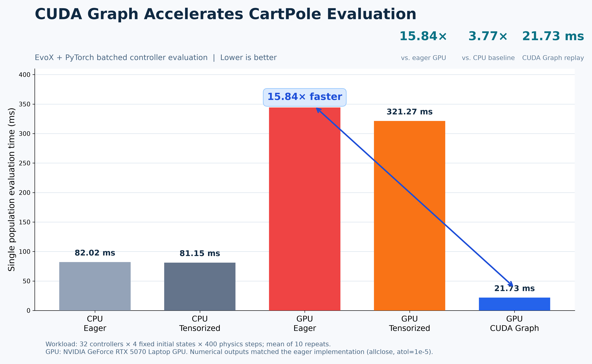

This workload contains only 32 controllers and a 49-parameter network, so the measured ratios do not generalize to every task. It nevertheless validates an important capability of EvoX: organizing candidates into populations, evaluating them in batches, and extending the workflow to GPUs and larger workloads. **Together, AI-assisted implementation and EvoX can reorganize evolutionary computation around modern hardware.**

## From a Single Sentence to a Scalable Evolutionary-Computation Workflow

EvoX provides more than an isolated list of algorithms. It offers an extensible evolutionary-computation ecosystem:

- `Problem` brings real-world tasks, simulators, and model evaluations into evolutionary computation.
- `Algorithm` and operator interfaces support both existing algorithms and custom development.
- `Workflow` connects populations, problems, monitors, and experiments.
- PyTorch enables population computation to be tensorized and moved to modern hardware.
- Unified interfaces allow one optimization run to grow into batch experiments, algorithm comparisons, and neuroevolution workflows.

Researchers previously had to switch constantly between problem descriptions, mathematical models, framework APIs, algorithm code, experiment scripts, statistical tools, and GPU optimization. Now the process can begin with natural language and progressively become a complete, executable, and reproducible computational workflow within the same conversation.

**Humans define the goals, AI organizes the implementation, and EvoX runs the evolution.**

Start with one sentence, and explore your own evolutionary space.

---

**Note 1:** This article uses Codex as a representative AI coding agent. Other agents capable of reading, generating, executing, and debugging code may use EvoX in similar ways. Results depend on the model, context, runtime environment, and tool permissions.

**Note 2:** The demonstrations were run with the GPT-5.5 Terra model using medium intelligence, medium reasoning effort, and standard speed.

**Note 3:** The experimental results apply only to the tasks, environments, implementations, budgets, and hardware described here. They do not represent general performance or speedup guarantees.
