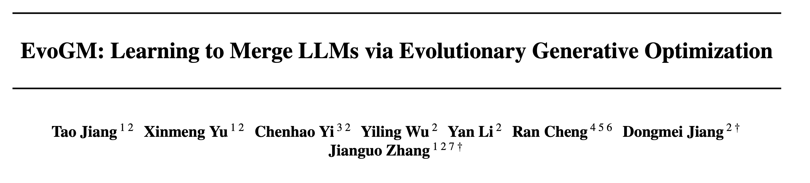
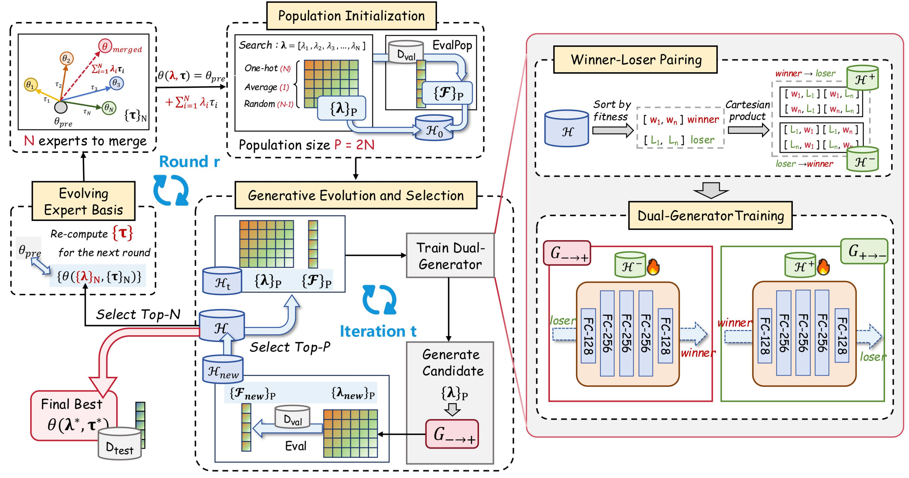
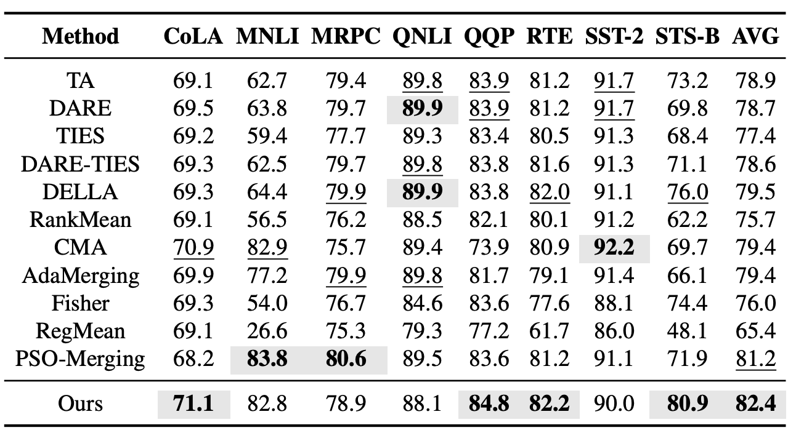
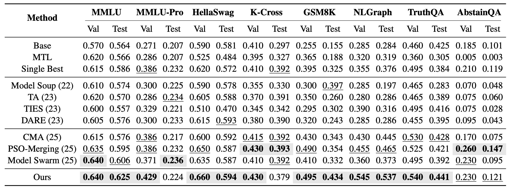
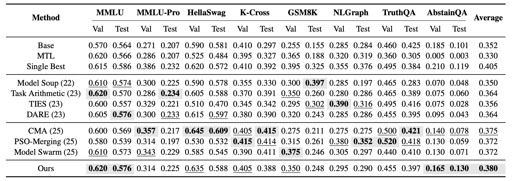
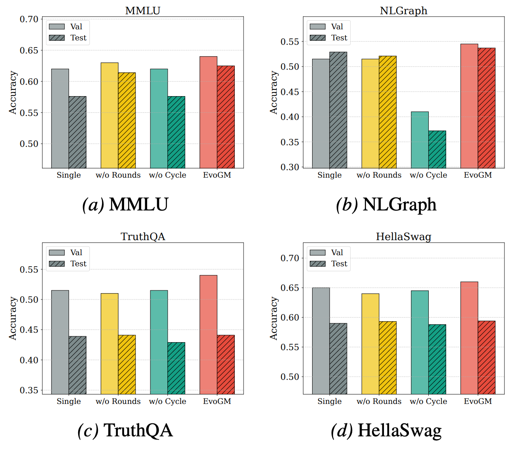
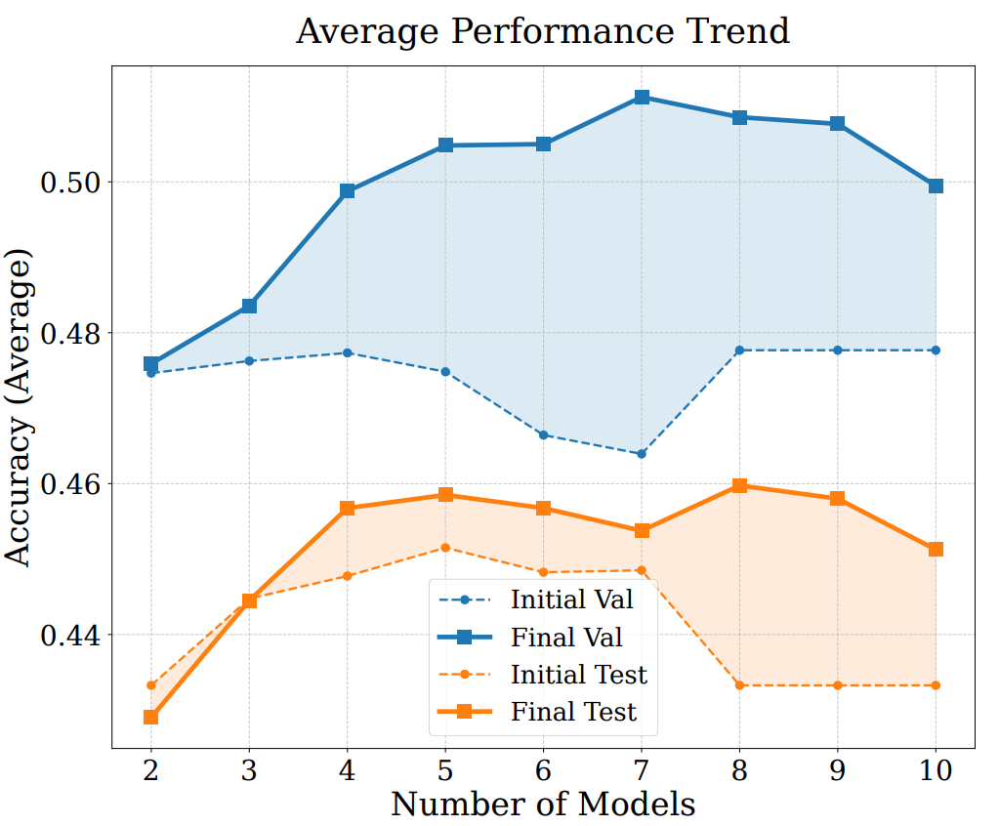

---
title: "EvoGM: 재훈련 없이 집단 진화로 대규모 모델 자율 병합"
pubDate: 2026-06-28
summary: "EvoX 팀과 鵬城실험실이 병합 계수 탐색을 학습 가능한 생성형 최적화 문제로 변환하는 생성형 진화 모델 병합 프레임워크 EvoGM을 제안합니다. 대규모 모델을 재훈련하지 않고도 자율적인 모델 병합을 실현합니다."
---

# EvoGM: 재훈련 없이 집단 진화로 대규모 모델 자율 병합

## 요약

대규모 언어 모델의 능력이 향상됨에 따라 다양한 작업에 맞게 미세 조정된 전문가 모델도 점점 늘어나고 있습니다. 병합에 참여하는 대규모 모델을 재훈련하지 않고, 추가적인 대규모 훈련 데이터에도 의존하지 않으면서 이러한 전문가 모델의 능력을 효율적으로 재활용하는 방법은 모델 병합에서 중요한 문제입니다. 기존 방법은 보통 평균 병합, 수동 스케일링, 매개변수 트리밍 또는 무작위 탐색에 의존합니다. 이들은 어느 정도 여러 모델의 능력을 조합할 수 있지만, 과거 평가로부터 지속적으로 학습하여 병합 전략을 개선하기는 어렵습니다.

이 문제에 대응하기 위해 EvoX 팀과 鵬城실험실은 생성형 진화 모델 병합 프레임워크 EvoGM(Evolutionary Generative Merging)을 제안했습니다. EvoGM은 병합 계수 탐색을 학습 가능한 생성형 최적화 문제로 변환합니다. EvoGM은 서로 다른 병합 구성을 후보 개체군으로 조직화하고, winner-loser 페어링, 이중 생성기 훈련, 순환 일관성 제약, 진화적 전문가 기반 업데이트를 통해 개체군이 「생성—평가—선택—재학습」의 폐루프 안에서 지속적으로 진화하도록 합니다. 제한된 검증 피드백으로부터 저성능 구성을 고성능 구성으로 변환하는 방법을 자율적으로 학습합니다. 실험 결과에 따르면 EvoGM은 이미 본 작업과 미본 작업 시나리오 모두에서 더 강력한 모델 병합 능력을 보여줍니다.

## 1. 왜 모델 병합이 필요한가?

최근 대규모 언어 모델의 능력은 점점 강해지고 있지만, 훈련과 미세 조정의 비용도 점점 높아지고 있습니다. 자연스러운 질문이 생깁니다. 서로 다른 작업에서 좋은 성능을 보이는 여러 전문가 모델이 이미 있다면, 이러한 대규모 모델을 재훈련하지 않고 그 능력을 조합하여 더 강력하고 범용적인 새 모델을 얻을 수 있을까요?

이것이 바로 모델 병합이 해결하려는 문제입니다.

모델 병합의 핵심 아이디어는 직관적입니다. 여러 전문가 모델은 종종 동일한 기본 모델에서 파생되었으며, 서로 다른 데이터나 작업에서 미세 조정된 것에 불과합니다. 따라서 각 전문가 모델의 기본 모델 대비 매개변수 변화를 「능력 방향」으로 볼 수 있고, 이러한 방향을 가중 조합하여 새로운 병합 모델을 구성할 수 있습니다. 그 장점은 병합에 참여하는 대규모 모델을 재훈련하거나 미세 조정할 필요가 없고, 추가적인 대규모 훈련 데이터에도 의존하지 않으며, 적절한 병합 계수만 탐색하면 된다는 것입니다. EvoGM은 경량 생성기를 훈련하여 계수를 탐색하지만, 전문가 대규모 모델의 매개변수는 업데이트하지 않습니다.

## 2. 모델 병합의 진짜 어려움은 어디에 있는가?

진짜 어려운 부분은 여기에 있습니다. 이 계수들을 어떻게 선택해야 할까요?

모델 병합은 여러 전문가 모델의 가중 조합처럼 보이지만, 서로 다른 전문가 모델 간의 능력 관계는 단순하지 않습니다. 일부 작업 방향은 상호 보완적이지만, 일부 매개변수 업데이트는 서로 충돌할 수 있습니다. 한 병합 계수 조합은 한 종류의 작업에서 더 나은 성능을 보일 수 있지만, 다른 종류의 작업에서는 성능 저하를 가져올 수도 있습니다. 따라서 병합 계수와 최종 모델 성능 사이에는 쉽게 수동으로 특성화할 수 있는 선형 관계가 존재하지 않습니다.

전통적인 방법은 보통 평균 병합, 수동 스케일링, 매개변수 트리밍 또는 희소화(sparsification) 같은 휴리스틱 규칙에 의존합니다. 이러한 방법은 간단하고 효과적이지만, 명확한 한계도 있습니다. 정적이고 경험적이며, 서로 다른 작업의 검증 피드백에 따라 적응적으로 조정하기 어렵습니다.

이후 진화 탐색형 방법이 모델 병합에 도입되어, 후보 병합 구성을 개체군으로 조직화하고 무작위 섭동, 적합도 평가, 선택을 통해 더 나은 계수를 찾게 되었습니다. 이러한 방법은 고정 규칙보다 유연하지만, 여전히 핵심적인 문제가 남아 있습니다. 검증 결과는 보통 순위 매기기와 필터링에만 사용되며, 더 나아가 학습 가능한 탐색 경험으로 전환되지 않습니다. 다시 말해, 알고리즘은 「어떤 후보 모델이 더 나은지」는 알지만, 「더 열등한 후보 모델을 어떻게 개선해야 하는지」를 진정으로 학습하지는 못합니다.

이것이 바로 EvoGM이 해결하려는 핵심 문제입니다. 모델 병합은 후보 집단의 시행착오와 필터링에 그치지 않고, 과거 평가로부터 개선 방향을 학습하여 더 유망한 병합 구성을 자율적으로 생성해야 합니다.

## 3. EvoGM: 집단 진화 속에서 병합 전략을 자율적으로 학습하기

위 문제를 해결하기 위해 EvoGM(Evolutionary Generative Merging)을 제안했습니다. 코드는 오픈소스로 공개되어 있습니다: https://github.com/JiangTao97/evogm.

EvoGM의 핵심 아이디어는 후보 병합 구성을 개체군으로 조직화하고, 병합 계수 탐색 과정을 생성형 학습 문제로 변환하는 것입니다.

핵심은 생성 모델이 직접 「최적의 병합 계수가 무엇인지」를 학습하는 것이 아니라, 「열등한 구성에서 더 나은 구성으로 어떻게 변환하는지」를 학습한다는 점입니다. 모델 병합 시나리오에서는 서로 다른 구성 간에 신뢰할 수 있는 전역 순위를 형성하기 어려운 경우가 많기 때문입니다. 대조적으로, 쌍별 비교가 더 안정적인 우열 신호를 얻기 쉽습니다.

EvoGM은 과거 검증 결과를 활용하여 winner-loser 페어링 데이터를 구성하고, 생성기가 loser에서 winner로의 개선 방향을 학습하도록 합니다. 각 후보 병합 구성 쌍에 대해 알고리즘은 해당 성능 차이를 기록할 뿐만 아니라, 이러한 「나쁨에서 좋음으로의」 관계를 훈련 샘플로 변환합니다. 지속적인 축적과 학습을 통해 생성기는 어떤 계수 조정이 성능 향상을 가져올 가능성이 더 높은지를 점차 포착하여 탐색 공간 구조에 대한 암묵적 이해를 형성합니다. 다시 말해, 우수한 해 자체가 아니라 성능 향상의 법칙을 학습하는 것입니다.

이 접근법은 진화 최적화의 경쟁 학습 메커니즘과 일맥상통합니다. 가장 먼저 CSO(Competitive Swarm Optimizer)로 거슬러 올라갈 수 있습니다. winner-loser 경쟁을 통해 개체 업데이트를 촉진하고, 성능이 열등한 개체가 성능이 더 나은 개체에 가까워지도록 합니다. EvoGO(Evolutionary Generative Optimization)는 한 걸음 더 나아가 생성 모델을 활용하여 과거 탐색 데이터로부터 개선 방향을 학습하고, 데이터 구동 방식으로 일부 수동 설계된 탐색 연산자를 대체합니다. EvoGM은 이 사상을 모델 병합 시나리오에 도입하여 검증 피드백으로 생성기를 훈련하고 후속 탐색을 안내합니다. 이로써 검증 결과는 후보 해의 필터링과 도태에만 사용되는 것이 아니라, 지속적으로 재사용 가능한 탐색 경험으로 전환되어 탐색 과정이 반복될수록 지식을 축적하고 효율을 높일 수 있습니다.

## 4. EvoGM은 어떻게 동작하는가?

EvoGM의 전체 흐름은 다섯 단계로 나눌 수 있습니다. 후보 방안 구성, winner-loser 훈련 쌍 형성, 생성기 훈련, 새 계수 생성 및 선택, 전문가 기반 업데이트입니다. 전문가 모델과 검증 작업이 주어지면 이러한 단계는 자동으로 순환 실행될 수 있으며, 병합 규칙이나 계수를 수동으로 라운드마다 설계하거나 조절할 필요가 없습니다.

1. 개체군 초기화: 후보 병합 방안 구성

EvoGM은 먼저 초기 후보 해의 배치를 구성해야 합니다. 여기서 각 후보 해는 여러 전문가 모델의 서로 다른 조합 방식, 즉 한 세트의 병합 계수에 해당합니다.

구체적으로 초기 개체군에는 보통 몇 가지 유형의 구성이 포함됩니다. 평균 병합에 해당하는 계수, 개별 전문가 모델에 해당하는 one-hot 계수, 그리고 무작위 샘플링으로 얻은 병합 계수입니다. 이를 통해 일반적인 벤치마크 병합 방식을 포괄하면서 후속 탐색에 일정한 다양성을 제공할 수 있습니다.

각 후보 계수 조합에 대해 EvoGM은 이를 바탕으로 병합 모델을 구성하고 검증 세트에서 성능을 평가합니다. 이 단계 이후 알고리즘이 얻는 것은 단순한 후보 모델이 아니라 「병합 계수—검증 성능」의 역사 기록 배치입니다. 후속의 모든 생성형 학습과 진화적 선택은 이러한 기록 위에 구축됩니다.

2. 승자—패자 페어링: 검증 결과를 훈련 데이터로 변환

후보 해와 그 검증 성능을 얻은 후 EvoGM은 성능에 따라 과거 후보 구성을 winner와 loser로 분류합니다. winner는 상대적으로 더 우수한 병합 구성을, loser는 상대적으로 열등한 병합 구성을 나타냅니다.

여기서 핵심은 고득점 구성을 단순히 보존하고 저득점 구성을 폐기하는 것이 아니라, 둘을 훈련 쌍으로 조합하는 것입니다. 생성기에게 하나의 winner-loser pair는 유용한 정보를 제공합니다. 이 열등한 구성에서 출발하여 어떤 더 나은 구성에 가까워져야 하는지를 알려줍니다.

따라서 저성능 후보는 무효 샘플이 아닙니다. 오히려 탐색 과정의 「출발점」을 제공하고, 고성능 후보는 「개선 방향」을 제공합니다. 이러한 페어링 방식을 통해 EvoGM은 제한된 검증 평가 결과를 더 많은 학습 가능한 지도 신호로 변환하여 소규모 피드백 하에서의 데이터 활용 효율을 높일 수 있습니다.

3. 이중 생성기 훈련: 열등한 구성에서 우수한 구성으로의 변환 학습

winner-loser 훈련 쌍을 구성한 후 EvoGM은 이중 생성기 구조를 사용하여 훈련합니다.

순방향 생성기는 loser에서 winner로의 매핑, 즉 저성능 병합 구성을 더 유망한 고성능 구성으로 변환하는 방법을 학습합니다. 역방향 생성기는 winner에서 loser로의 역매핑을 학습하여 생성 과정의 구조적 일관성을 제약하는 데 사용됩니다.

이 설계의 목적은 생성기가 기존의 고득점 구성을 단순히 기억하는 것이 아니라, 병합 계수 공간에서의 개선 법칙을 학습하는 것입니다. 순환 일관성 제약을 통해 EvoGM은 생성기가 소수의 고득점에 붕괴(collapse)할 위험을 줄이고, 생성된 후보 구성이 고성능 영역을 향하면서도 탐색 공간의 구조 정보를 최대한 보존하도록 합니다.

4. 생성형 진화와 선택: 학습된 연산자로 무작위 섭동 대체

생성기 훈련이 완료되면 EvoGM은 순방향 생성기를 사용하여 현재 후보 구성을 변환하고 새로운 병합 계수 배치를 생성합니다. 이 단계는 전통적인 진화 알고리즘의 「새 개체 생성」에 해당하지만, 새 개체는 주로 무작위 섭동이 아니라 생성 모델이 학습한 개선 방향에서 나옵니다.

이후 이러한 새로 생성된 병합 계수는 새로운 병합 모델을 구성하는 데 사용되고, 다시 검증 세트에서 평가됩니다. 평가 결과는 역사 기록에 추가되어 기존 후보와 함께 선택에 참여합니다.

이러한 순환을 통해 EvoGM은 매 라운드 「생성—평가—선택—재학습」 과정을 거칩니다. 이 폐루프가 후보 병합 방안의 집단 진화를 구성합니다. 과거 검증 결과가 지속적으로 축적되고 생성기가 새로운 훈련 신호를 지속적으로 받아, 고품질 병합 구성을 자율적으로 생성하는 능력을 점차 향상시킵니다.

5. 진화적 전문가 기반: 탐색 공간을 지속적으로 자기 업데이트

병합 계수 최적화 외에 EvoGM은 진화적 전문가 기반 메커니즘을 추가로 도입합니다.

전통적인 모델 병합은 보통 전문가 모델을 고정 입력으로 취급하고, 고정된 전문가 모델 사이에서만 병합 계수를 탐색합니다. EvoGM은 다릅니다. 각 라운드가 끝난 후 성능이 가장 좋은 병합 모델 중 일부가 선택되어 다음 라운드 탐색의 새로운 전문가 기반이 됩니다.

이렇게 하는 의미는 우수한 병합 모델 자체가 이미 특정 효과적인 능력 조합을 포함하고 있다는 것입니다. 이를 새로운 전문가 기반에 편입하면 후속 탐색은 원래 전문가 모델 간의 선형 결합에 국한되지 않고, 이미 검증된 중간 모델을 기반으로 진화를 계속할 수 있습니다.

따라서 EvoGM의 탐색 공간은 고정되지 않으며, 탐색 과정에 따라 지속적으로 업데이트됩니다. 더 나은 병합 계수를 찾을 뿐만 아니라, 현재 작업에 더 적합한 전문가 표현 기반을 점진적으로 구축합니다.

## 5. EvoGM의 핵심 장점은 무엇인가?

전통적인 모델 병합 방법과 비교할 때 EvoGM의 장점은 주로 세 가지 측면에 나타납니다.

첫째, EvoGM은 모델 병합을 정적 휴리스틱 규칙에서 피드백 구동형 자율 탐색으로 발전시킵니다. 전통적인 방법은 평균 병합, 수동 스케일링 또는 무작위 섭동에 의존하는 경우가 많지만, EvoGM은 과거 검증 결과에 따라 탐색 방향을 지속적으로 조정하여 병합 과정이 수동 규칙 설계와 계수 조절에 의존하지 않게 합니다.

둘째, EvoGM은 제한된 평가 예산 하에서의 데이터 활용 효율을 높입니다. 모델 병합에서 각 후보 구성 평가는 실제로 병합 모델을 구성하고 검증 작업을 실행해야 하므로 비용이 낮지 않습니다. EvoGM은 이러한 평가 결과를 더 나아가 학습 가능한 훈련 신호로 변환하여 매 시행착오가 후속 탐색에 정보를 제공합니다.

셋째, EvoGM은 더 나은 병합 계수 조합을 찾을 뿐만 아니라, 전문가 모델 간 능력 조합 법칙을 점진적으로 학습합니다. 후보 개체군의 생성형 탐색과 전문가 기반 업데이트를 통해 기존 전문가 모델을 기반으로 탐색 공간을 지속적으로 재구성하고 확장하여, 더 효과적으로 고성능 병합 모델을 자율적으로 발견할 수 있습니다.

## 6. 실험 결과: EvoGM은 정말 효과적인가?

이미 본 작업 설정에서 먼저 GLUE 시리즈 작업에서 EvoGM의 모델 병합 효과를 평가했습니다. 이 실험은 CoLA, MNLI, MRPC, QNLI, QQP, RTE, SST-2, STS-B 등 8개의 언어 이해 작업을 포괄하며, Task Arithmetic, TIES, DARE-TIES, DELLA, RankMean, CMA, AdaMerging, PSO-Merging 등 대표적인 모델 병합 방법과 비교했습니다. 실험 결과에 따르면 EvoGM은 8개 작업에서의 평균 성능이 이전 최고 성능을 보였던 PSO-Merging을 초과합니다.

더 도전적인 미본 작업 설정에서 EvoGM이 기존 전문가 모델의 능력을 전문가 미세 조정에 참여하지 않은 새로운 작업으로 이전할 수 있는지를 추가로 평가했습니다. 구체적으로 Qwen2.5-1.5B 기반의 10개 LoRA 전문가 모델을 병합하고, MMLU, MMLU-Pro, HellaSwag, Knowledge Crosswords, GSM8K, NLGraph, TruthfulQA, AbstainQA 등 8개의 미본 작업에서 테스트했습니다. 이러한 작업은 지식 이해, 복잡한 추론, 안전성·신뢰성 등 서로 다른 능력 차원을 포괄하며, 이미 본 작업보다 모델 병합 방법의 일반화 능력을 더 잘 반영합니다.

단일 작업 미본 병합 설정에서 EvoGM은 각 목표 작업에 대해 개별적으로 한 세트의 병합 계수를 탐색합니다. 실험 결과에 따르면 EvoGM은 8개 테스트 작업 중 5개에서 최고 테스트 성능을 달성했습니다.

단일 작업 병합 외에도 다중 작업 미본 병합 설정을 추가로 검토했습니다. 이 설정에서는 각 작업에 대해 개별적으로 최적 모델을 찾는 것이 아니라, 8개의 미본 작업을 동시에 포괄할 수 있는 통합 병합 모델을 얻는 것이 목표입니다. 실험 결과에 따르면 다중 작업 미본 병합에서 EvoGM은 모든 병합 방법 중 최고 평균 테스트 성능을 달성했습니다.

결과는 EvoGM이 단일 작업 병합과 다중 작업 설정 모두에서 더 강력한 전반적 일반화 성능을 달성했으며, 여러 지식, 추론, 안전 관련 작업에서 기존 모델 병합 방법을 능가함을 보여줍니다.

EvoGM의 성능 원인과 확장 능력을 추가로 분석하기 위해 소거(ablation) 실험과 서로 다른 모델 수에서의 병합 실험을 수행했습니다. 결과에 따르면 완전한 EvoGM은 항상 최적 또는 가장 안정적인 성능을 달성했으며, 핵심 구성 요소를 제거하면 성능이 다양한 정도로 하락하여, 그 우위가 주로 생성형 진화 메커니즘에서 비롯되며 단순한 무작위 탐색이나 더 많은 탐색 라운드가 아님을 보여줍니다. 동시에 병합에 참여하는 전문가 모델 수가 증가해도 EvoGM은 양호한 성능을 유지하고 안정적인 향상 추세를 보여, 더 대규모이고 복잡한 병합 공간에 효과적으로 대응하고 서로 다른 전문가 모델 간의 상호 보완적 능력을 충분히 활용할 수 있는 우수한 확장성을 갖추고 있음을 나타냅니다.

## 7. EvoGO에서 EvoGM으로: 생성형 진화 사상의 확장

더 큰 관점에서 EvoGM은 대규모 모델 병합에서 EvoGO 사상의 확장으로 이해할 수 있습니다. EvoGO는 진화 최적화가 수동 설계된 교차, 변이, 섭동 연산자에 의존하는 것에서, 생성 모델이 과거 탐색 데이터에 기반하여 새로운 해 생성 방식을 자동으로 학습하는 방향으로 전환하는 방법에 초점을 맞춥니다. 즉, 진화 탐색은 「후보 해를 무작위로 생성하고 필터링하는」 것을 넘어 「더 유망한 후보 해를 어떻게 생성하는지」를 학습하기 시작합니다.

EvoGM은 이 사상을 대규모 모델 병합 시나리오에 적용합니다. 여기서 후보 해는 일반 최적화 문제의 수치 변수가 아니라 한 세트의 병합 계수입니다. 한 번의 평가도 단순한 목적 함수 계산이 아니라 병합 모델을 구성하고 하류 작업에서 성능을 검증하는 것입니다. 따라서 EvoGM은 실제로 모델 병합을 생성형 최적화 문제로 재표현합니다. 과거 평가 결과로부터 전문가 모델 간 능력 조합 법칙을 학습하고 더 우수한 병합 구성을 생성하는 방법입니다.

이 점이 EvoGM을 전통적인 탐색형 모델 병합과 명확히 구별합니다. 전통적인 방법은 보통 검증 결과를 순위 매기기와 필터링에만 사용하지만, EvoGM은 더 나아가 검증 결과를 훈련 신호로 변환합니다. 저성능 구성은 단순히 폐기되지 않고, 고성능 구성과 winner-loser pairs를 형성하여 생성기가 열등한 구성에서 우수한 구성으로의 진화 방향을 학습하는 데 사용됩니다.

EvoGO에서 EvoGM으로의 전환은 본질적으로 「후보 해를 최적화하는 방법을 학습하는」 것에서 「대규모 모델 병합 전략을 집단 속에서 자율적으로 진화시키는」 것으로의 이동입니다. 이는 모델 병합을 경험 규칙과 무작위 섭동에서 해방시킬 뿐만 아니라, 새로운 접근법도 제공합니다. 대규모 모델의 능력은 병합될 수 있고, 병합 전략 자체도 집단 피드백으로부터 지속적으로 학습할 수 있습니다.

## 8. 결론과 전망

오픈소스 생태계에서 전문가 모델, LoRA 모델, 작업 모델이 점점 늘어나면서, 미래의 핵심 문제는 「새 모델을 어떻게 훈련할 것인가」뿐만 아니라 「기존 모델 능력을 어떻게 효율적으로 조합할 것인가」일 수 있습니다. EvoGM은 새로운 답을 제공합니다. 병합에 참여하는 대규모 모델을 재훈련하지 않고, 생성형 진화 학습을 통해 제한된 검증 피드백을 활용하여 후보 개체군 구성, 병합 방안 생성, 평가 선택, 전문가 기반 업데이트를 자율적으로 완료합니다. 간단히 말해 EvoGM은 모델 병합을 「경험에 기반한 계수 조정」에서 「병합 전략이 스스로 학습하고 진화하는」 방향으로 이끕니다. 이는 대규모 모델 능력 재활용이 새로운 단계에 진입할 수 있음을 의미합니다. 새로운 작업을 만날 때마다 모델을 재훈련하는 것이 아니라, 기존 전문가 모델이 집단 진화와 자율 병합을 통해 새로운 작업에 더 적합한 모델을 지속적으로 조합해 내는 것입니다.

## 오픈소스 코드 / 커뮤니티

📄 논문:
https://arxiv.org/pdf/2605.29295
🔗 GitHub:

https://github.com/JiangTao97/evogm
🔼 상위 프로젝트(EvoX):

https://github.com/EMI-Group/evox
🌐 QQ 교류 그룹: 297969717

