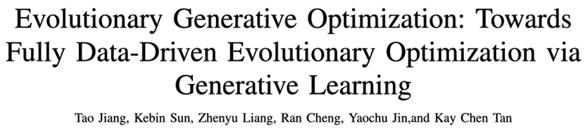
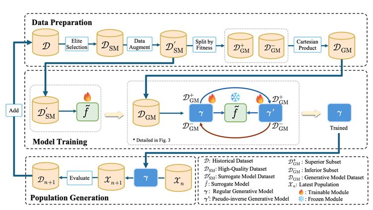
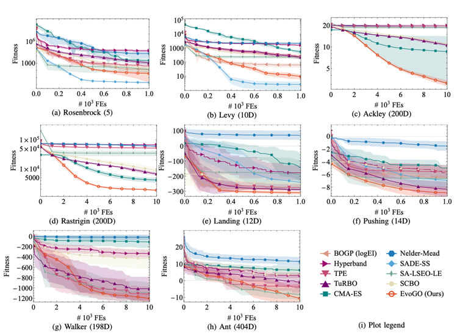
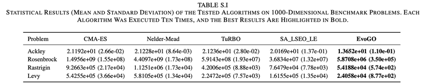
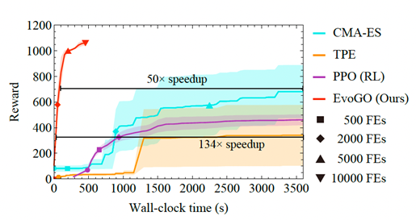
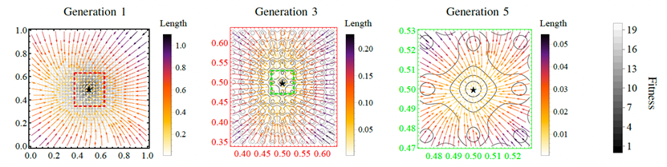
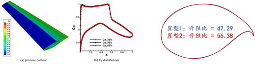
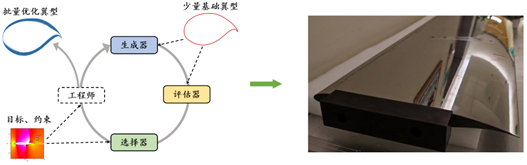
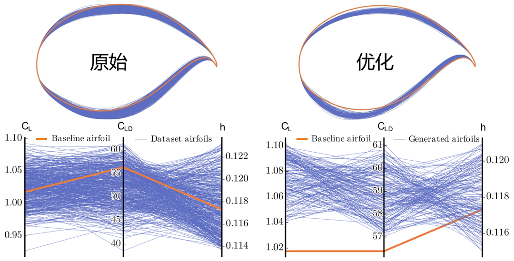

# EvoGO: Computación en GPU × Aprendizaje Generativo → Un nuevo paradigma para algoritmos evolutivos con convergencia en 10 generaciones

En los últimos años, los métodos de optimización evolutiva basados en datos han logrado avances notables. Desde los algoritmos evolutivos asistidos por sustitutos (surrogates) hasta los algoritmos evolutivos generativos, la optimización evolutiva ha pasado gradualmente de los paradigmas tradicionales basados en operadores fijos a los basados en el aprendizaje. Sin embargo, la naturaleza basada en datos de los métodos existentes sigue siendo incompleta en tres aspectos importantes. En primer lugar, la coordinación entre el mecanismo generativo y el proceso evolutivo aún depende a menudo de reglas heurísticas diseñadas manualmente. En segundo lugar, los objetivos de entrenamiento de los modelos generativos suelen heredarse de tareas de generación de propósito general y no están suficientemente alineados con los objetivos de optimización. En tercer lugar, las muestras en línea extremadamente limitadas pero muy valiosas disponibles en la optimización de caja negra aún no se han organizado sistemáticamente en una experiencia de optimización que se pueda aprender y transferir. Para abordar estos problemas, el equipo de EvoX propuso la Optimización Generativa Evolutiva (EvoGO), que organiza todo el proceso de optimización en tres etapas unificadas: preparación de datos, entrenamiento del modelo y generación de la población. El objetivo es permitir que los algoritmos de optimización aprendan directamente la ley de mejora de pasar de soluciones inferiores a superiores a partir de datos históricos. Los resultados experimentales muestran que EvoGO demuestra ventajas estables en tres categorías de tareas —optimización numérica, control clásico y control robótico de alta dimensión— abarcando 25 pruebas de referencia (benchmarks) y escalas de problemas que van desde 10 hasta 1000 dimensiones, y convergiendo en la mayoría de las tareas a gran escala en aproximadamente 10 generaciones. En tareas complejas, al combinarse con la inferencia paralela en GPU, EvoGO también muestra ventajas prácticas significativas en el tiempo de ejecución; cuando CMA-ES alcanza su rendimiento convergente, EvoGO puede lograr el mismo rendimiento de forma hasta 134 veces más rápida. Estos resultados indican que la optimización evolutiva totalmente basada en datos no solo puede lograr resultados competitivos en las pruebas de referencia estándar, sino que también abre nuevas posibilidades para un marco generativo unificado con el fin de resolver problemas complejos de optimización de caja negra de alta dimensión.

## El problema: La optimización basada en datos aún no ha dado el paso definitivo

En los últimos años, los métodos de optimización evolutiva basados en datos se han desarrollado rápidamente. Los métodos asistidos por sustitutos y los basados en modelos generativos ya han impulsado la optimización evolutiva desde la búsqueda basada en operadores fijos hacia la búsqueda basada en el aprendizaje. Esto significa que los modelos de aprendizaje han comenzado a entrar en múltiples etapas del proceso, incluyendo la evaluación, el modelado e incluso la generación.

Sin embargo, esta transformación aún está incompleta. Los métodos existentes pueden haber aprendido a "evaluar" o "generar" en diferentes niveles, pero no han aprendido realmente a "optimizar". Por un lado, la producción de la siguiente generación de soluciones candidatas sigue dependiendo a menudo de reglas heurísticas diseñadas manualmente para la coordinación. Por otro lado, el objetivo de generación y el objetivo de optimización suelen estar insuficientemente alineados. Al mismo tiempo, las muestras en línea extremadamente limitadas disponibles en la optimización de caja negra aún no se han transformado sistemáticamente en una experiencia de optimización que se pueda aprender y transferir.

Por lo tanto, lo que verdaderamente falta hoy en día no son más modelos per se, sino el paso final: permitir que los algoritmos de optimización aprendan directamente el proceso de pasar de peores soluciones a mejores a partir de datos históricos. Este es exactamente el paso que EvoGO busca impulsar.

## El avance: Cómo EvoGO reescribe el proceso de optimización

Para abordar los problemas anteriores, EvoGO no continúa por la ruta tradicional de mejorar los operadores locales como el cruce y la mutación. En su lugar, intenta reescribir todo el proceso de optimización a un nivel más holístico. Su idea central es eliminar el proceso de "cómo generar la siguiente generación de soluciones candidatas" de las reglas escritas manualmente y entregarlo a un mecanismo generativo basado en datos para que lo aprenda. Específicamente, EvoGO organiza todo el proceso de optimización en tres etapas unificadas —**preparación de datos, entrenamiento del modelo y generación de la población**— de modo que la organización de la experiencia, el aprendizaje direccional y la actualización de la población ya no estén fragmentados, sino integrados en un único bucle de optimización.

En la etapa de preparación de datos, EvoGO primero filtra muestras de alta calidad de las poblaciones históricas para construir una base de entrenamiento más confiable. Cuando las muestras son escasas, también se puede utilizar el aumento de datos aprendido para aliviar dicha escasez. Y lo que es más importante, las muestras se dividen aún más en soluciones superiores e inferiores y se organizan en relaciones emparejadas. Como resultado, lo que el modelo aprende ya no es solo una distribución estática de soluciones candidatas, sino más bien la relación direccional de pasar de soluciones inferiores a superiores.

En la etapa de entrenamiento del modelo, EvoGO adopta una estructura emparejada que consta de un modelo sustituto (surrogate model), un generador directo (forward generator) y un generador pseudoinverso (pseudo-inverse generator). El modelo sustituto proporciona una caracterización aproximada del panorama del objetivo; el generador directo aprende el mapeo de las soluciones inferiores a las superiores; y el generador pseudoinverso mantiene la estabilidad del entrenamiento mediante una restricción de consistencia de reconstrucción. A diferencia de las tareas de generación general, el objetivo de entrenamiento aquí no es simplemente ajustarse a la distribución de los datos, sino asegurar que el proceso de generación se mueva hacia regiones mejores bajo la guía del panorama del objetivo.

En la etapa de generación de la población, el modelo generativo entrenado actúa directamente sobre la población actual para producir una nueva generación de soluciones candidatas en paralelo. Estas soluciones luego son evaluadas por la función objetivo real, y el estado de la población se actualiza en consecuencia antes de entrar en la siguiente iteración. En este punto, la forma en que se realizan las actualizaciones de la población cambia fundamentalmente. La optimización evolutiva tradicional se basa principalmente en reglas de cruce, mutación y selección especificadas manualmente para explorar gradualmente el espacio de búsqueda, mientras que EvoGO convierte este proceso en un mecanismo de actualización en paralelo impulsado por datos históricos e implementado por un modelo generativo.

El paralelismo de EvoGO opera en dos niveles. Por un lado, la población puede representarse en forma tensorial, lo que permite que la generación y evaluación de los individuos se ejecute en paralelo en la GPU. Por otro lado, EvoGO también puede ejecutar múltiples modelos generativos simultáneamente en una sola GPU, lo que permite la optimización paralela en diferentes semillas aleatorias o diferentes instancias de problemas. Por lo tanto, su capacidad paralela existe tanto dentro de las poblaciones como entre múltiples poblaciones.

Desde esta perspectiva, la contribución clave de EvoGO no es simplemente la introducción de un modelo generativo, sino la unificación de la organización de muestras, la alineación de objetivos y la actualización de la población dentro de un único marco metodológico. La optimización evolutiva tradicional enfatiza la búsqueda impulsada por reglas preescritas, mientras que EvoGO va un paso más allá al intentar que el sistema aprenda el proceso de búsqueda en sí directamente a partir de datos históricos.

## Validación: Análisis de rendimiento y mecanicista

Para evaluar rigurosamente la eficacia de este nuevo paradigma totalmente basado en datos, el artículo se centra en tres preguntas clave: ¿Es EvoGO lo suficientemente potente y eficiente? ¿Cuáles son las decisiones de diseño cruciales detrás de su éxito? ¿Qué comportamiento de búsqueda inteligente exhibe?

### 1. Comparación de rendimiento: La "convergencia en 10 generaciones" lidera en las pruebas de referencia

El artículo lleva a cabo una evaluación sistemática en tres categorías de tareas —optimización numérica, control clásico y control robótico de alta dimensión— que abarcan 25 pruebas de referencia con dimensiones de problemas que van de 10 a 1000. EvoGO se compara de forma exhaustiva con la optimización bayesiana, las estrategias de evolución clásicas, los métodos heurísticos y los métodos avanzados asistidos por sustitutos.

En general, EvoGO muestra claras ventajas en la mayoría de las tareas. En particular, esta ventaja no se limita a problemas de baja dimensión o relativamente regulares. Por el contrario, a medida que aumentan la dimensionalidad del problema y la complejidad de la tarea, la ventaja de EvoGO a menudo se vuelve más pronunciada. En condiciones de baja dimensión y muestras pequeñas, algunos de los métodos asistidos por sustitutos más potentes siguen siendo muy competitivos. Pero una vez que los problemas se vuelven de alta dimensión, complejos y dependientes de la computación en paralelo, el mecanismo generativo de EvoGO puede desplegarse más plenamente, y en la mayoría de las tareas a gran escala puede converger en aproximadamente 10 generaciones. Esto sugiere que el valor de EvoGO no radica en lograr la superioridad local en un solo tipo de problema, sino en estar mejor adaptado a la utilización de la experiencia a gran escala y la búsqueda paralela requeridas por la optimización compleja de caja negra.

Esto es especialmente evidente en el entorno de control robótico de alta dimensión Hopper en Brax. Bajo el mismo presupuesto de evaluación de funciones y presupuesto de tiempo de ejecución, EvoGO supera significativamente a los algoritmos de optimización tradicionales como CMA-ES y TPE, y también supera al algoritmo de aprendizaje por refuerzo PPO, que requiere una interacción en línea con el entorno. Y lo que es más importante, gracias a la potencia de cálculo paralelo del hardware moderno, como las GPU, EvoGO puede alcanzar un alto nivel de recompensa en unos 500 segundos. Cuando CMA-ES finalmente converge a su mejor nivel de rendimiento, el tiempo real requerido por EvoGO para alcanzar el mismo rendimiento es mucho más corto, con una aceleración de hasta 134 veces. Este resultado muestra que la ventaja de EvoGO no radica simplemente en reducir el número de generaciones, sino en el hecho de que su propio proceso de búsqueda se adapta mejor a los recursos de computación en paralelo, comprimiendo las acciones de optimización que de otro modo se distribuirían en muchas generaciones en un proceso de actualización generativa de alto rendimiento.

### 2. Estudio de ablación: Analizando las claves del éxito

Para verificar la necesidad de los componentes centrales en el diseño "totalmente basado en datos" de EvoGO, el equipo de investigación llevó a cabo ablaciones sistemáticas centradas en la arquitectura generativa emparejada, el mecanismo de guía del sustituto y el diseño de objetivos orientado a la optimización. Se construyeron cinco variantes: una versión de un solo generador, una versión sin sustituto, una versión con objetivo adversarial, una versión con sustituto MLP y una versión con sustituto heurístico.

Los resultados experimentales muestran que la arquitectura generativa emparejada, el mecanismo de guía del sustituto y el diseño del objetivo orientado a la optimización son cruciales para la eficacia de EvoGO. La eliminación del generador pseudoinverso conduce a una estabilidad de convergencia notablemente peor y a una menor diversidad de la población, lo que indica que la estructura emparejada formada por la generación directa y las restricciones inversas es necesaria para mantener la estabilidad del entrenamiento y evitar el colapso de modo (mode collapse). La eliminación del modelo sustituto, o la sustitución del objetivo de optimización original por un objetivo adversarial general, también causa una degradación significativa del rendimiento, lo que demuestra que la guía del sustituto y la alineación del objetivo son fundamentales para la ventaja del método. Reemplazar el proceso gaussiano (Gaussian process) por un perceptrón multicapa (MLP) o por reglas heurísticas deja el método funcional, pero con un ligero declive general, lo que indica que EvoGO no depende de una forma específica de sustituto, aunque el modelado explícito de la incertidumbre es más beneficioso para el rendimiento. En general, las mejoras de rendimiento de EvoGO no provienen de un solo módulo, sino de la sinergia entre la arquitectura generativa emparejada, el mecanismo de guía del sustituto y el diseño del objetivo orientado a la optimización.

### 3. Visualización del comportamiento: Revelando un proceso dinámico basado en datos

Para analizar de forma más intuitiva la dinámica de búsqueda de EvoGO, el artículo presenta un experimento de visualización en la función bidimensional de Ackley, con el tamaño de la población establecido en 100. Específicamente, en diferentes generaciones evolutivas, se registran los resultados de transformación del generador directo entrenado en las soluciones de entrada; es decir, se rastrea el proceso de mapeo de las soluciones de entrada a las soluciones de salida. En la figura, las flechas representan vectores desde las soluciones de entrada a las de salida, y sus colores corresponden a las longitudes de los vectores. La estrella marca el óptimo global, y los cuadros de líneas discontinuas indican las regiones cubiertas por las soluciones generadas en diferentes generaciones. Para mayor claridad, las configuraciones de traslación y rotación del panorama de la función se omiten en esta visualización.

Los resultados de la visualización muestran que lo que EvoGO aprende no es una perturbación aleatoria sin dirección, sino un patrón de actualización que se adapta a la etapa de la búsqueda. En la etapa inicial, los vectores generados son generalmente más largos, lo que indica que el algoritmo tiende a una exploración global de gran amplitud. A medida que avanza la evolución, las longitudes de los vectores disminuyen gradualmente y las regiones generadas continúan contrayéndose, lo que demuestra que la búsqueda se desplaza hacia una explotación (exploitation) local más fina. Al mismo tiempo, los vectores en su conjunto se agrupan hacia la región óptima, lo que indica que el generador directo ya ha extraído una dirección de búsqueda con significado práctico de las muestras históricas. A nivel de comportamiento, este fenómeno respalda la propiedad central de EvoGO: no solo aprende la distribución de las soluciones candidatas, sino la ley de actualización que se mueve del estado actual hacia un estado mejor.

## Aplicación: Validación en ingeniería del ala supercrítica de un avión de fuselaje ancho

La entrega exitosa del **C919** marca un paso crucial para China en el desarrollo de grandes aviones de producción nacional. Sin embargo, como avión de pasillo único y fuselaje estrecho, el C919 sirve principalmente para rutas de corto y medio alcance, y aún se necesitan avances en el dominio de los aviones de pasajeros de fuselaje ancho. Para satisfacer las necesidades de desarrollo de la próxima generación de aviones nacionales de fuselaje ancho, **el diseño del ala supercrítica** se ha convertido en un tema clave en la optimización aerodinámica, desempeñando un papel importante en la reducción de la resistencia aerodinámica en crucero, la mejora de la eficiencia del combustible y el aumento de la estabilidad de vuelo. Por lo tanto, cómo lograr una optimización eficiente y confiable del ala supercrítica se ha convertido en un desafío técnico fundamental en el proceso de desarrollo de los aviones de fuselaje ancho en China.

Como se muestra en el artículo original, mediante la optimización de características geométricas como una cuerda más larga, una superficie superior más plana y un mayor arqueo (camber) del borde de salida, un ala supercrítica puede regular la distribución de la presión transónica, suprimir la formación de ondas de choque, reducir la resistencia de onda y mejorar la eficiencia de la sustentación. Sin embargo, su diseño óptimo se enfrenta a múltiples desafíos. Por un lado, bajo las condiciones de alto número de Reynolds de los aviones de fuselaje ancho, el diseño debe satisfacer simultáneamente restricciones aerodinámicas estrictas como la relación sustentación-resistencia (eficiencia aerodinámica), el coeficiente de sustentación y el ángulo de ataque en crucero, lo que impone requisitos de precisión extremadamente altos sobre los parámetros de forma. Por otro lado, existe una relación de acoplamiento fuertemente no lineal entre la geometría del perfil alar y el rendimiento aerodinámico, que es difícil de caracterizar con precisión para los métodos de modelado tradicionales. Además, el proceso de diseño existente depende en gran medida de la experiencia, de simulaciones CFD repetidas y de experimentos en túneles de viento, lo que conlleva altos costos computacionales, largos ciclos de desarrollo y la dificultad de acercarse efectivamente al óptimo global en un espacio de diseño de alta dimensión.

Para abordar este problema, el equipo de EvoX construyó un proceso de diseño integrado basado en EvoGO, que consta de evaluación del rendimiento, generación de perfiles alares y selección de candidatos. Sobre la base de un pequeño número de muestras históricas de perfiles alares, el método construye un modelo de evaluación del rendimiento, un modelo de generación de perfiles alares y un modelo de selección, y mejora continuamente el diseño del perfil alar a través de la evolución iterativa. Se utiliza un modelo sustituto para predecir con precisión métricas clave como la relación sustentación-resistencia, el coeficiente de sustentación y el ángulo de ataque en crucero. Al mismo tiempo, se introduce un mecanismo generativo para reemplazar la búsqueda heurística tradicional, lo que permite una aproximación eficiente al óptimo en un espacio de diseño de alta dimensión. Combinado con una estrategia de selección de candidatos, este método puede identificar rápidamente perfiles alares candidatos que satisfagan tanto las restricciones físicas como los requisitos de rendimiento aerodinámico en un vasto espacio de búsqueda, mejorando así la eficiencia del diseño.

Utilizando solo 500 muestras históricas de perfiles alares, el método logra una precisión de predicción superior al 99,5% en tres indicadores aerodinámicos clave —relación sustentación-resistencia, coeficiente de sustentación y ángulo de ataque en crucero—, y la tasa de calificación de los perfiles alares generados automáticamente supera el 95%. Estos resultados indican que los métodos de optimización evolutiva totalmente basados en datos, como EvoGO, no solo pueden tener un buen rendimiento en las pruebas de referencia estándar, sino que también están comenzando a demostrar la capacidad de proporcionar un soporte de diseño efectivo para problemas de ingeniería reales.

## Profundizando la visión: De la física a la filosofía, reinterpretando EvoGO

### Perspectiva física: Del ensayo y error desordenado a la evolución ordenada

Desde una perspectiva física, la optimización de caja negra puede entenderse como un proceso de búsqueda gradual de un estado más estable dentro de un campo de potencial real pero de observación incompleta. Para el optimizador, la función objetivo y su panorama de aptitud (fitness landscape) existen objetivamente en todo momento, pero en el momento inicial el sistema solo puede obtener conocimiento local a través de un muestreo y evaluación limitados. Por tanto, la búsqueda conlleva inherentemente una alta incertidumbre.

La optimización evolutiva tradicional depende en gran medida de la perturbación local y del ensayo y error aleatorio. Aunque puede acercarse gradualmente a mejores regiones a través del muestreo repetido y la selección, el proceso de búsqueda sigue manifestándose principalmente como una exploración local de alta entropía, y la experiencia histórica es difícil de acumular sistemáticamente. Lo que distingue a EvoGO es que organiza aún más las muestras históricas en una base de información que codifica dirección y estructura. El modelo sustituto proporciona una comprensión aproximada del panorama local del objetivo; el emparejamiento de soluciones superiores e inferiores extrae información direccional sobre cómo pasar de regiones peores a mejores; y el bucle formado por la generación directa y las restricciones inversas permite que este proceso de actualización direccional se despliegue de forma continua mientras se mantiene estable.

En términos físicos, EvoGO se parece más a un proceso en el que la estructura ordenada se forma gradualmente bajo la guía de un campo de potencial efectivo. Lo que hace no es simplemente acelerar la búsqueda, sino reducir gradualmente la incertidumbre de la búsqueda bajo una observabilidad limitada, transformando la actualización de la población de un ensayo y error desordenado a un flujo evolutivo organizado. La velocidad es solo el resultado; el cambio más profundo es que la experiencia histórica comienza a transformarse en información estructural que se puede acumular, transmitir y reutilizar.

### Perspectiva filosófica: Del "El Tao da origen a todas las cosas" a la generación de leyes

Desde una perspectiva filosófica, lo que es aún más digno de destacar de EvoGO es que encarna un proceso generativo que pasa de la experiencia al orden, y de lo local a lo global. Este proceso puede resumirse a través de la frase clásica: **"El Tao da origen al Uno, el Uno da origen al Dos, el Dos da origen al Tres, y el Tres da origen a todas las cosas."**

El **"Tao"** corresponde a la verdadera ley del problema en cuestión, que existe objetivamente pero que no se puede captar por completo. En la optimización, la solución óptima no está prescrita subjetivamente por el algoritmo; por el contrario, siempre está latente dentro de la función objetivo real y su panorama de aptitud. Lo que puede hacer el algoritmo no es crear el Tao, sino acercarse continuamente a él.

El **"Uno"** corresponde a la estructura unificada que se extrae de la experiencia desordenada. Inicialmente, las muestras históricas no son más que rastros dispersos de búsqueda; no constituyen automáticamente conocimiento. Solo cuando estas muestras se ordenan, filtran y organizan, la experiencia comienza a pasar del desorden a un todo que se puede aprender. Este es el significado de "dar origen al Uno".

El **"Dos"** corresponde a la diferenciación: al surgimiento de la dirección. La división entre soluciones superiores e inferiores no representa meramente la distinción entre lo bueno y lo malo; más importante aún, marca la primera vez que el sistema adquiere un sentido de dirección a partir de la experiencia. Sin esta diferenciación, la experiencia simplemente se acumula; con ella, la experiencia adquiere tensión evolutiva.

El **"Tres"** corresponde al cierre: a la generación de relaciones. Cuando el conocimiento objetivo, la progresión hacia adelante y la restricción hacia atrás forman conjuntamente un sistema autoconsistente, la optimización ya no es un collage de operaciones locales, sino que comienza a tomar forma como un mecanismo integral capaz de automantenimiento y autocorrección. En este punto, el método adquiere verdaderamente la capacidad de generar continuamente nuevas soluciones.

**"Todas las cosas"** corresponden entonces a las nuevas poblaciones y las nuevas soluciones candidatas que surgen continuamente sobre este orden generativo. No se producen a ciegas, sino que surgen continuamente bajo la dirección, estructura y restricciones de bucle cerrado ya formadas. Precisamente por esta razón, lo que EvoGO avanza no es meramente la capacidad de "encontrar mejores soluciones más rápido", sino una nueva capacidad para que la optimización evolutiva genere leyes a partir de la experiencia, y luego genere soluciones continuamente a partir de esas leyes.

El significado filosófico de EvoGO no radica en simplemente sustituir a los operadores tradicionales. Más bien, radica en mostrar más claramente que la optimización no tiene que avanzarse solo a través de reglas preescritas; a través de la acumulación, diferenciación y organización de la experiencia, puede formar gradualmente su propio orden generativo.

## Conclusión y perspectivas

En lo que se centra EvoGO no es solo en una mejora local del proceso de optimización evolutiva tradicional, sino en una reconstrucción más fundamental de cómo ocurre la optimización en sí misma. Al organizar la optimización en las tres etapas unificadas de preparación de datos, entrenamiento del modelo y generación de la población, y al introducir la construcción direccional de datos basada en el emparejamiento superior-inferior, una arquitectura generativa emparejada guiada por un sustituto y un mecanismo de generación de población paralela, EvoGO demuestra ventajas estables tanto en rendimiento como en eficiencia en las pruebas de referencia estándar. Al mismo tiempo, también ha validado su potencial para problemas de ingeniería reales y complejos a través del diseño de optimización del ala supercrítica de aviones de pasajeros de fuselaje ancho de próxima generación. A un nivel más alto, la importancia de este trabajo radica en demostrar que la optimización evolutiva no tiene que permanecer necesariamente confinada a reglas heurísticas especificadas manualmente. El proceso de optimización en sí mismo puede destilarse progresivamente de la experiencia histórica como una ley que se puede aprender.

## Código abierto / Comunidad

- **Artículo científico:**  
  https://arxiv.org/abs/2602.01147
- **GitHub:**  
  https://github.com/EMI-Group/evogo
- **Proyecto original (EvoX):**  
  https://github.com/EMI-Group/evox
- **Grupo QQ:** `297969717`
- **Cuenta oficial de WeChat:** Evolutionary Machine Intelligence

EvoGO se basa en el marco EvoX. Si estás interesado en EvoX, te invitamos a consultar los artículos (https://mp.weixin.qq.com/s/uT6qSqiWiqevPRRTAVIusQ) en la cuenta pública de EvoX para obtener más detalles.
