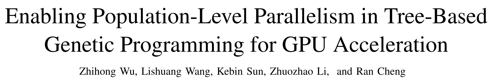
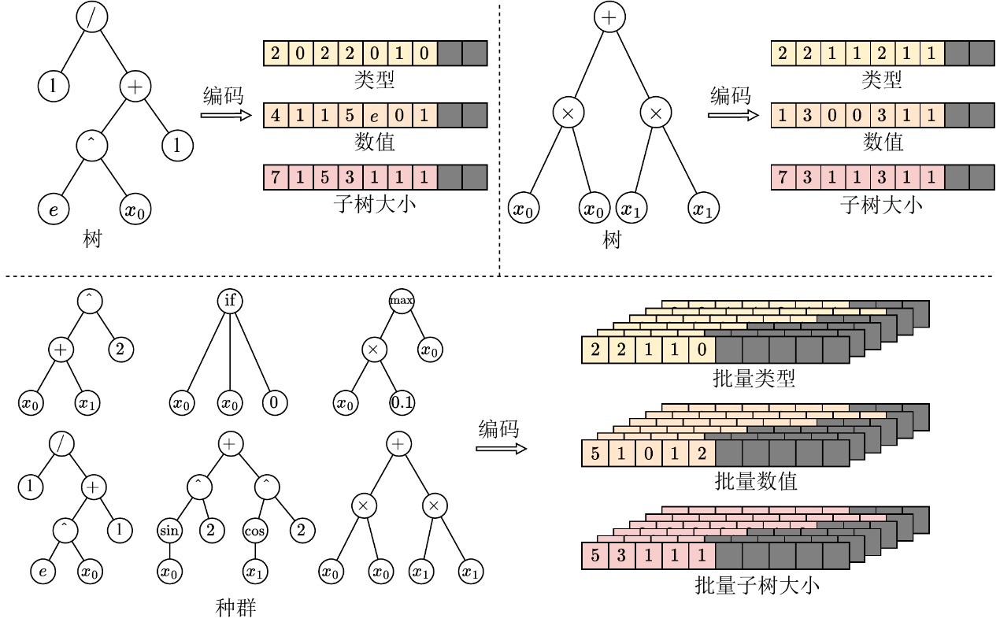
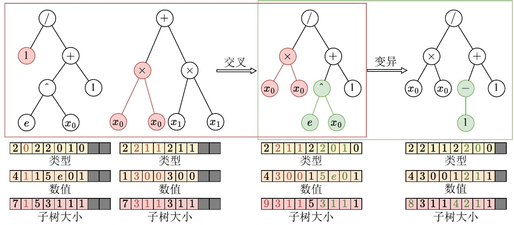
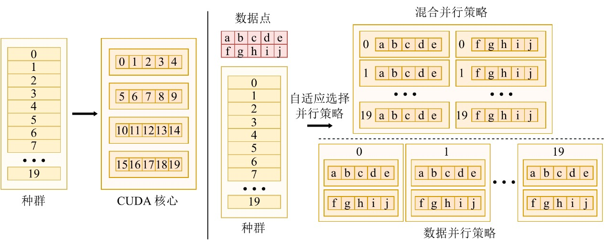
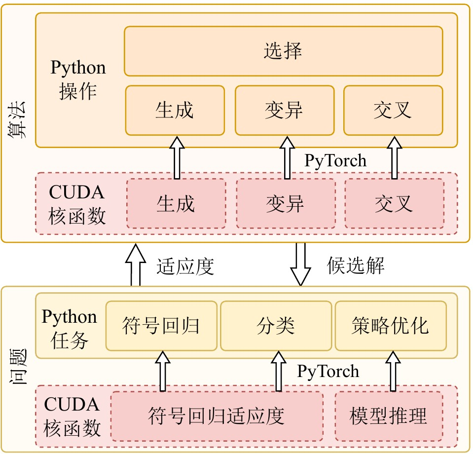
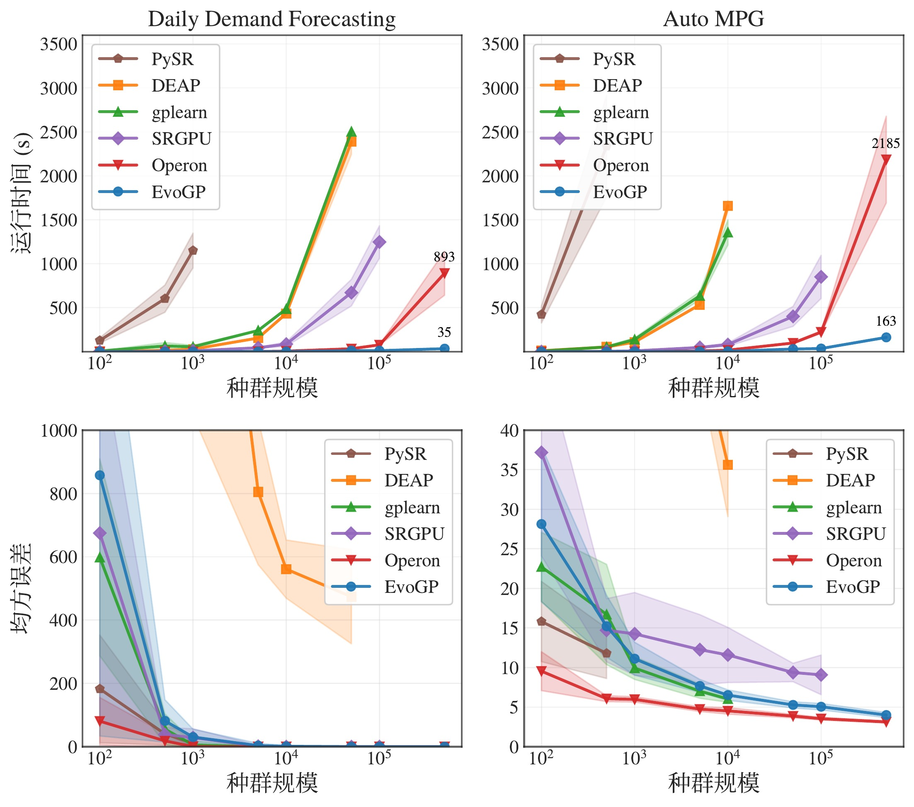
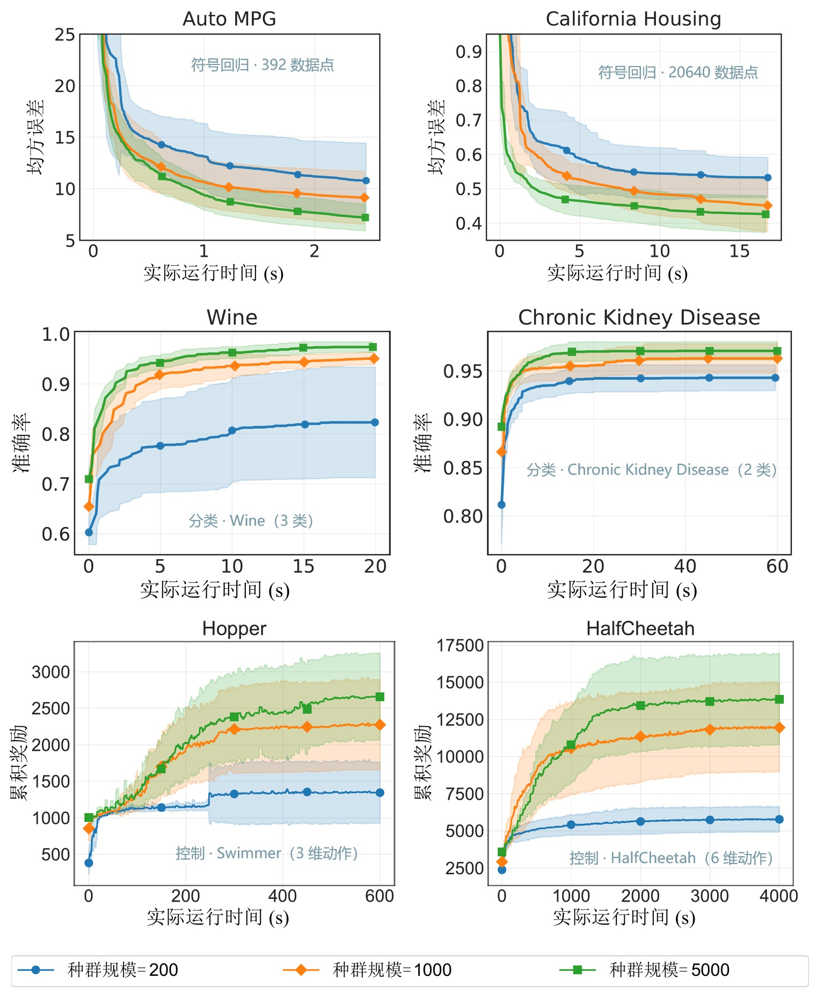

La programación genética es un método evolutivo que combina búsqueda estructural con interpretabilidad. Ofrece ventajas únicas en tareas como regresión simbólica, clasificación y control: no solo optimiza parámetros, sino que también busca y produce directamente expresiones de programa analizables. Sin embargo, debido a la heterogeneidad de las estructuras individuales y a las rutas de ejecución irregulares, **la mayoría de las implementaciones existentes de programación genética siguen confinadas a la ejecución en CPU y llevan mucho tiempo sin lograr adaptarse de verdad a las GPU.** Esto limita directamente la eficiencia computacional y dificulta el tratamiento de conjuntos de datos masivos o entornos de simulación complejos en las aplicaciones actuales.

Para abordar este reto, **proponemos el framework EvoGP, reorganizando desde cero la representación de árboles, la lógica de los operadores genéticos y los mecanismos de ejecución paralela.** Los resultados experimentales muestran que **EvoGP alcanza un rendimiento computacional pico superior a 10^11 GPops/s, permitiendo evaluar rápidamente poblaciones de 500.000 individuos en un segundo —hasta 304× más rápido que las implementaciones GPU existentes.** Este hito marca una ruptura definitiva con las barreras de adaptación al hardware e inaugura la programación genética en la era de la computación de alto rendimiento acelerada por GPU.

**El reto de la adaptación a GPU en la programación genética**

En los últimos años, las GPU se han convertido en una infraestructura crítica para la computación inteligente de alto rendimiento, gracias a su paralelismo masivo y su alto rendimiento. Sin embargo, la programación genética no ha logrado aprovechar plenamente esta ventaja hardware. El obstáculo principal reside en la ausencia de métodos de representación y ejecución alineados con las arquitecturas hardware modernas. El modelo de ejecución Single Instruction, Multiple Threads (SIMT) de la GPU destaca en el procesamiento de datos regulares, uniformes y susceptibles de procesamiento por lotes. Los individuos de programación genética, en cambio, presentan una heterogeneidad estructural significativa: tamaños de árbol, topologías y lógica de evaluación variables. Una vez colocados en una GPU, estas estructuras exponen de inmediato problemas como acceso a memoria no contiguo, asignación dinámica de memoria ineficiente y grave divergencia de hilos.

Al mismo tiempo, para liberar de verdad la potencia de cómputo de la GPU, un sistema debe gestionar tanto el paralelismo a nivel de datos dentro de cada árbol como el paralelismo a nivel de individuo en toda la población. Unificar ambos modos bajo una única estrategia de planificación, optimizar el diseño de memoria y evitar la contención de recursos constituye un formidable reto de ingeniería de sistemas. Muchas implementaciones anteriores, por fallos de diseño fundamentales, explotaban solo el paralelismo a nivel de datos, dejando gran parte de la capacidad concurrente de la GPU sin uso. **EvoGP aborda este problema de raíz: en lugar de forzar a la programación genética a ejecutarse apenas en GPU, ofrece una arquitectura subyacente diseñada a medida que convierte la programación genética en un framework de cómputo verdaderamente preparado para la era de la GPU.**

**Representación tensorizada de estructuras en árbol**

Para llevar la programación genética a la era de la GPU, la primera tarea es eliminar la barrera de heterogeneidad de las estructuras individuales. Las estructuras en árbol tradicionales basadas en punteros o listas enlazadas producen diseños de memoria muy irregulares que bloquean por completo la ejecución por lotes en GPU. Con este fin, **EvoGP introduce una representación tensorizada innovadora, empleando un esquema de codificación lineal en prefijo para codificar las estructuras en árbol como arrays contiguos que contienen tipos de nodo, valores de nodo y tamaños de subárbol.**

Para gestionar árboles de distinto tamaño, **EvoGP introduce una restricción de longitud máxima permitida y utiliza valores NaN para el relleno y la alineación.** Mediante esta conversión, EvoGP transforma con éxito individuos morfológicamente diversos de una población en matrices tensoriales de forma fija y memoria alineada. Esta tensorización elimina la sobrecarga de la asignación dinámica de memoria y de la indexación irregular, garantizando que la GPU pueda realizar acceso uniforme a memoria y cómputo concurrente de alto rendimiento —la base sobre la que todo el framework entra en la era de la GPU.

Figura 1: Representación tensorizada de estructuras en árbol. EvoGP codifica los árboles en una representación por lotes unificada, permitiendo un procesamiento eficiente en GPU de individuos de programa con estructuras diversas.

**Refactorización unificada de los operadores genéticos**

Tras completar la representación tensorizada de las estructuras en árbol, EvoGP refactoriza además los operadores genéticos para alinearlos con la arquitectura GPU en el nivel más bajo. En las representaciones en árbol tradicionales, las modificaciones estructurales como el crossover o la mutación suelen requerir un análisis repetido de secuencias para determinar los límites de subárbol, con una complejidad temporal *O*(n) que hace la ejecución en GPU muy ineficiente. Gracias a los arrays de tamaño de subárbol explícitamente conservados en la codificación tensorizada, el sistema puede acceder directamente a los límites de subárbol en tiempo *O*(1), eliminando por completo el costoso análisis estructural.

Sobre esta base, **EvoGP extrae los elementos comunes estructurales de diversos operadores genéticos basados en árboles —como el crossover de un punto y la mutación de subárbol— y los unifica en una única primitiva computacional central: el intercambio de subárboles.** Esto transforma la evolución estructural compleja en operaciones altamente regulares de segmentación de memoria y concatenación de tensores. Esta refactorización reduce significativamente la sobrecarga de flujo de control durante la ejecución paralela, convirtiendo el proceso evolutivo central de la programación genética en una forma de cómputo bien adaptada al hardware moderno de alto rendimiento.

Figura 2: Operaciones unificadas de crossover/mutación. EvoGP unifica múltiples operadores genéticos basados en árboles bajo un único mecanismo subyacente, haciendo que el proceso evolutivo central se adapte mejor a la ejecución paralela en GPU.

**Conmutación adaptativa de estrategias paralelas**

Para prosperar en la era de la GPU, un algoritmo debe ser capaz de extraer la máxima potencia de cómputo del hardware. Las escalas de datos varían drásticamente entre tareas, y una única estrategia paralela no puede mantener una utilización estable del dispositivo. Con este fin, **EvoGP diseña e implementa una estrategia paralela adaptativa que combina dinámicamente el paralelismo intra-individuo e inter-individuo según el tamaño del conjunto de datos.**

Al procesar conjuntos de datos de pequeño a mediano tamaño, el sistema adopta un modo paralelo híbrido que combina el paralelismo a nivel de datos y de población en un único kernel de cómputo, de modo que cuando la carga de trabajo por individuo es insuficiente, la concurrencia a nivel de población ocupa los núcleos GPU inactivos. Para conjuntos de datos a gran escala, una sola tarea de evaluación puede saturar el hardware, y el sistema conmuta automáticamente al modo de paralelismo puro de datos, lanzando kernels de cómputo independientes para la evaluación de cada individuo y cargando las estructuras en árbol en memoria constante de solo lectura, maximizando la eficiencia de difusión de memoria y mejorando significativamente el rendimiento de acceso a memoria. Este mecanismo adaptativo garantiza que el sistema mantenga una eficiencia computacional extremadamente alta en cargas de trabajo diversas, sirviendo como garantía central del framework de aceleración GPU.

Figura 3: Mecanismo paralelo adaptativo. EvoGP conmuta automáticamente entre distintos modos paralelos según la escala de la tarea para mantener una mayor eficiencia computacional.

**Unificación de alto rendimiento y usabilidad**

La vitalidad de un framework de computación de alto rendimiento reside no solo en la velocidad subyacente, sino también en la compatibilidad con el ecosistema y la facilidad de uso. Muchas aplicaciones prácticas se despliegan en ecosistemas basados en Python como OpenAI Gym, MuJoCo, Brax y Genesis. **Sin dejar de perseguir una aceleración GPU extrema, EvoGP logra una integración fluida con los ecosistemas de desarrollo existentes al incrustar kernels CUDA de alto rendimiento personalizados como operadores personalizados dentro del runtime de PyTorch.**

Además, para aprovechar plenamente las ventajas de la arquitectura GPU, **EvoGP adopta un modelo totalmente residente en GPU, garantizando que los datos de población y los contextos de evaluación se mantengan íntegramente en la GPU, eliminando por completo la costosa sobrecarga de transferencia host-dispositivo habitual en los frameworks tradicionales.** Esta filosofía de diseño zero-copy permite que EvoGP se integre de forma natural y eficiente con entornos modernos de aprendizaje por refuerzo acelerados por GPU, ofreciendo capacidades de simulación paralela eficientes de extremo a extremo como un sistema completo que equilibra rendimiento extremo y alta escalabilidad.

Figura 4: Arquitectura general. EvoGP no es un módulo de aceleración aislado, sino un framework completo que equilibra el rendimiento subyacente con la usabilidad de capa superior.

**Desbloqueo del rendimiento a gran escala de población**

Superar los cuellos de botella de cómputo amplía directamente los límites de búsqueda de los algoritmos evolutivos, permitiendo que la programación genética se beneficie de verdad de la era de la GPU. En el pasado, configuraciones de población ultragrandes solían ser poco prácticas por el coste computacional prohibitivo. Bajo el mecanismo de paralelismo a nivel de población de rendimiento extremadamente alto de EvoGP, procesar un número masivo de individuos se ha vuelto genuinamente viable en la práctica.

Las pruebas de referencia principales muestran que el rendimiento pico de EvoGP supera 10^11 GPops/s, demostrando una velocidad asombrosa bajo concurrencia masiva —completando la evaluación exhaustiva de poblaciones de hasta 500.000 individuos en solo un segundo. En tiempo de ejecución, establece una ventaja decisiva respecto a las implementaciones GPU existentes. Más críticamente, en pruebas de población a gran escala, el algoritmo exhibe una excelente escalabilidad: en la convergencia del error de regresión simbólica, la mejora de la precisión de clasificación y las recompensas acumuladas en tareas de control robótico, poblaciones mayores producen sistemáticamente un mejor rendimiento final. Esto demuestra que EvoGP libera no solo velocidad computacional, sino que permite que poblaciones mayores alcancen soluciones de mayor calidad en menos tiempo de reloj, elevando fundamentalmente el potencial de búsqueda y el techo de capacidad de los métodos de programación genética.

Figura 5: Comparación global de rendimiento. EvoGP logra ventajas de rendimiento significativas en múltiples configuraciones de tareas manteniendo una calidad de resultados estable.

Figura 6: Rendimiento en distintas escalas de población. EvoGP hace que tamaños de población mayores sean prácticamente utilizables en un tiempo aceptable y desbloquea un mayor potencial de búsqueda.

**Conclusión**

**El framework EvoGP responde de forma sistemática a la cuestión de cómo la programación genética puede utilizar eficazmente las arquitecturas GPU modernas.** No es un simple parche sobre implementaciones existentes, sino que logra innovaciones fundamentales en el diseño subyacente mediante representación tensorizada, refactorización de operadores y paralelismo adaptativo, abriendo por completo el camino para que la programación genética entre en los sistemas de computación de alto rendimiento. **Este trabajo no solo demuestra la vitalidad perdurable de los métodos evolutivos clásicos en la era del cómputo, sino que también ofrece una solución a nivel de sistema altamente escalable para el aprendizaje automático interpretable y la toma de decisiones de agentes autónomos, marcando la verdadera entrada de la programación genética en la era acelerada por GPU.**

**Código abierto / Comunidad**

📄 Artículo:

https://ieeexplore.ieee.org/document/11390710

🔗 GitHub:

https://github.com/EMI-Group/evogp

🔼 Proyecto upstream (EvoX):

https://github.com/EMI-Group/evox

🌐 Grupo QQ: 297969717

**Grupo QQ |** Evolutionary Machine Intelligence

