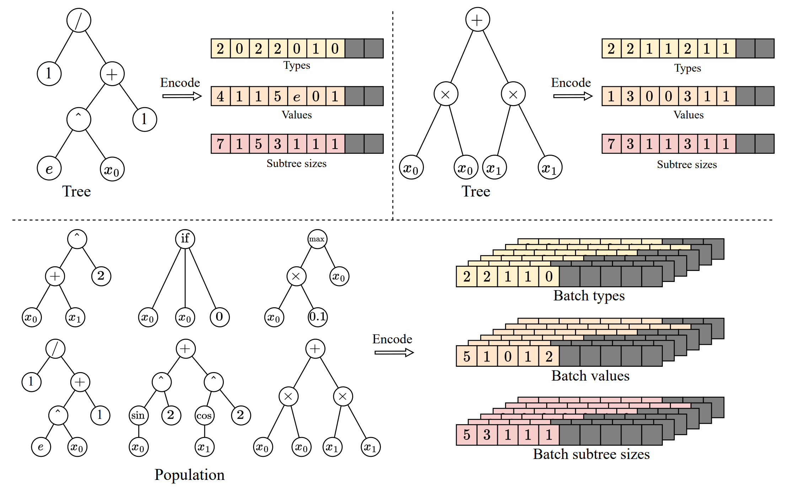
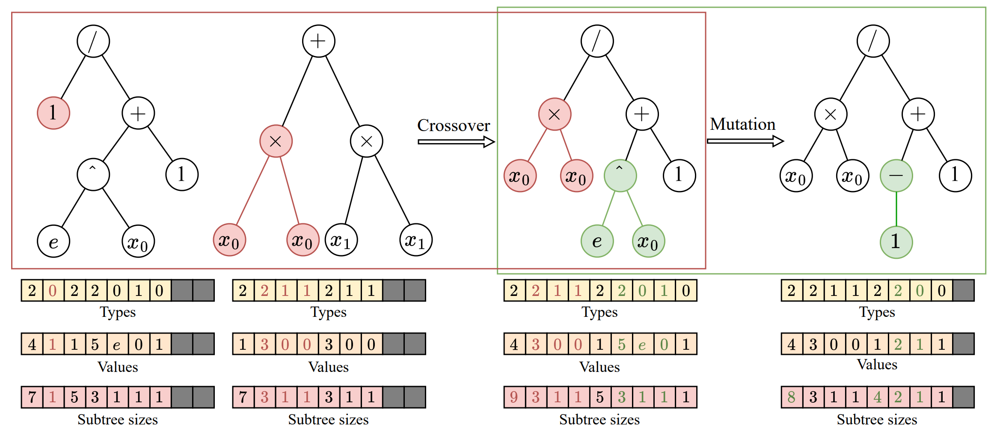
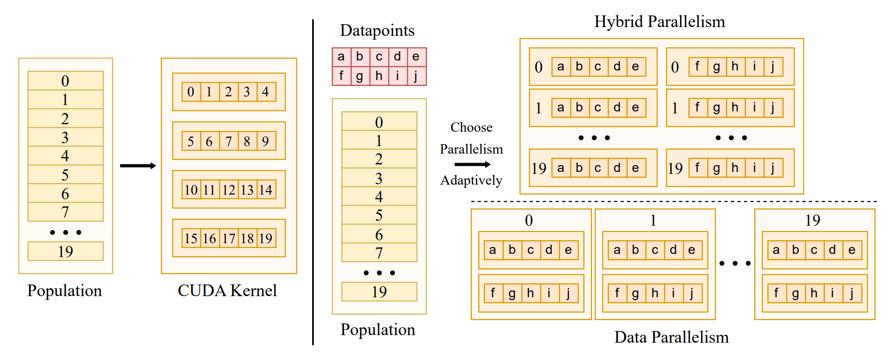
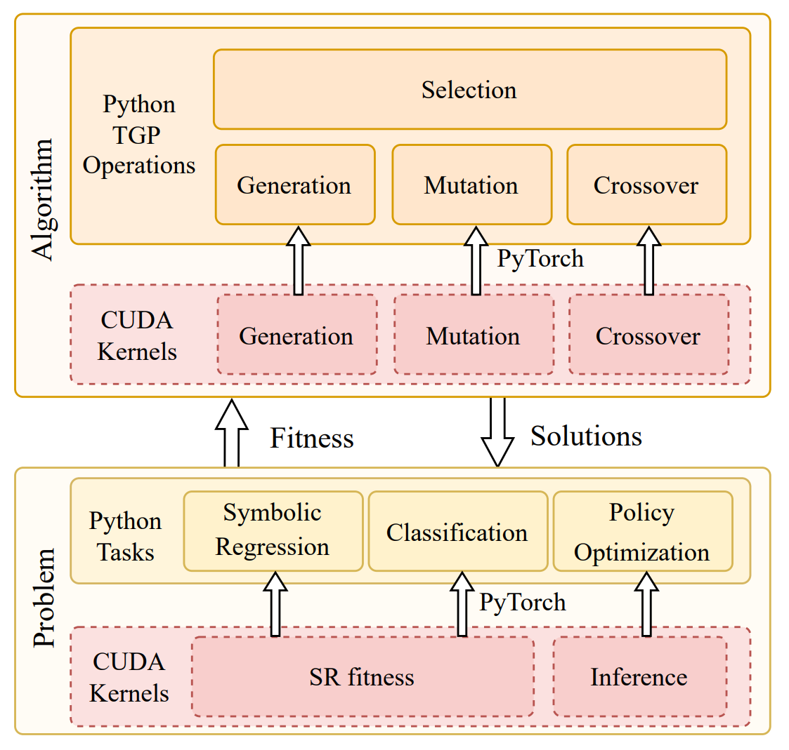
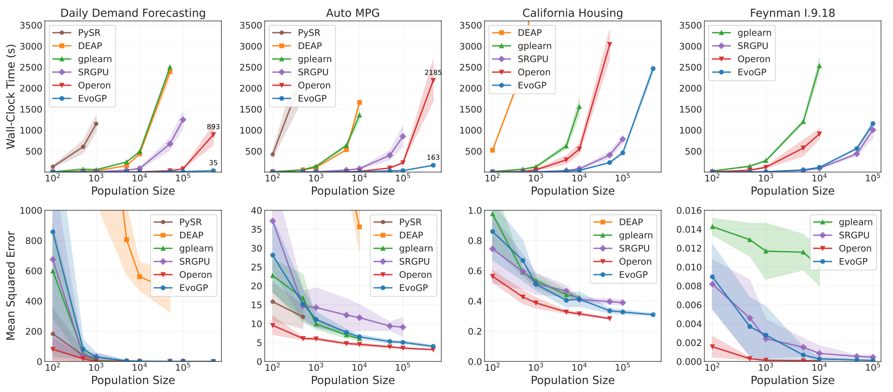
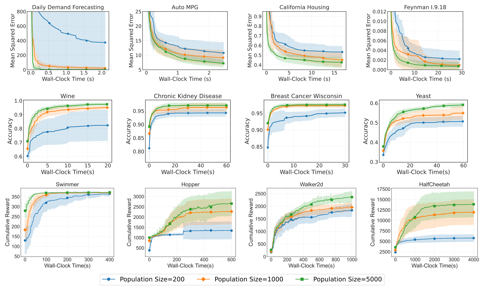

---
title: "EvoGP: un framework GPU nativo per la programmazione genetica ad albero a 10^11 GPops/s"
pubDate: 2026-06-02
summary: "EvoGP riorganizza da zero la rappresentazione ad albero, gli operatori genetici e l'esecuzione parallela, raggiungendo un throughput di picco superiore a 10^11 GPops/s e un'accelerazione fino a 304× rispetto alle implementazioni GPU esistenti."
---

La programmazione genetica è un metodo evolutivo che combina ricerca strutturale e interpretabilità. Offre vantaggi unici in compiti come regressione simbolica, classificazione e controllo — non solo ottimizzando parametri, ma anche cercando e producendo direttamente espressioni di programma analizzabili. Tuttavia, a causa dell'eterogeneità delle strutture individuali e dei percorsi di esecuzione irregolari, **la maggior parte delle implementazioni esistenti di programmazione genetica resta confinata all'esecuzione su CPU e da tempo fatica ad adattarsi veramente alle GPU.** Ciò limita direttamente l'efficienza computazionale e rende difficile gestire dataset massivi o ambienti di simulazione complessi nelle applicazioni moderne.

Per affrontare questa sfida, **proponiamo il framework EvoGP, riorganizzando da zero la rappresentazione ad albero, la logica degli operatori genetici e i meccanismi di esecuzione parallela.** I risultati sperimentali mostrano che **EvoGP raggiunge un throughput computazionale di picco superiore a 10^11 GPops/s, consentendo la valutazione rapida di popolazioni di 500.000 individui in meno di un secondo — fino a 304× più veloce delle implementazioni GPU esistenti.** Questo traguardo segna una rottura definitiva con le barriere di adattamento hardware e introduce la programmazione genetica nell'era del calcolo ad alte prestazioni accelerato da GPU.

**La sfida dell'adattamento GPU nella programmazione genetica**

Negli ultimi anni, le GPU sono diventate un'infrastruttura critica per il calcolo intelligente ad alte prestazioni, grazie al loro massiccio parallelismo e all'elevato throughput. Eppure la programmazione genetica non è riuscita a sfruttare appieno questo vantaggio hardware. L'ostacolo principale risiede nella mancanza di metodi di rappresentazione ed esecuzione allineati alle architetture hardware moderne. Il modello di esecuzione Single Instruction, Multiple Threads (SIMT) delle GPU eccelle nel processare dati regolari, uniformi e trattabili in batch. Gli individui nella programmazione genetica, al contrario, presentano un'eterogeneità strutturale significativa — dimensioni degli alberi, topologie e logiche di valutazione variabili. Una volta collocati su una GPU, queste strutture rivelano immediatamente problemi come accesso alla memoria non contiguo, allocazione dinamica inefficiente e grave divergenza dei thread.

Allo stesso tempo, per liberare veramente la potenza di calcolo delle GPU, un sistema deve gestire sia il parallelismo a livello di dati all'interno dei singoli alberi sia il parallelismo a livello di individui nell'intera popolazione. Unificare queste due modalità sotto un'unica strategia di scheduling, ottimizzare il layout della memoria e prevenire la contesa delle risorse costituiscono una formidabile sfida di ingegneria dei sistemi. Molte implementazioni passate, a causa di difetti progettuali fondamentali, sfruttavano solo il parallelismo a livello di dati, lasciando inattiva gran parte della capacità concorrente delle GPU. **EvoGP affronta questo problema di fondo: invece di far funzionare a malapena la programmazione genetica sulle GPU, fornisce un'architettura sottostante dedicata che la rende un framework di calcolo veramente pronto per l'era GPU.**

**Rappresentazione tensorizzata delle strutture ad albero**

Per portare la programmazione genetica nell'era GPU, il primo compito è eliminare la barriera di eterogeneità delle strutture individuali. Le strutture ad albero tradizionali basate su puntatori o liste collegate producono layout di memoria altamente irregolari che bloccano completamente l'esecuzione in batch su GPU. A tal fine, **EvoGP introduce una rappresentazione tensorizzata innovativa, utilizzando uno schema di codifica lineare a prefisso per codificare le strutture ad albero come array contigui contenenti tipi di nodo, valori di nodo e dimensioni dei sottoalberi.**

Per gestire alberi di dimensioni diverse, **EvoGP introduce un vincolo di lunghezza massima consentita e utilizza valori NaN per l'allineamento mediante padding.** Attraverso questa conversione, EvoGP trasforma con successo individui morfologicamente diversi in una popolazione in matrici tensoriali a forma fissa e allineate in memoria. Questa tensorizzazione elimina l'overhead dell'allocazione dinamica della memoria e dell'indicizzazione irregolare, garantendo che la GPU possa eseguire accesso uniforme alla memoria e calcolo concorrente ad alto throughput — ponendo le basi per l'ingresso dell'intero framework nell'era GPU.

Figura 1: Rappresentazione tensorizzata delle strutture ad albero. EvoGP codifica gli alberi in una rappresentazione batch unificata, consentendo un'elaborazione efficiente su GPU di individui di programma con strutture diverse.

**Refactoring unificato degli operatori genetici**

Dopo aver completato la rappresentazione tensorizzata delle strutture ad albero, EvoGP refactorizza ulteriormente gli operatori genetici per allinearli al livello più basso all'architettura GPU. Nelle rappresentazioni ad albero tradizionali, modifiche strutturali come crossover o mutazione richiedono tipicamente un parsing ripetuto delle sequenze per determinare i confini dei sottoalberi, con complessità temporale *O*(n) e rendendo l'esecuzione su GPU altamente inefficiente. Grazie agli array di dimensioni dei sottoalberi esplicitamente conservati nella codifica tensorizzata, il sistema può ora accedere direttamente ai confini dei sottoalberi in *O*(1), eliminando completamente il costoso parsing strutturale.

Sfruttando questo vantaggio, **EvoGP estrae le somiglianze strutturali di vari operatori genetici ad albero — come crossover a un punto e mutazione di sottoalbero — e li unifica in un'unica primitiva computazionale fondamentale: lo scambio di sottoalberi.** Ciò trasforma l'evoluzione strutturale complessa in operazioni altamente regolari di slicing della memoria e concatenazione di tensori. Questo refactoring riduce significativamente l'overhead del flusso di controllo durante l'esecuzione parallela, rendendo il processo evolutivo centrale della programmazione genetica una forma di calcolo ben adatta all'hardware ad alto throughput moderno.

Figura 2: Operazioni unificate di crossover/mutazione. EvoGP unifica più operatori genetici ad albero sotto un unico meccanismo sottostante, rendendo il processo evolutivo centrale più adatto all'esecuzione parallela su GPU.

**Commutazione adattiva delle strategie parallele**

Per prosperare nell'era GPU, un algoritmo deve essere in grado di estrarre la massima potenza di calcolo hardware. Le scale dei dati variano drasticamente tra i compiti, e una singola strategia parallela non può mantenere un'utilizzazione stabile del dispositivo. A tal fine, **EvoGP progetta e implementa una strategia parallela adattiva che combina dinamicamente parallelismo intra-individuo e inter-individuo in base alla dimensione del dataset.**

Quando si elaborano dataset di piccole e medie dimensioni, il sistema adotta una modalità parallela ibrida, combinando parallelismo a livello di dati e di popolazione all'interno di un singolo kernel di calcolo — garantendo che quando i carichi di lavoro individuali sono insufficienti, la concorrenza a livello di popolazione riempia i core GPU inattivi. Per dataset su larga scala, un singolo compito di valutazione può saturare l'hardware, e il sistema passa automaticamente alla modalità puramente data-parallela, avviando kernel di calcolo indipendenti per la valutazione di ciascun individuo e caricando le strutture ad albero in memoria costante di sola lettura — massimizzando l'efficienza di broadcast della memoria e migliorando significativamente il throughput di accesso alla memoria. Questo meccanismo adattivo garantisce che il sistema mantenga un'efficienza computazionale estremamente elevata su carichi di lavoro diversi, fungendo da garanzia centrale del framework di accelerazione GPU.

Figura 3: Meccanismo parallelo adattivo. EvoGP passa automaticamente tra diverse modalità parallele in base alla scala del compito per mantenere un'efficienza computazionale più elevata.

**Unire alte prestazioni e usabilità**

La vitalità di un framework di calcolo ad alte prestazioni risiede non solo nella velocità sottostante, ma anche nella compatibilità con l'ecosistema e nella facilità d'uso. Molte applicazioni pratiche sono distribuite in ecosistemi basati su Python come OpenAI Gym, MuJoCo, Brax e Genesis. **Pur perseguendo un'estrema accelerazione GPU, EvoGP raggiunge un'integrazione fluida con gli ecosistemi di sviluppo esistenti incorporando kernel di calcolo CUDA ad alte prestazioni personalizzati come operatori custom all'interno del runtime PyTorch.**

Inoltre, per sfruttare appieno i vantaggi dell'architettura GPU, **EvoGP adotta un modello completamente residente su GPU, garantendo che i dati della popolazione e i contesti di valutazione siano mantenuti interamente sulla GPU — eliminando completamente il costoso overhead di trasferimento dati host-device comune nei framework tradizionali.** Questa filosofia di progettazione zero-copy consente a EvoGP di integrarsi in modo naturale ed efficiente con gli ambienti moderni di reinforcement learning accelerati da GPU, fornendo capacità di simulazione parallela end-to-end efficienti come sistema completo che bilancia prestazioni estreme e alta scalabilità.

Figura 4: Architettura complessiva. EvoGP non è un modulo di accelerazione isolato, ma un framework completo che bilancia le prestazioni sottostanti con l'usabilità del livello superiore.

**Sbloccare le prestazioni su larga scala di popolazione**

Superare i colli di bottiglia computazionali espande direttamente i confini di ricerca degli algoritmi evolutivi, consentendo alla programmazione genetica di beneficiare veramente dell'era GPU. In passato, configurazioni di popolazione ultra-grandi erano spesso impraticabili a causa di costi computazionali proibitivi. Sotto il meccanismo parallelo a livello di popolazione ad altissimo throughput di EvoGP, l'elaborazione di numeri massicci di individui è diventata genuinamente fattibile in pratica.

I test di benchmark principali mostrano che il throughput di picco di EvoGP supera 10^11 GPops/s, dimostrando una velocità sorprendente sotto massiccia concorrenza — completando la valutazione completa di popolazioni fino a 500.000 individui in un solo secondo. Nel runtime stabilisce un vantaggio decisivo rispetto alle implementazioni GPU esistenti. Ancora più critico, nei test su larga scala di popolazione, l'algoritmo mostra un'eccellente scalabilità: sulla convergenza dell'errore in regressione simbolica, sul miglioramento dell'accuratezza in classificazione e sulle ricompense cumulative nei compiti di controllo robotico, popolazioni più grandi producono costantemente prestazioni finali migliori. Ciò dimostra che EvoGP libera non solo la velocità computazionale — consente a popolazioni più grandi di raggiungere soluzioni di qualità superiore in un tempo di esecuzione più breve, elevando fondamentalmente il potenziale di ricerca e il limite di capacità dei metodi di programmazione genetica.

Figura 5: Confronto complessivo delle prestazioni. EvoGP ottiene significativi vantaggi di prestazione su più configurazioni di compiti mantenendo una qualità dei risultati stabile.

Figura 6: Prestazioni su diverse scale di popolazione. EvoGP rende dimensioni di popolazione maggiori praticamente utilizzabili entro tempi accettabili e sblocca un potenziale di ricerca più forte.

**Conclusione**

**Il framework EvoGP risponde sistematicamente alla domanda di come la programmazione genetica possa utilizzare efficacemente le architetture GPU moderne.** Non è una semplice patch alle implementazioni esistenti, ma realizza innovazioni fondamentali nel design sottostante attraverso rappresentazione tensorizzata, refactoring degli operatori e parallelismo adattivo — aprendo completamente la strada all'ingresso della programmazione genetica nei sistemi di calcolo ad alte prestazioni. **Questo lavoro dimostra non solo la duratura vitalità dei metodi evolutivi classici nell'era del calcolo, ma fornisce anche una soluzione a livello di sistema altamente scalabile per il machine learning interpretabile e il processo decisionale di agenti autonomi — segnando la vera entrata della programmazione genetica nell'era accelerata da GPU.**

**Open Source / Community**

📄 Paper:

https://ieeexplore.ieee.org/document/11390710

🔗 GitHub:

https://github.com/EMI-Group/evogp

🔼 Upstream Project (EvoX):

https://github.com/EMI-Group/evox

🌐 QQ Group: 297969717

**QQ Group |** Evolutionary Machine Intelligence

