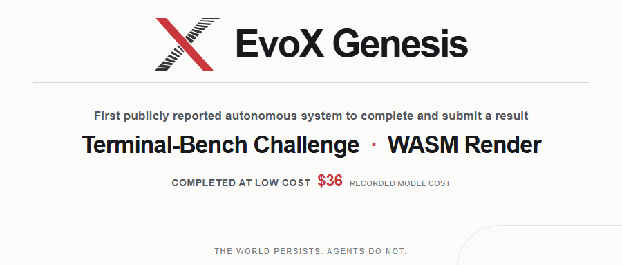
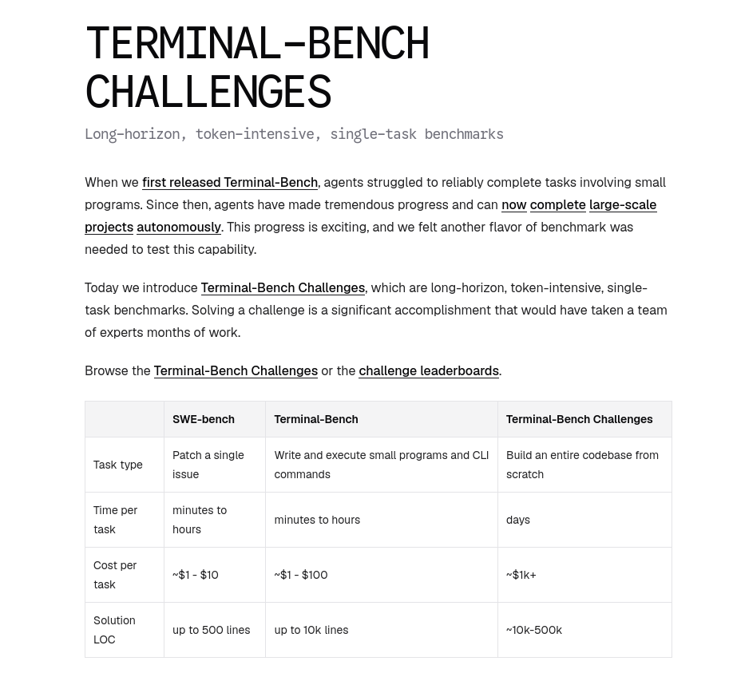
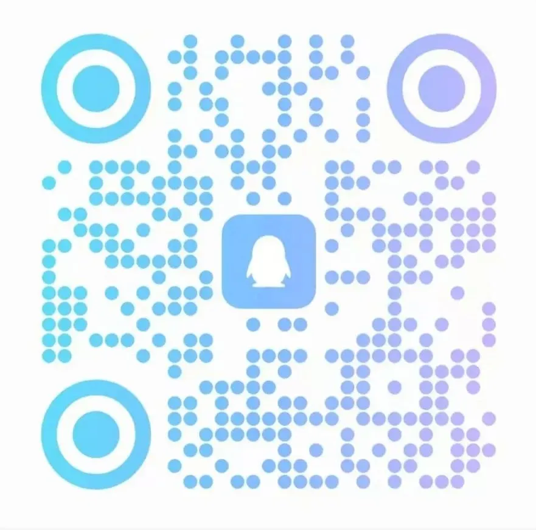

EvoX チームは、Genesis を使用して Terminal-Bench Challenges の WASM Render チャレンジを完了し提出しました。今回の実行で記録されたモデルコストは **36ドル** です。

本記事の公開時点で、**Genesis は Terminal-Bench Challenge の成果を完了・提出したと公開報告した最初の自律システムである可能性があります**。

## WASM Render：完全な WebGL ソフトウェアスタックをゼロから実装する

WASM Render では、純粋な JavaScript/WASM によるソフトウェアレンダラーを実装し、Node.js プロジェクトに WebGL 1.0 および 2.0 API を提供することが求められます。対象環境は、ブラウザ、GPU、ネイティブの C++ バインディング、外部ライブラリに依存できません。

チャレンジの定義によれば、ソリューションは GLSL コンパイラ、三角形ラスタライザー、そして WebGL API の表面全体をカバーする必要があります。Terminal-Bench がこのタスクに定めた検証範囲には、2,071 件の Khronos CTS テストに加え、three.js と Babylon.js のビジュアルリグレッションテストが含まれます。これはチャレンジの受け入れ目標を述べたものであり、Genesis の提出物がすでに Terminal-Bench の公式評価を通過したことを意味するものではありません。

多くのコーディングエージェントのベンチマークは、単一のバグ修正や局所的な機能を評価単位とします。WASM Render は異なります。作業は大量の相互依存するモジュールにまたがり、実装・統合・検証を続ける過程でコードベース全体の一貫性を保つ必要があります。

この種のタスクは、長期開発における中心的な問題を浮き彫りにします。局所的な変更が全体アーキテクチャと整合するか、初期の意思決定が後の作業に正しく引き継がれるか、検証結果が次の段階の信頼できる指針となるか、ということです。Terminal-Bench Challenges は評価対象を完全なソフトウェアプロジェクトへと拡大し、まさにこの能力を観察しようとしています。

## Genesis は長期開発をどう持続させるか

Genesis は、開発状態のすべてを保持するために、永続する単一のエージェントや際限なく増大するコンテキストに依存しません。ソフトウェアプロジェクト自体が永続する「世界」を構成します。受け入れられたソフトウェアのバージョンが現在の事実を記録し、リポジトリのパスがエージェントの位置と責任範囲を定めます。

寿命の限られたエージェントたちは、リポジトリ構造を中心に再帰的に展開し、限定されたスコープの中で候補となる変更を実装・検査・検証します。エージェントの成果物はまず提案であり、受け入れられたコードと検証証拠だけがプロジェクトの歴史に入り、後続のエージェントに引き継がれます。

WASM Render のようなシステムプロジェクトでは、これにより各エージェントは明確で有限な局所的な問題に取り組む一方で、コンパイラ、レンダリングパイプライン、状態管理、互換性の作業が、同一のコードと検証の歴史に沿って継続的に進化できます。

Genesis はわずか36ドルで WASM Render チャレンジを完了しました。これは、Terminal-Bench が示す1チャレンジあたり1,000ドル超という想定を大きく下回ります。

また、私たちの内部における非正式なテストから、Genesis は約10万行規模のコードベースで効果的に機能することが示されています。100万行以上の規模のコードベースについては経験が比較的少ないものの、これまでの試みは順調に進んでいます。

🌐 プロジェクト公式サイト：

https://genesis.evox.group/

🔗 **GitHub**：

https://github.com/EMI-Group/genesis

🌐 QQ グループ：297969717

<strong>QQ グループ｜</strong>Evolutionary Machine Intelligence

