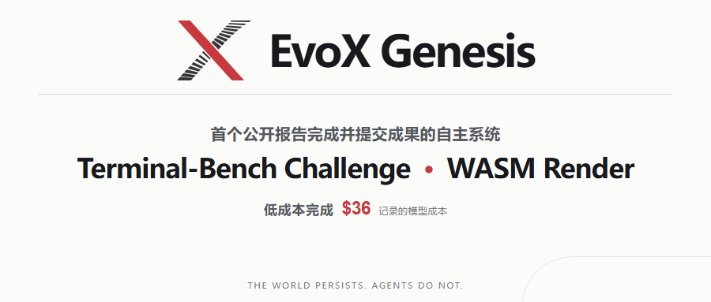

EvoX 团队已使用 Genesis 完成并提交 Terminal-Bench Challenges 中的 WASM Render 挑战，本次运行记录的模型成本为 **36 美元**。

截至本文发布，**Genesis 可能是首个公开报告完成并提交 Terminal-Bench Challenge 成果的自主系统**。

## WASM Render：从头实现完整的 WebGL 软件栈

WASM Render 要求实现一个纯 JavaScript/WASM 软件渲染器，为 Node.js 项目提供 WebGL 1.0 和 2.0 API。目标环境不依赖浏览器、GPU、C++ 原生绑定或外部库。

按照挑战定义，解决方案需要覆盖 GLSL 编译器、三角形光栅化器以及 WebGL API 表面。Terminal-Bench 为该任务规定的验证范围包括 2,071 项 Khronos CTS 测试，以及 three.js 和 Babylon.js 的视觉回归测试。这里描述的是挑战的验收目标，并不表示 Genesis 的提交目前已经通过 Terminal-Bench 的官方评估。

许多编码智能体基准以一次缺陷修复或一个局部功能为单位。WASM Render 的不同之处在于，工作需要跨越大量相互依赖的模块，并在持续实现、集成和验证的过程中保持整个代码库一致。

这类任务会持续暴露长周期开发中的核心问题：局部修改是否符合整体架构，早期决策能否被后续工作正确继承，以及验证结果能否成为下一轮开发的可靠依据。Terminal-Bench Challenges 将评价对象扩大到完整软件项目，正是为了观察这种能力。

## Genesis 如何维持长周期开发

Genesis 不依靠一个持续存在的智能体或不断增长的单一上下文来保存全部开发状态。软件项目本身构成持续存在的“世界”：接受的软件版本记录当前事实，仓库路径限定智能体所处的责任范围。

生命周期有限的智能体围绕仓库结构递归展开，在局部范围内实现、检查和验证候选修改。智能体的输出首先是提案；只有被接受的代码和验证证据才会进入项目历史，并由后续智能体继承。

对于 WASM Render 这样的系统工程任务，这使单个智能体能够处理明确、有限的局部问题，同时让编译器、渲染管线、状态管理和兼容性工作沿着同一份代码与验证历史持续演进。

Genesis 仅花费 36 美元便完成了 WASM Render 挑战，远低于 Terminal-Bench 所述的每项挑战 1,000 美元以上的预期成本。

我们的内部非正式测试也表明，Genesis 能够有效处理约 10 万行代码规模的代码库。对于 100 万行及以上规模的代码库，我们的实践经验相对有限，但迄今为止的尝试进展顺利。

🌐 项目官网：

https://genesis.evox.group/

🔗 **GitHub**：

https://github.com/EMI-Group/genesis

🌐 QQ交流群：297969717

<strong>QQ交流群｜</strong>演化机器智能

