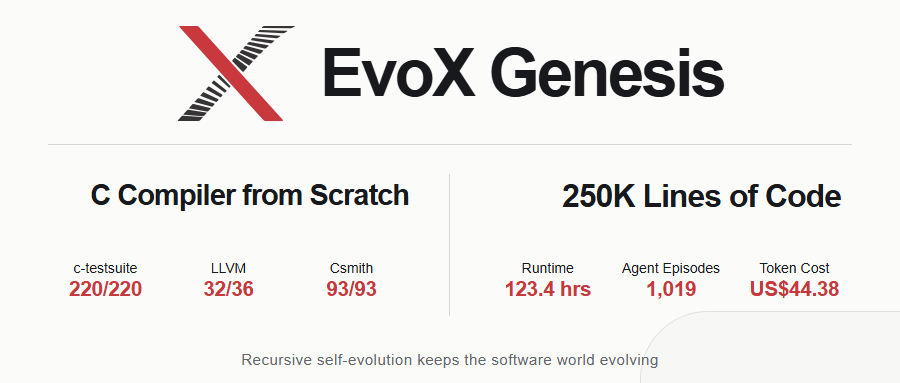
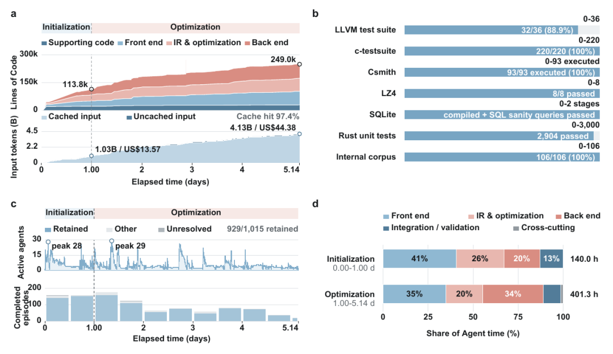
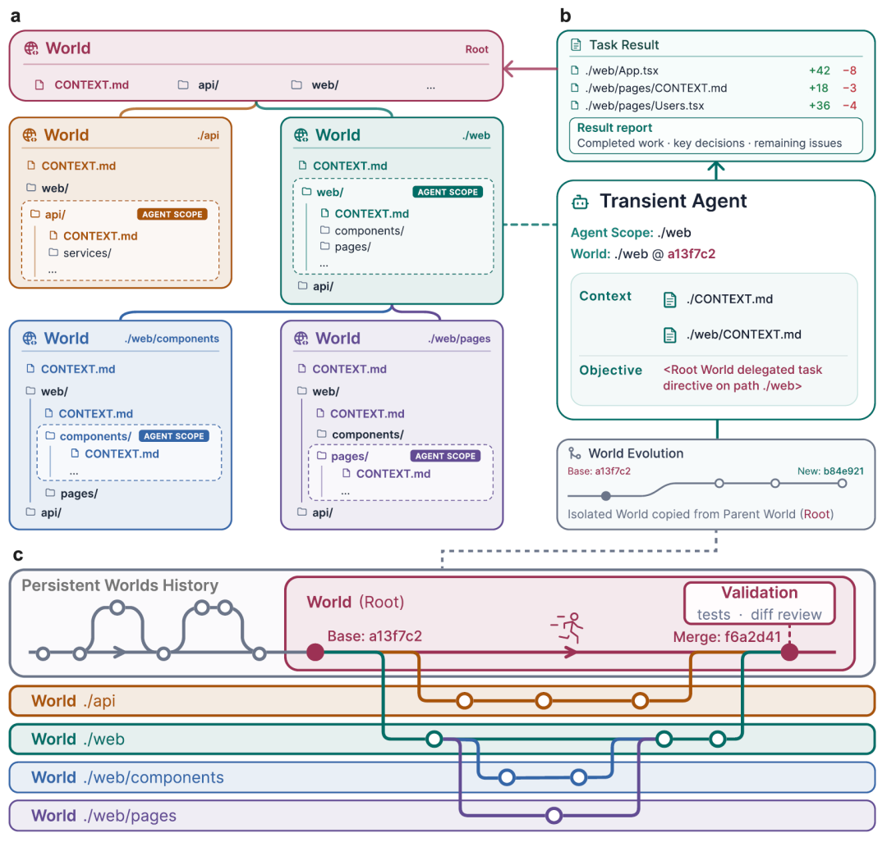
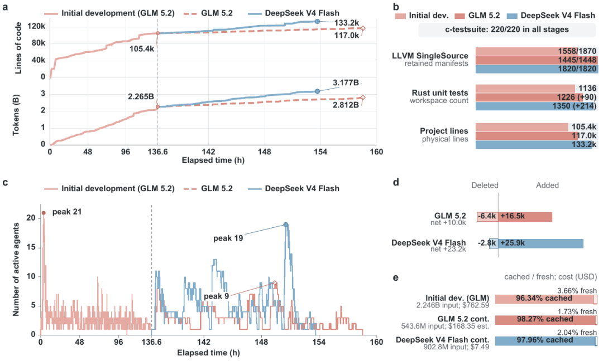
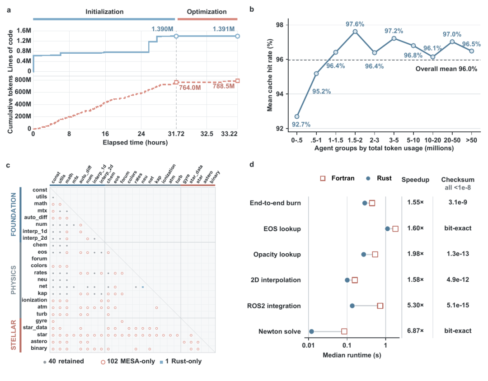
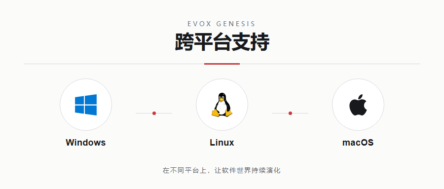

# EvoX Genesis : un système d'IA évolutif récursif qui a construit un compilateur C de 250 000 lignes à partir de zéro

L'équipe EvoX du Département de Science des Données et Intelligence Artificielle de la Hong Kong Polytechnic University a publié **EvoX Genesis**, un système d'IA évolutif récursif.

EvoX Genesis ne repose plus sur un agent persistant pour maintenir un développement de longue durée. Il laisse au contraire le monde du logiciel évoluer par lui-même.

À partir d'un dépôt vide, le système a construit un **compilateur C de 248 989 lignes** en 123,4 heures, à travers 1 019 épisodes d'agent, pour un coût en tokens de modèle de seulement **44,38 $**.

## Codage de longue durée : une frontière qui ne cesse de reculer

Le temps de travail des agents de codage est passé de courtes tâches ponctuelles à plusieurs dizaines d'heures.

OpenAI a fait tourner Codex à partir d'un dépôt vide pendant environ 25 heures d'affilée, produisant environ 30 000 lignes de code.

Anthropic a mobilisé 16 agents Claude, à travers près de 2 000 sessions, environ deux semaines et près de 20 000 $ de coûts d'API, pour construire de zéro un compilateur C d'environ 100 000 lignes.

Le temps ne cesse de s'allonger, les agents de plus en plus nombreux, et les logiciels de plus en plus complexes.

Mais le centre de la recherche reste l'agent :

des modèles plus puissants, des contextes plus longs, une mémoire plus persistante, davantage d'agents.

**L'équipe EvoX a retourné la question dans une autre direction :**

**Pourquoi l'agent devrait-il persister ?**

Et si ce qui devait vraiment persister, c'était le monde du logiciel dans lequel il vit ?

## 123,4 heures, 250 000 lignes

Nous avons laissé EvoX Genesis démarrer à partir d'un dépôt dont l'implémentation était vide.

Il n'y avait qu'un seul objectif : construire un compilateur C.

123,4 heures, 1 019 épisodes d'agent, **248 989 lignes de code**, et un coût en tokens de modèle de seulement **44,38 $**.

Le compilateur final a réussi 220/220 tests de c-testsuite, 32/36 cas de test LLVM, et 93/93 tests de programmes aléatoires Csmith.

Aucun compilateur existant n'attendait d'être complété — **tout est parti de zéro.**

_Figure 1 : Résultats de l'expérience du compilateur C / taille du code, temps d'exécution, épisodes d'agent, coût et résultats des tests_

_(avec le modèle DeepSeek V4 Flash)_

## Ne pas maintenir l'agent en vie — maintenir le monde du logiciel en vie

La vie d'un logiciel complexe est naturellement plus longue qu'une seule session d'agent.

EvoX Genesis organise le logiciel en un monde du logiciel qui se déploie récursivement :

les agents de niveau supérieur décomposent les objectifs, et de nouveaux agents accomplissent le travail au niveau local ;

une fois les résultats vérifiés, ils entrent dans l'historique des versions du logiciel et deviennent la réalité du prochain cycle de développement.

Les agents peuvent alors disparaître,

et de nouveaux agents continuent à partir du monde du logiciel déjà constitué.

Ce qui persiste, ce n'est ni une conversation, ni un scratchpad qui s'allonge sans fin, ni un « agent maître » en ligne permanente.

Ce qui persiste, c'est le code, la structure, les contraintes, les résultats de vérification et l'historique déjà produit.

**Ce qui persiste, ce n'est pas l'agent, mais le monde du logiciel.**

**L'agent ne persiste pas. Ses conséquences validées, oui.**

Telle est l'évolution autonome récursive d'EvoX Genesis. Pour les utilisateurs, cela signifie aussi quelque chose de très simple :

**Vous ne construisez pas des agents — vous décrivez seulement ce que le logiciel doit devenir.**

Nul besoin de concevoir à l'avance des agents, des rôles ou des flux de travail, ni de décomposer manuellement un arbre de tâches complet.

L'utilisateur n'a qu'à décrire l'objectif de développement du logiciel dans un court texte ;

comment les tâches sont décomposées, comment les agents sont générés, comment la récursion se déploie et comment les résultats sont vérifiés — tout cela est fait par EvoX Genesis lui-même.

_Figure 2 : Le concept de Persistent Recursive World / les agents naissent, agissent et disparaissent ; le monde du logiciel continue de se déployer_

## Les modèles peuvent être remplacés ; le monde du logiciel continue

Cette continuité n'exige même pas d'utiliser le même modèle du début à la fin.

Dans une autre série d'expériences, un monde du logiciel initialement construit par GLM 5.2 a été confié à DeepSeek V4 Flash pour poursuivre le développement.

Au final, il a réussi 1 820/1 820 des tests LLVM SingleSource conservés.

Les modèles peuvent être remplacés, les agents peuvent être remplacés — le monde du logiciel continue.

_Figure 3 : L'expérience de continuation entre modèles, GLM 5.2 → DeepSeek V4 Flash_

## Partir de zéro, ou hériter de l'historique

Construire à partir de zéro n'est qu'une extrémité du cycle de vie d'un logiciel ;

l'autre extrémité est un monde du logiciel qui existe depuis des années, riche en structure et en historique.

Nous avons appliqué EvoX Genesis à MESA — un système de calcul scientifique pour l'évolution stellaire développé depuis longtemps.

L'expérience portait sur 13 modules Fortran, totalisant **139 414 lignes** ;

EvoX Genesis les a refactorisés en crates Rust correspondantes, pour un coût en tokens de modèle d'environ **10,6 $**.

Un monde du logiciel peut être créé à partir de rien, ou hériter de l'historique et continuer à évoluer.

_Figure 4 : MESA Fortran → Rust, 13 modules, 139 414 lignes de code, 10,6 $_

## Les avantages de coût se cumulent au fil du temps

Le développement logiciel de longue durée ne signifie pas que les coûts croissent linéairement.

Dans EvoX Genesis, le code vérifié, la structure et l'historique de développement s'accumulent continuellement et deviennent le fondement du prochain cycle de travail. Les agents suivants n'ont pas besoin de réanalyser tout le projet depuis le début ; une grande partie des informations existantes peut être directement mise en cache et réutilisée, avec un taux de réussite de cache allant jusqu'à 97,4 %.

Au fur et à mesure que le système fonctionne, l'état de développement réutilisable s'enrichit, les calculs redondants diminuent, et le coût unitaire du développement finit par baisser avec le temps.

Ce sont des intérêts composés d'ingénierie qui s'accumulent au fil du temps.

## EvoX Genesis est désormais open source

Le projet est open source, avec des paquets d'installation disponibles pour Windows, macOS et Linux.

🌐 Site web :

https://genesis.evox.group/

🔗 **GitHub** :

https://github.com/EMI-Group/genesis

↓ **Téléchargements** :

**https://github.com/EMI-Group/genesis/releases**

**▤ Article :**

**https://arxiv.org/abs/2608.10450**

🌐 Groupe QQ : 297969717

**Les agents s'en vont ; le monde du logiciel continue d'évoluer**

**EvoX Genesis**

Références :

OpenAI, *Run long horizon tasks with Codex* (2026).

Anthropic, *Building a C compiler with a team of parallel Claudes* (2026).
