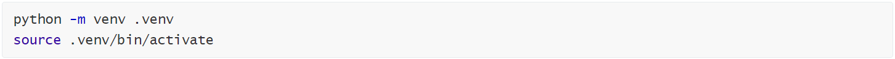
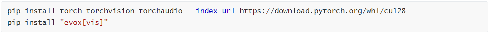
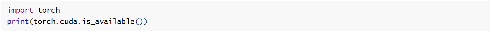
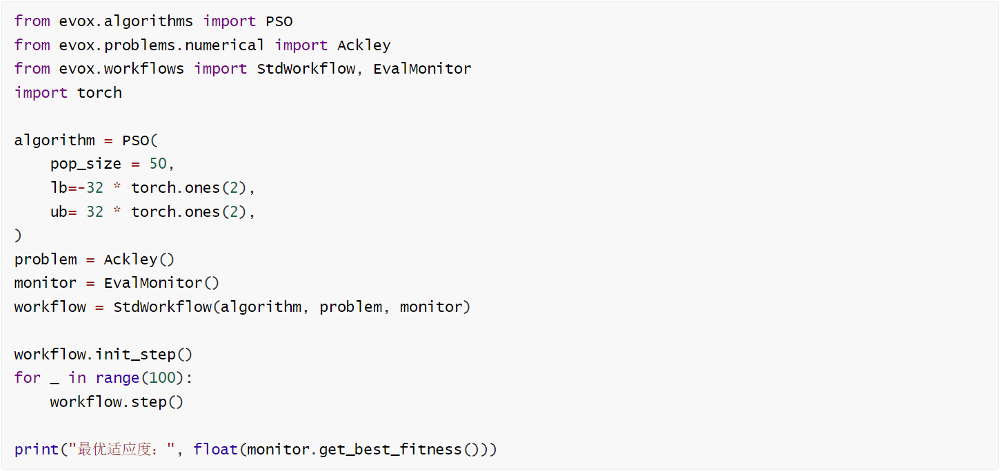
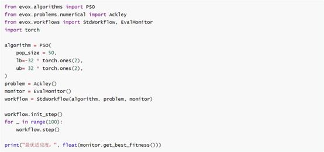
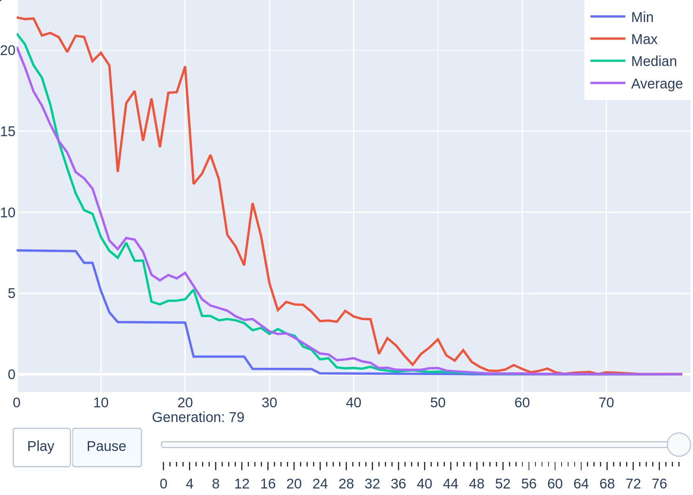
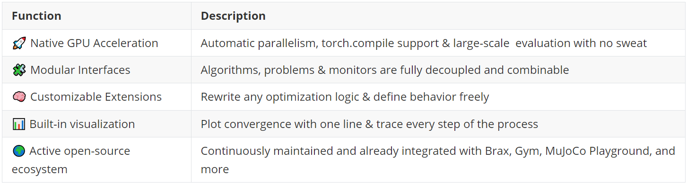

Por un lado, la Evolutionary Computation es extremadamente potente en la investigación y la ingeniería del mundo real, pero difícil de invocar. Por otro lado, las capacidades de las GPU son cada vez más potentes, pero les resulta difícil ejercer su potencia en tareas de computación evolutiva.

Necesitamos una solución verdaderamente moderna: soporte nativo para GPU, arquitectura modular, interfaces claras, facilidad de uso inmediata y escalabilidad personalizable. Esto es EvoX: un motor de computación evolutiva para el futuro.

Para ayudar a los usuarios a empezar rápidamente, el equipo de EvoX ha lanzado el «Tutorial de EvoX para principiantes». El tutorial consta de 8 capítulos que cubren desde los conceptos básicos hasta aplicaciones prácticas avanzadas, guiándote paso a paso sobre cómo ejecutar algoritmos evolutivos en una GPU.

**Recursos completos del tutorial**

Tutorial online en chino:

[EvoX Beginners Tutorial - EvoX Document](https://evox.readthedocs.io/zh-cn/latest/tutorial/ "https://evox.readthedocs.io/zh-cn/latest/tutorial/")

Tutorial en PDF en chino:

Por favor, únete al grupo de QQ para obtenerlo: 297969717

A continuación, te guiaremos a través de todo el proceso, desde la instalación hasta la operación, en solo 10 minutos.

**Paso 1: Configuración del entorno**

Abre tu terminal y crea un entorno de Python limpio:

También puedes usar tu herramienta preferida para crear un entorno de Python limpio.

**Paso 2: Instalar PyTorch y EvoX**

Comprueba si la GPU está disponible:

**Paso 3: Ejecuta tu primer algoritmo evolutivo**

****

¿Qué hace esto? Compone un algoritmo (PSO), un problema (Ackley) y un monitor (EvalMonitor) a través de una interfaz estándar. ¡EvoX se encarga de todo el paralelismo, la aceleración y la monitorización!

**Paso 4: Graficar la curva de convergencia**

Solo una línea es suficiente:

¿Ves esa curva descendente? Esa es la **trayectoria donde tu algoritmo evolutivo se acerca al objetivo** y **el camino que toma para explorar el mundo desconocido.**

**Paso 5: Intenta extenderlo**

Si «simplemente ejecutar un Ackley» no es suficiente, puedes:

· Cambiar PSO por GA, DE, CMA-ES, NSGA-II, RVEA...
 · Cambiar Ackley por Rastrigin, Griewank, CEC2022
 · Cambiar a un problema multiobjetivo configurando `n_objs >= 2`
 · Implementar tu propia lógica con `MyProblem` y `MyAlgorithm`
 · Conectarlo con modelos de PyTorch o entornos de reinforcement-learning (Gym, Brax, MuJoCo Playground)

Ya sea el ajuste de hiperparámetros, la búsqueda de arquitectura, la neuroevolución o la optimización de estrategias de control, EvoX lo gestiona todo con facilidad.

**¿Por qué elegir EvoX?**

**Agradecimientos**

Este tutorial fue escrito por **Boqing Xu**, **Xinmeng Yu**, **Bowen Zheng** y **Xinyao Li**. **Beichen Huang** fue responsable de la recopilación, edición y publicación online del tutorial.

Agradecemos sinceramente a cada miembro de la comunidad de EvoX. Son nuestros esfuerzos conjuntos los que han permitido que EvoX siga evolucionando.

**Código de código abierto / Recursos de la comunidad**

Artículo científico:

[https://arxiv.org/abs/2503.20286](https://arxiv.org/abs/2503.20286 "https://arxiv.org/abs/2503.20286")

GitHub:

[https://github.com/EMI-Group/evomo](https://github.com/EMI-Group/evomo "https://github.com/EMI-Group/evomo")

Proyecto original (EvoX):

[https://github.com/EMI-Group/evox](https://github.com/EMI-Group/evox "https://github.com/EMI-Group/evox")

Grupo de QQ: 297969717

Grupo de QQ | Evolving Machine Intelligence

EvoMO está construido sobre el framework EvoX. Si estás interesado en aprender más sobre EvoX, no dudes en consultar el artículo oficial sobre EvoX 1.0 publicado en nuestra cuenta pública de WeChat para más detalles.

 ([https://mp.weixin.qq.com/s/uT6qSqiWiqevPRRTAVIusQ](https://mp.weixin.qq.com/s/uT6qSqiWiqevPRRTAVIusQ "https://mp.weixin.qq.com/s/uT6qSqiWiqevPRRTAVIusQ"))
