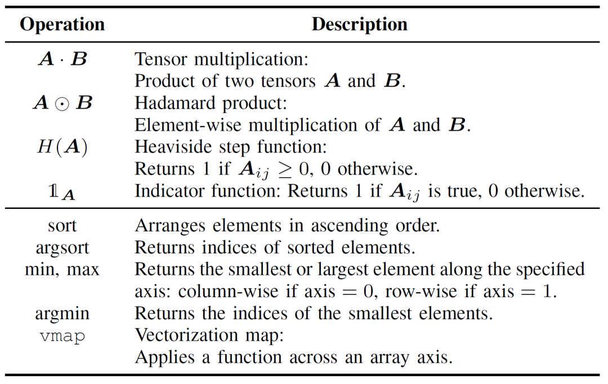
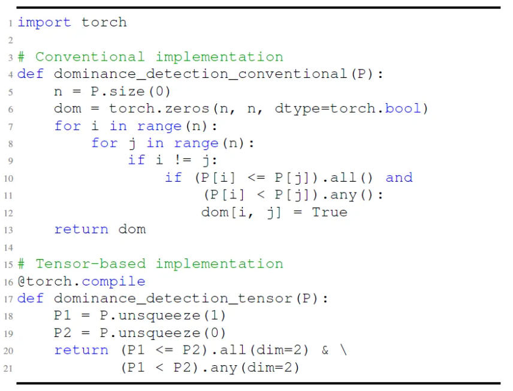
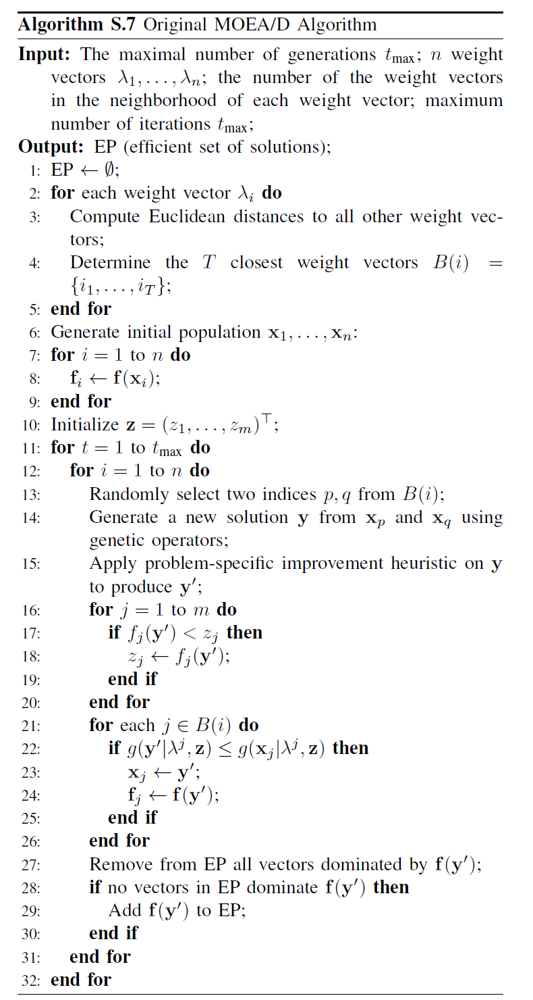
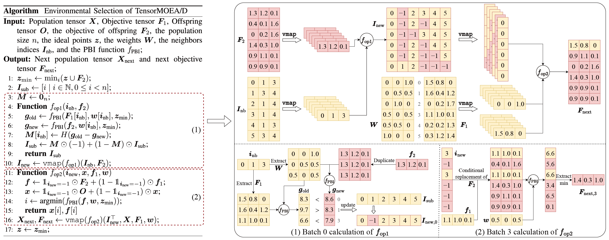
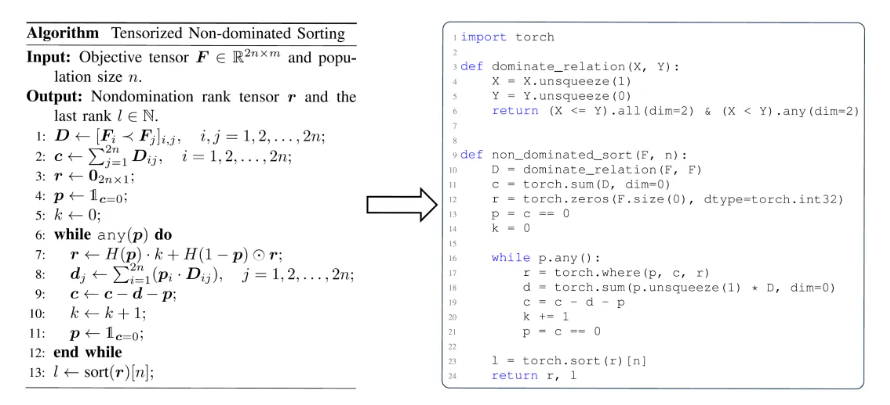
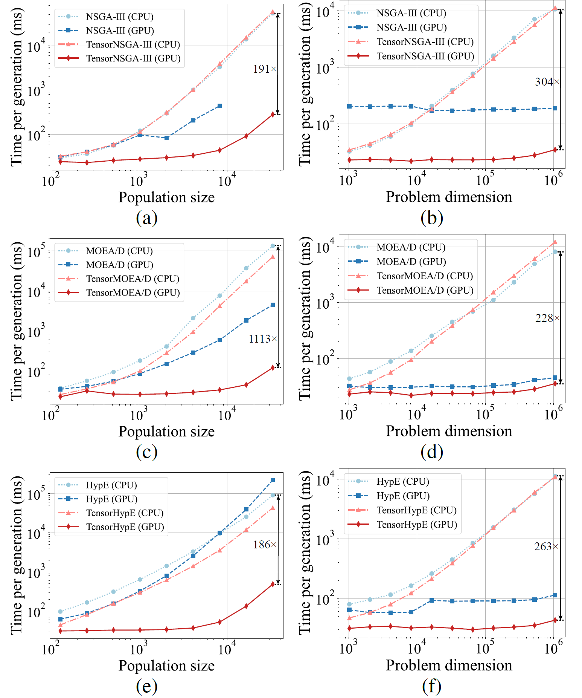
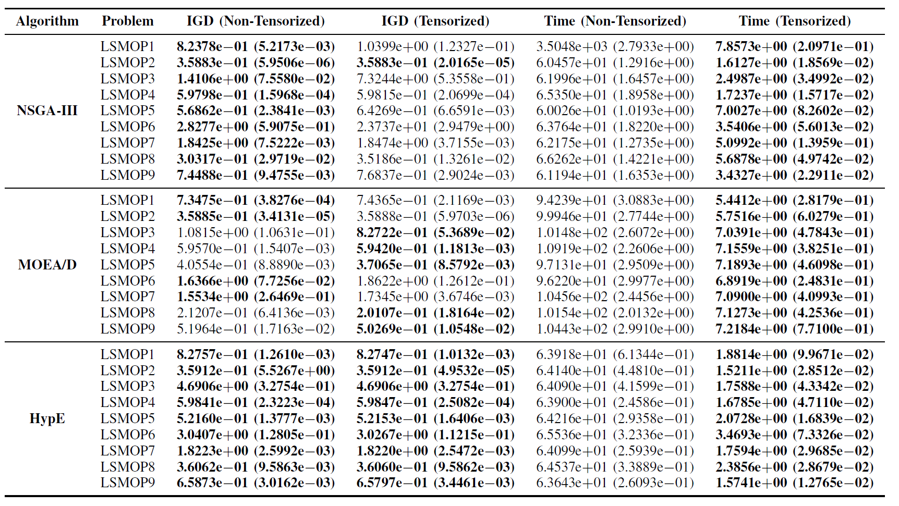
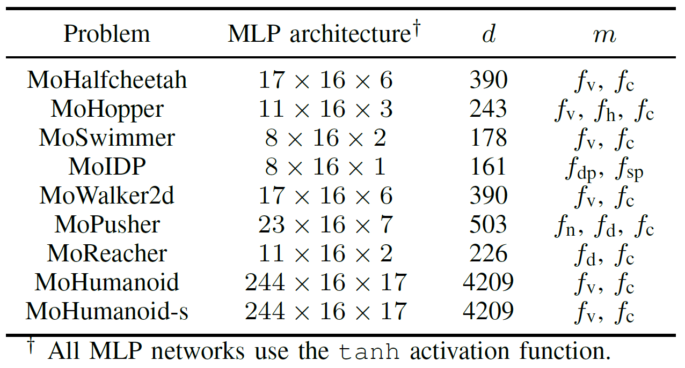
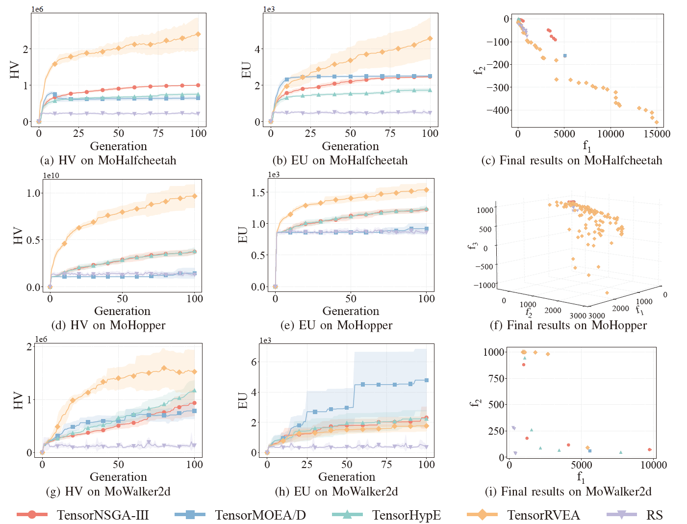
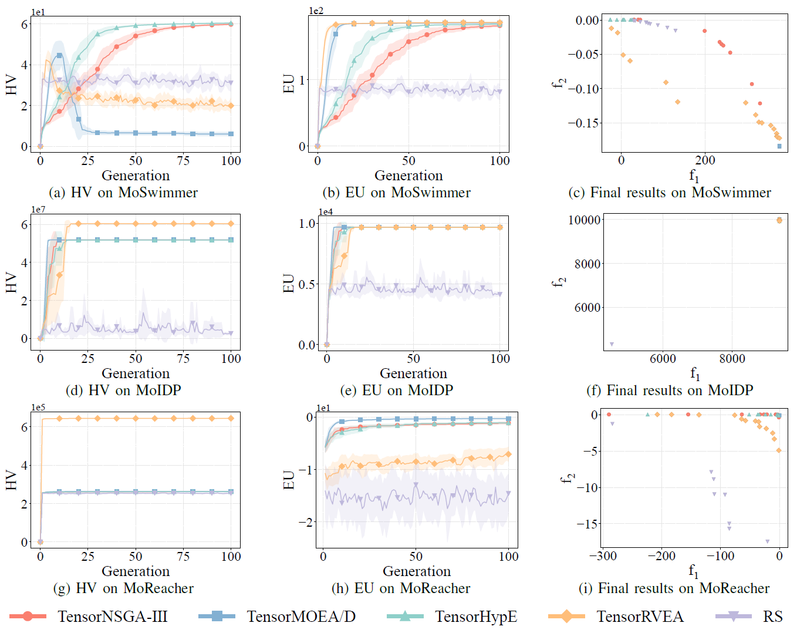

## Unindo a Otimização Multiobjetivo Evolutiva e a Aceleração por GPU através da Tensorização

Zhenyu Liang, Hao Li, Naiwei Yu, Kebin Sun, e Ran Cheng, Senior Member, IEEE

Com o aumento contínuo da procura por soluções de otimização complexas em domínios como o design de engenharia e a gestão de energia, os algoritmos de otimização multiobjetivo evolutiva (EMO) têm atraído uma atenção generalizada devido às suas capacidades robustas na resolução de problemas multiobjetivo. No entanto, à medida que as tarefas de otimização crescem em escala e complexidade, os algoritmos EMO tradicionais baseados em CPU encontram estrangulamentos de desempenho significativos.

Para colmatar esta limitação, a equipa EvoX propôs a paralelização de algoritmos EMO em GPUs através da metodologia de tensorização. Aproveitando este método, desenharam e implementaram com sucesso vários algoritmos EMO acelerados por GPU. Além disso, a equipa desenvolveu o **"MoRobtrol"**, uma **suite de testes para controlo robótico multiobjetivo** construída sobre o motor de física Brax, com o objetivo de avaliar sistematicamente o desempenho de algoritmos EMO acelerados por GPU.

Com base nestes avanços na investigação, a equipa EvoX lançou a **EvoMO**, uma biblioteca de algoritmos EMO de alto desempenho acelerada por GPU. O código-fonte correspondente está disponível publicamente no GitHub: [https://github.com/EMl-Group/evomo](https://github.com/EMl-Group/evomo "https://github.com/EMl-Group/evomo")

## Metodologia de Tensorização

No campo da otimização computacional, um **tensor** refere-se a uma estrutura de dados de matriz multidimensional capaz de representar escalares, vetores, matrizes e dados de ordem superior. A **tensorização** é o processo de converter estruturas de dados e operações dentro de um algoritmo para o formato de tensor, permitindo que o algoritmo aproveite plenamente as capacidades de computação paralela das GPUs.

Nos algoritmos EMO, todas as estruturas de dados fundamentais podem ser expressas num formato tensorizado. Os indivíduos numa população podem ser representados por um tensor de soluções ***X***, onde cada vetor de linha corresponde a um indivíduo. Os valores da função objetivo formam um tensor de objetivos ***F***. Adicionalmente, estruturas de dados auxiliares, como vetores de referência e vetores de peso, podem ser expressas como tensores R e W, respetivamente. Esta representação unificada de tensores permite operações ao nível da população no nível da representação, estabelecendo uma base sólida para a computação paralela em larga escala.

A tensorização das operações dos algoritmos EMO é crucial para aumentar a eficiência computacional e pode ser dividida em duas camadas: operações básicas de tensores e tensorização do fluxo de controlo. As operações básicas de tensores constituem o núcleo da implementação tensorizada dos algoritmos EMO, conforme detalhado na Tabela I.

Tabela I: Operações Básicas de Tensores

A tensorização do fluxo de controlo substitui a lógica tradicional de ciclos e condições por operações de tensores paralelizáveis. Por exemplo, os ciclos for/while podem ser transformados em operações em lote (batch) utilizando mecanismos de broadcasting ou funções de ordem superior como `vmap`. Da mesma forma, as condições if-else podem ser substituídas por técnicas de mascaramento (masking), onde as condições lógicas são codificadas como tensores booleanos, permitindo a alternância flexível entre diferentes caminhos de computação.

Comparada com as implementações tradicionais de algoritmos EMO, a abordagem de tensorização oferece vantagens significativas. Primeiro, proporciona maior flexibilidade, lidando naturalmente com dados multidimensionais, enquanto os métodos convencionais estão frequentemente restritos a operações de matrizes bidimensionais. Segundo, a tensorização melhora significativamente a eficiência computacional através da execução paralela, evitando a sobrecarga associada a ciclos explícitos e ramificações condicionais. Por fim, simplifica a estrutura do código, resultando em programas mais concisos e fáceis de manter.

Como ilustrado na Fig. 1, por exemplo, a implementação tradicional da verificação de dominância de Pareto depende de ciclos aninhados para realizar comparações elemento a elemento. Em contraste, a versão tensorizada alcança a mesma funcionalidade através de operações de broadcasting e mascaramento, permitindo a avaliação paralela. Isto não só reduz a complexidade do código, como também melhora drasticamente o desempenho em tempo de execução.

Fig.1: Comparação entre as implementações convencionais e baseadas em tensores da deteção de dominância de Pareto.

De uma perspetiva mais profunda, a tensorização é adequada para a aceleração por GPU porque as GPUs possuem um grande número de núcleos paralelos, e a sua arquitetura SIMT (single-instruction multiple-thread) alinha-se naturalmente com as computações de tensores, destacando-se particularmente em operações de matrizes. Hardware dedicado, como os Tensor Cores da NVIDIA, aumenta ainda mais o rendimento das operações de tensores. Em geral, algoritmos que exibem alto paralelismo, contêm tarefas computacionais independentes e têm ramificações condicionais mínimas são mais propensos à tensorização. Para algoritmos como o MOEA/D, que envolvem dependências sequenciais, a estrutura inerente coloca desafios à tensorização direta. No entanto, através da refatorização estrutural e do desacoplamento de computações críticas, ainda é possível alcançar uma aceleração paralela eficaz.

## Exemplo de Aplicação da Tensorização de Algoritmos

Com base na metodologia de representação tensorizada, a equipa EvoX desenhou e implementou versões tensorizadas de três algoritmos EMO clássicos: o NSGA-III baseado em dominância, o MOEA/D baseado em decomposição e o HypE baseado em indicadores. A secção seguinte fornece uma explicação detalhada utilizando o MOEA/D como exemplo. As implementações tensorizadas do NSGA-III e do HypE podem ser encontradas no artigo de referência.

Como ilustrado na Fig. 2, o MOEA/D tradicional decompõe um problema multiobjetivo em múltiplos subproblemas, cada um dos quais é otimizado de forma independente. O algoritmo compreende quatro passos fundamentais: cruzamento e mutação, avaliação de fitness, atualização do ponto ideal e atualização da vizinhança. Estes passos são executados sequencialmente para cada indivíduo dentro de um único ciclo. Este processamento sequencial leva a uma sobrecarga computacional substancial ao lidar com grandes populações, uma vez que cada indivíduo deve completar todos os passos por ordem, limitando os benefícios potenciais da aceleração por GPU. Em particular, a atualização da vizinhança depende de interações entre indivíduos, o que complica ainda mais a paralelização.

Fig.2: Pseudocódigo do MOEA/D

Para resolver a questão das dependências sequenciais no MOEA/D tradicional, a equipa introduziu um método de representação tensorizada dentro do ciclo interno de seleção ambiental. Ao desacoplar o cruzamento e mutação, a avaliação de fitness, a atualização do ponto ideal e a atualização da vizinhança, estes componentes são tratados como operações independentes. Isto permite o processamento paralelo de todos os indivíduos, levando à construção de um algoritmo MOEA/D tensorizado, referido como TensorMOEA/D. Neste algoritmo, a seleção ambiental é dividida em duas fases principais: comparação e atualização da população, e seleção de soluções de elite. Estas duas fases são primariamente tensorizadas através de duas aplicações da operação `vmap`. O processo detalhado é ilustrado na Fig. 3.

Fig.3: Visão geral da seleção ambiental no algoritmo TensorMOEA/D. **Esquerda**: Pseudocódigo do algoritmo. **Direita**: Fluxo de dados de tensores do módulo (1) e módulo (2). A parte superior da figura à direita mostra o fluxo de dados de tensores geral para os módulos (1) e (2), enquanto a parte inferior apresenta o fluxo de dados de tensores de cálculo em lote, com o módulo (1) à esquerda e o módulo (2) à direita.

Para obter uma compreensão mais abrangente do valor da tensorização nos algoritmos EMO, esta pode ser resumida a partir de três perspetivas. Primeiro, a tensorização permite uma transformação direta de formulações matemáticas para código eficiente, reduzindo a lacuna entre o design do algoritmo e a implementação. Por exemplo, a Fig. 4 ilustra como o procedimento de ordenação não-dominada tensorizado pode ser traduzido diretamente de pseudocódigo para código Python. Segundo, a tensorização simplifica significativamente a estrutura do código ao unificar as operações ao nível da população numa única representação de tensor. Isto reduz a dependência de ciclos e instruções condicionais, melhorando assim a legibilidade e a manutenção do código. Terceiro, a tensorização aumenta a reprodutibilidade dos algoritmos. A sua representação estruturada facilita os testes comparativos e a reprodução consistente de resultados.

Fig.4: A transformação contínua da ordenação não-dominada tensorizada de pseudocódigo (Esquerda) para código Python (Direita).

## Demonstração de Desempenho

Para avaliar o desempenho dos algoritmos de otimização multiobjetivo acelerados por GPU, a equipa EvoX realizou sistematicamente três categorias de experiências, focando-se na aceleração computacional, no desempenho da otimização numérica e na eficácia em tarefas de controlo robótico multiobjetivo.

**Desempenho de Aceleração Computacional:**

****

Fig.5: Desempenho de aceleração comparativo do NSGA-III, MOEA/D e HypE com as suas contrapartes tensorizadas em plataformas CPU e GPU através de vários tamanhos de população e dimensões de problemas.

Os resultados experimentais mostram que o TensorNSGA-III, o TensorMOEA/D e o TensorHypE alcançam velocidades de execução significativamente mais elevadas em GPUs em comparação com as suas contrapartes baseadas em CPU não tensorizadas. À medida que o tamanho da população e a dimensionalidade do problema aumentam, a aceleração máxima observada atinge até **1113x**. Os algoritmos tensorizados demonstram excelente escalabilidade e estabilidade ao lidar com tarefas computacionais de larga escala — o seu tempo de execução aumenta apenas marginalmente, mantendo um desempenho consistentemente elevado. Estas descobertas destacam as vantagens substanciais da tensorização para a aceleração por GPU na otimização multiobjetivo.

**Desempenho na Suite de Testes LSMOP:**

Tabela II: Resultados Estatísticos (Média e Desvio Padrão) do IGD e Tempo de Execução (s) para Algoritmos EMO Não Tensorizados e Tensorizados em LSMOP1–LSMOP9. Todas as Experiências Foram Realizadas numa GPU RTX 4090 e os Melhores Resultados Estão Destacados.

Os resultados experimentais indicam que os algoritmos EMO acelerados por GPU baseados em representações tensorizadas melhoram significativamente a eficiência computacional, mantendo, e em alguns casos até superando, a precisão de otimização das suas contrapartes originais.

**Tarefas de Controlo Robótico Multiobjetivo:**

Para avaliar de forma abrangente o desempenho prático dos algoritmos EMO acelerados por GPU, a equipa desenvolveu uma suite de testes chamada MoRobtrol para controlo robótico multiobjetivo. As tarefas incluídas nesta suite estão listadas na Tabela III.

Tabela III: Visão Geral dos Problemas de Controlo Robótico Multiobjetivo na Suite de Testes MoRobtrol Proposta

Fig.6: Desempenho comparativo (HV, EU e visualização dos resultados finais) do TensorNSGA-III, TensorMOEA/D, TensorHypE, TensorRVEA e pesquisa aleatória (RS) em vários problemas: MoHalfcheetah (390D), MoHopper (243D) e MoWalker2d (390D). *Nota*: Valores mais elevados para todas as métricas indicam melhor desempenho.

Fig.7: Desempenho comparativo (HV, EU e visualização dos resultados finais) do TensorNSGA-III, TensorMOEA/D, TensorHypE, TensorRVEA e pesquisa aleatória (RS) em vários problemas: MoPusher (503D), MoHumanoid (4209D) e MoHumanoid-s (4209D). *Nota*: Valores mais elevados para todas as métricas indicam melhor desempenho.

Fig.8: Desempenho comparativo (HV, EU e visualização dos resultados finais) do TensorNSGA-III, TensorMOEA/D, TensorHypE, TensorRVEA e pesquisa aleatória (RS) em vários problemas: MoSwimmer (178D), MoIDP (161D) e MoReacher (226D). *Nota*: Valores mais elevados para todas as métricas indicam melhor desempenho.

As experiências compararam o desempenho do TensorNSGA-III, TensorMOEA/D, TensorHypE, TensorRVEA e Pesquisa Aleatória (RS) dentro da suite de testes MoRobtrol. Os resultados mostram que o TensorRVEA alcançou o melhor desempenho global, obtendo os valores de HV mais elevados e demonstrando uma boa diversidade de soluções em múltiplos ambientes. O TensorMOEA/D exibiu uma forte adaptabilidade em tarefas de larga escala, destacando-se particularmente na consistência de preferência das soluções. O TensorNSGA-III e o TensorHypE mostraram um desempenho semelhante e foram competitivos em várias tarefas. No geral, os algoritmos baseados em decomposição tensorizados demonstraram vantagens superiores na resolução de problemas complexos e de larga escala.

## Conclusão e Trabalho Futuro
Este estudo propõe uma metodologia de representação tensorizada para abordar as limitações dos algoritmos EMO tradicionais baseados em CPU em termos de eficiência computacional e escalabilidade. A abordagem foi aplicada a vários algoritmos representativos, incluindo NSGA-III, MOEA/D e HypE, alcançando melhorias de desempenho significativas em GPUs enquanto mantém a qualidade da solução. Para validar a sua aplicabilidade prática, a equipa também desenvolveu o MoRobtrol, uma suite de testes de controlo robótico multiobjetivo que reformula tarefas de controlo robótico em ambientes de simulação física como problemas de otimização multiobjetivo. Os resultados demonstram o potencial dos algoritmos tensorizados em cenários computacionalmente intensivos, como a inteligência incorporada (embodied intelligence). Embora o método de tensorização tenha melhorado substancialmente a eficiência algorítmica, ainda há espaço para melhorias adicionais. As direções futuras incluem a melhoria de operadores principais, como a ordenação não-dominada, o design de novas operações tensorizadas para sistemas multi-GPU e a integração de dados em larga escala e técnicas de deep learning para aumentar ainda mais o desempenho em problemas de otimização de larga escala.

## Código de Fonte Aberta / Recursos da Comunidade

Artigo:

[https://arxiv.org/abs/2503.20286](https://arxiv.org/abs/2503.20286 "https://arxiv.org/abs/2503.20286")

GitHub:

[https://github.com/EMI-Group/evomo](https://github.com/EMI-Group/evomo "https://github.com/EMI-Group/evomo")

Projeto Upstream (EvoX):

[https://github.com/EMI-Group/evox](https://github.com/EMI-Group/evox "https://github.com/EMI-Group/evox")

Grupo QQ: 297969717

O EvoMO é construído sobre a framework EvoX. Se estiver interessado em saber mais sobre o EvoX, sinta-se à vontade para consultar o artigo oficial sobre o EvoX 1.0 publicado na nossa conta pública do WeChat para mais detalhes.

