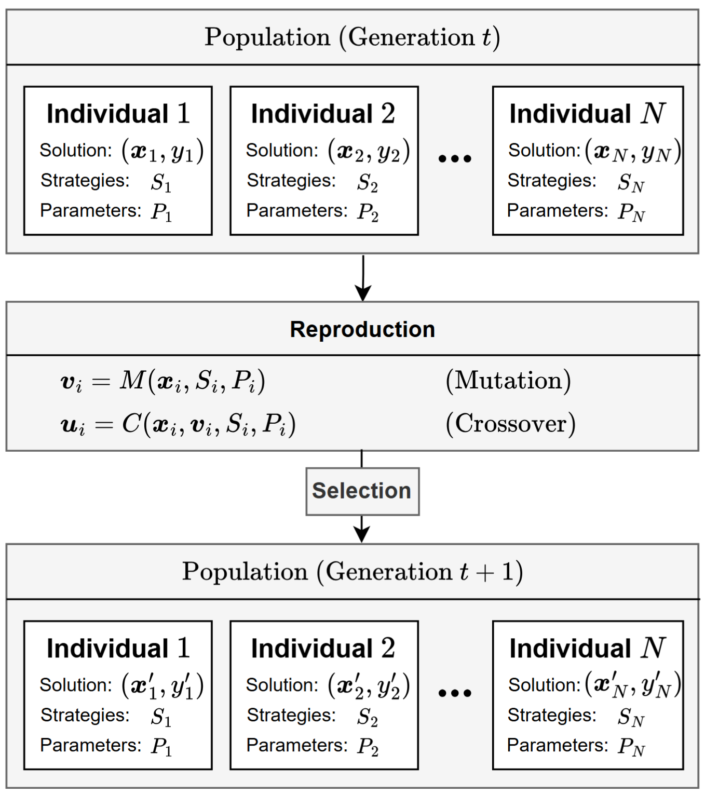
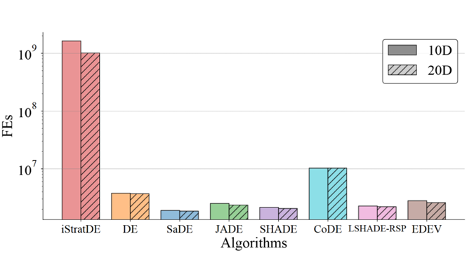
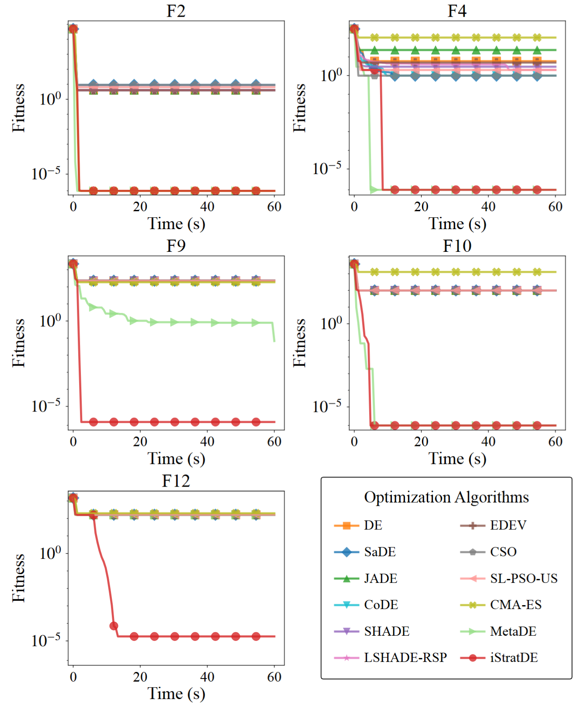
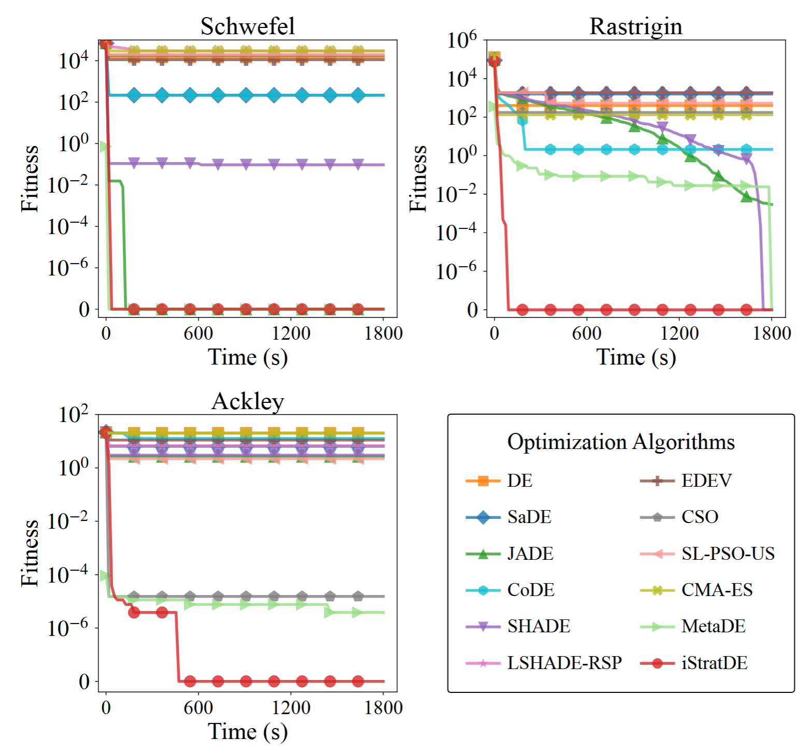
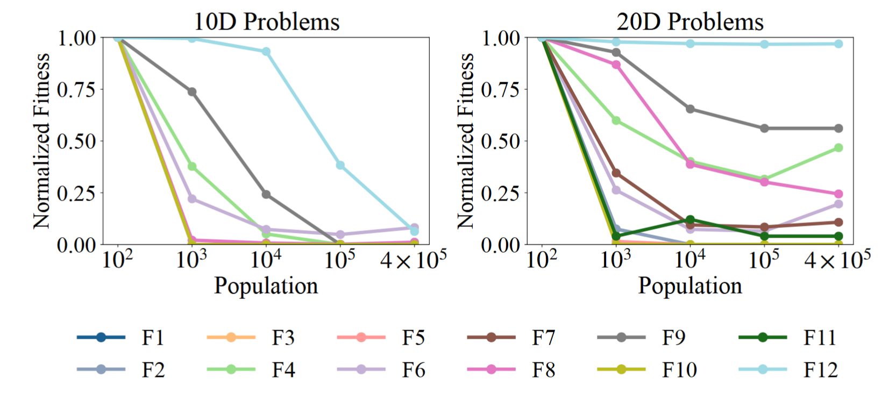
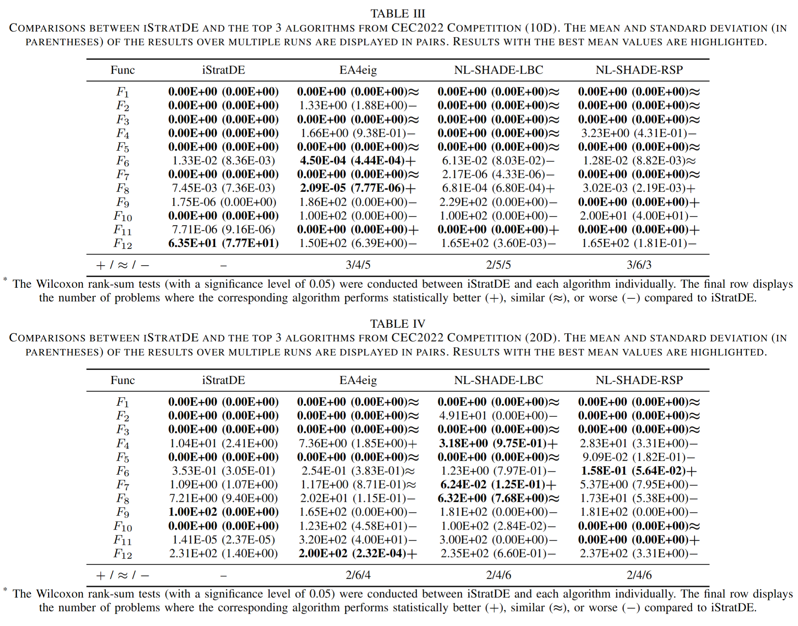
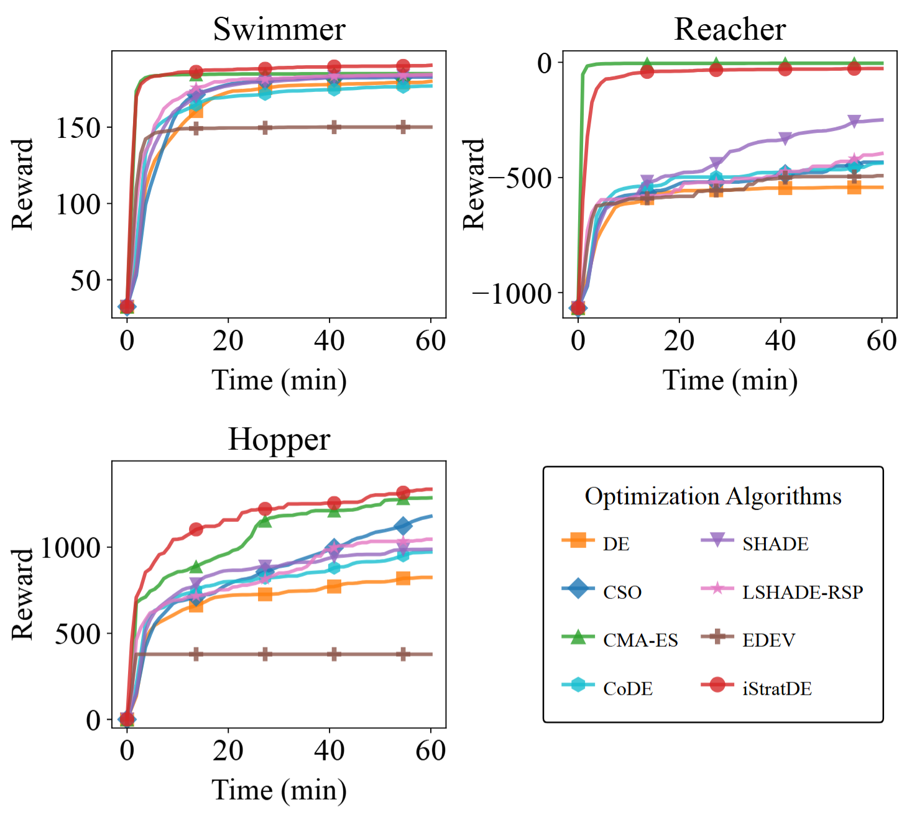

## iStratDE: Computação GPU x Populações Ultra-Grandes Liberam Todo o Potencial da Evolução Diferencial

A Evolução Diferencial (DE) é altamente sensível à seleção de estratégia. A maioria das variantes existentes de DE busca melhor desempenho através de mecanismos adaptativos ou estruturas de controle cada vez mais sofisticadas. No entanto, enquanto a adaptação dinâmica tem sido extensivamente estudada, os benefícios estruturais da **diversidade estática de estratégias** receberam muito menos atenção.

Para preencher essa lacuna, a equipe EvoX investigou como a **diversidade de estratégias no nível individual** molda a dinâmica de busca e o desempenho de otimização da DE, e propôs uma variante minimalista: **iStratDE (Individual-Level Strategy Diversity Differential Evolution)**. A ideia central é simples: na inicialização, cada indivíduo recebe sua própria estratégia de mutação e cruzamento, e essa atribuição permanece fixa ao longo de toda a evolução. Ao introduzir diversidade no nível individual — descartando loops complicados de adaptação e retroalimentação — o iStratDE cria uma heterogeneidade comportamental persistente em toda a população.

Essa propriedade se torna especialmente poderosa em populações grandes. Como o algoritmo é livre de comunicação por design, ele naturalmente suporta execução paralela eficiente e escala suavemente para ambientes GPU. A equipe também fornece uma análise de convergência sob premissas padrão de alcançabilidade, estabelecendo a convergência quase certa do melhor fitness encontrado. Experimentos extensivos no **benchmark CEC2022** e em **tarefas de controle robótico** mostram que o iStratDE pode igualar ou até superar as variantes adaptativas convencionais de DE. O código-fonte foi publicado no GitHub: https://github.com/EMI-Group/istratde

## Contexto: A Computação Evolutiva na Armadilha da Complexidade

A DE tem sido há muito tempo uma das ferramentas mais eficazes para otimização contínua, graças aos seus operadores simples e forte capacidade de busca. No entanto, seu desempenho depende fortemente da escolha da estratégia de mutação e dos parâmetros de controle como *F* e *CR*. De acordo com o teorema No Free Lunch, nenhuma configuração única pode dominar em todos os problemas.

Nas últimas duas décadas, a resposta predominante tem sido tornar a DE cada vez mais adaptativa. Do SaDE à família LSHADE, os algoritmos se tornaram mais "inteligentes" ao manter arquivos históricos, estimar taxas de sucesso de estratégias e ajustar parâmetros no nível da população. Mas essa inteligência tem um custo. A lógica de controle centralizada introduz sobrecarga computacional substancial e, mais importante, barreiras severas de sincronização. Na era do paralelismo GPU, essa dependência da troca global de informação frequentemente leva a uma utilização precária do hardware e impede que os algoritmos explorem totalmente o poder computacional disponível.

## Quebrando o Impasse: Minimalismo e Diversidade Estrutural

É possível preservar a natureza minimalista da DE enquanto se alcança a robustez — ou até um desempenho superior — das variantes adaptativas complexas?

A equipe EvoX responde a essa pergunta com uma proposta contraintuitiva: **iStratDE**. Em vez de tentar tornar o algoritmo "mais inteligente" durante a execução, o iStratDE confere à população a máxima diversidade desde o início. Apoiado pelo framework distribuído e acelerado por GPU EvoX, o iStratDE demonstra que a evolução paralela em grande escala pode ser dramaticamente fortalecida através de uma simples atribuição de estratégias no nível individual, sem introduzir nenhum mecanismo adaptativo.

## O Que É o iStratDE?

A filosofia do iStratDE pode ser resumida como **"indivíduos diferentes, papéis diferentes."**

Nas variantes convencionais de DE, as estratégias geralmente são definidas ou adaptadas no nível da população. No iStratDE, a diversidade de estratégias é introduzida no nível do indivíduo:

- **Atribuído uma vez, fixo para sempre.** Durante a inicialização, cada indivíduo recebe aleatoriamente uma estratégia independente de mutação-cruzamento e um conjunto de parâmetros de controle.
- **Execução descentralizada.** Uma vez atribuídas, essas estratégias permanecem inalteradas ao longo de todo o processo evolutivo. Cada indivíduo busca de acordo com seu próprio conjunto de regras, sem reportar a um controlador central ou aguardar feedback de outros.
- **Paralelismo intrínseco.** Como os indivíduos não dependem uns dos outros através de sincronização complexa, o iStratDE elimina a sobrecarga de comunicação e se mapeia naturalmente na arquitetura SIMT da GPU.

Se a DE adaptativa tradicional se assemelha a um exército cujas táticas são centralmente coordenadas por um comandante, então o iStratDE se assemelha a um ecossistema. Alguns indivíduos estão naturalmente adaptados para exploração de longo alcance, enquanto outros são melhores na exploração localizada. Essa heterogeneidade não só fornece redundância contra a convergência prematura, como também permite contribuições assíncronas que mantêm a população avançando constantemente em direção a melhores soluções.

## Por Que o iStratDE Funciona?

Apesar de sua simplicidade, o iStratDE apresenta um desempenho notável tanto no benchmark CEC2022 quanto nas tarefas de controle robótico com Brax. Dois mecanismos são especialmente importantes:

- **Elitismo implícito.** Nem toda estratégia é adequada para todo problema, mas em uma população suficientemente grande, alguns indivíduos receberão configurações altamente compatíveis. Esses "elites" ascendem rapidamente e guiam a busca para regiões de alta qualidade.
- **Convergência assíncrona.** Diferentes estratégias convergem em diferentes velocidades. Alguns indivíduos fazem avanços agressivos cedo, enquanto outros melhoram de forma mais estável depois. Essa diversidade no ritmo de convergência ajuda a prevenir o colapso prematuro da população em ótimos locais.

## Vantagens Centrais do iStratDE

Ao introduzir diversidade de estratégias no nível individual, o iStratDE oferece vários benefícios importantes:

- **Extrema simplicidade estrutural.** Remove arquivos históricos, módulos de aprendizado de parâmetros e hiperparâmetros extras, devolvendo à DE uma forma limpa e altamente reproduzível.
- **Excelente eficiência GPU.** Graças ao seu design livre de comunicação, o iStratDE alcança aceleração quase linear em GPUs e pode gerenciar populações de mais de 100.000 indivíduos.
- **Melhor desempenho com populações maiores.** Diferente de muitas variantes tradicionais de DE, que frequentemente sofrem gargalos de eficiência quando a população fica muito grande, o iStratDE se beneficia diretamente da escala: mais indivíduos significam maior diversidade, cobertura mais ampla de estratégias e desempenho de busca mais forte.
- **Suporte teórico.** O resultado de convergência quase certa fornece uma base matemática sólida para esse design minimalista.

## Detalhes de Implementação

O iStratDE integra fortemente a tensorização com a aceleração GPU. Sua eficiência vem de um distintivo **design de bloqueio de comunicação**: diferente dos algoritmos adaptativos que dependem de estatísticas centralizadas, as estratégias dos indivíduos no iStratDE são completamente independentes, eliminando requisitos de sincronização e se alinhando perfeitamente com o modelo SIMT da GPU.

Com o suporte do framework EvoX, o iStratDE pode evoluir eficientemente populações de mais de 100.000 indivíduos em paralelo. Essa independência tensorizada não só melhora o throughput para otimização em grande escala, como também permite ampla cobertura do espaço de busca através de exploração concorrente massiva.

### Construção do Pool de Estratégias

Para criar diversidade na população, a equipe constrói um pool de estratégias com **192 configurações**. Cada estratégia segue a forma **DE/bl-to-br/dn/cs**, e é composta por elementos modulares:

- **Vetor base esquerdo**, selecionado de `rand`, `best`, `pbest` ou `current`
- **Vetor base direito**, também selecionado de `rand`, `best`, `pbest` ou `current`
- **Número de vetores diferenciais**, escolhido de `{1, 2, 3, 4}`
- **Esquema de cruzamento**, incluindo cruzamento binomial, exponencial e aritmético

Além disso, o fator de escala *F* e a taxa de cruzamento *CR* de cada indivíduo são independentemente amostrados de **U(0, 1)**. Através de diferentes combinações desses componentes, o iStratDE gera um amplo espectro de comportamentos de busca, desde altamente exploratórios até fortemente explotativos.

## Visão Geral da Arquitetura

O iStratDE segue um fluxo de trabalho descentralizado extremamente simples:

1. **Atribuição inicial.** O sistema inicializa as posições da população e atribui aleatoriamente a cada indivíduo uma estratégia e um conjunto de parâmetros dedicados.
2. **Evolução persistente.** Durante o loop de otimização, cada indivíduo sempre realiza mutação e cruzamento de acordo com sua configuração atribuída. As soluções evoluem, mas as estratégias não.
3. **Integração implícita.** Como a população é grande e heterogênea, o iStratDE não requer coordenação adaptativa explícita. Surge uma divisão natural do trabalho: indivíduos orientados à exploração descobrem novas regiões, enquanto indivíduos orientados à exploração refinam soluções promissoras.

*Fig. 1. Framework do iStratDE, ilustrando a inicialização, atribuição descentralizada de estratégias e evolução persistente.*

## Destaques Experimentais

Para avaliar o iStratDE em configurações genuinamente paralelas em grande escala, a equipe EvoX realizou experimentos sistemáticos sob um **orçamento de tempo fixo**, o que reflete melhor as condições reais de computação de alto desempenho do que a avaliação convencional com avaliações de função fixas.

Os experimentos incluem:

- **Testes de estresse com populações ultra-grandes**, escalando até 100.000 indivíduos
- **Benchmarks CEC2022**, comparando o iStratDE com variantes adaptativas convencionais de DE e os melhores métodos de competição em 60 segundos
- **Análise de escalabilidade populacional**, mostrando que o iStratDE continua melhorando à medida que a população cresce enquanto os métodos tradicionais atingem um gargalo de escala
- **Tarefas de controle robótico**, usando populações grandes para otimizar controladores neurais de alta dimensão em Brax

### 1. Benchmarks CEC2022 Sob um Orçamento de Tempo Fixo

Sob o mesmo orçamento de 60 segundos, os algoritmos adaptativos tradicionais permanecem restritos ao tamanho clássico de população de cerca de 100 devido à sua lógica serial e sobrecarga de sincronização. Em contraste, o iStratDE é projetado especificamente para execução SIMT em GPU e pode gerenciar eficientemente populações de **100.000 indivíduos**.

Como resultado, o iStratDE realiza até **10^9 avaliações de função** na mesma janela de tempo, alcançando aproximadamente **100x** o throughput computacional dos métodos convencionais. Na maioria das funções de benchmark, essa combinação de estrutura minimalista e paralelismo massivo leva a maior velocidade de convergência e precisão final.

*Fig. 2. Comparação de throughput de avaliações de função sob um orçamento de tempo fixo.*

*Fig. 3. Comparação de desempenho de otimização no benchmark CEC2022 de 10 dimensões.*

### 2. Robustez em Paisagens de Alta Dimensão

A equipe avalia ainda o iStratDE em desafiadoras versões **200-dimensionais** rotacionadas e deslocadas de Schwefel, Rastrigin e Ackley. Os métodos adaptativos tradicionais de DE como JADE e SHADE, assim como CMA-ES, sofrem fortemente com a maldição da dimensionalidade e frequentemente estagnam cedo.

Em contraste, o iStratDE mantém forte impulso de busca através de uma combinação de paralelismo em grande escala e diversidade de estratégias. Não só supera baselines especializados como CSO, mas também demonstra robustez competitiva contra **MetaDE**, um otimizador recente baseado em aprendizado em GPU. Em funções difíceis como Ackley, o iStratDE localiza com sucesso o ótimo global.

*Fig. 4. Comparação de desempenho em problemas de benchmark deslocados e rotacionados de 200 dimensões.*

### 3. Escalabilidade Populacional

Uma das descobertas mais marcantes é que o iStratDE quebra a suposição clássica de que simplesmente aumentar a população não continua melhorando a DE. Quando o tamanho da população cresce de **10^2** para **4 x 10^5**, o iStratDE continua melhorando de forma constante, sem sinais claros de saturação.

Em contraste, os algoritmos adaptativos tradicionais de DE geralmente deixam de se beneficiar quando a população excede um limiar moderado, podendo até degradar devido à sobrecarga de sincronização. Esse resultado sugere que o iStratDE pode converter recursos computacionais adicionais diretamente em melhor desempenho de otimização.

*Fig. 5. Análise de escalabilidade populacional do iStratDE com tamanhos de população crescentes.*

### 4. Comparação com os Melhores Métodos da Competição CEC2022

Para testar o limite superior de desempenho, a equipe compara o iStratDE com os métodos melhor classificados da competição CEC2022, incluindo **EA4eig**, **NL-SHADE-LBC** e **NL-SHADE-RSP**. Sob orçamentos idênticos de avaliação de funções, o iStratDE permanece altamente competitivo apesar de sua estrutura muito mais simples. Em várias funções difíceis de 10D e 20D, alcança resultados comparáveis — ou melhores — do que essas baselines sofisticadas.

*Fig. 6. Comparação do iStratDE com os métodos melhor classificados da competição CEC2022.*

### 5. Aplicação Real: Controle Robótico com Brax

Finalmente, a equipe aplica o iStratDE a tarefas de controle robótico em **Brax**, incluindo **Swimmer**, **Reacher** e **Hopper**, onde o objetivo é otimizar controladores de redes neurais com aproximadamente **1.500 parâmetros**.

Usando uma população de **10.000**, o iStratDE é comparado com CMA-ES, CSO e variantes tradicionais de DE. Em tarefas como Swimmer e Hopper, o iStratDE descobre rapidamente políticas de alta recompensa e mostra convergência mais forte do que métodos como CMA-ES e LSHADE. Isso demonstra que o iStratDE não é apenas teoricamente elegante, mas também praticamente eficaz para otimização de caixa preta em alta dimensão.

*Fig. 7. Curvas de convergência do iStratDE em três ambientes de controle Brax.*

## Conclusão e Perspectivas

O iStratDE é um retorno aos fundamentos algorítmicos. Em vez de empilhar lógica adaptativa cada vez mais complexa, constrói forte capacidade de busca a partir da **diversidade de estratégias no nível individual**. Ao liberar totalmente o potencial paralelo das GPUs modernas, o iStratDE revela o poder da **diversidade estruturada** na otimização multimodal e de alta dimensão.

Os resultados mostram que o iStratDE pode competir com — e em alguns cenários superar — as principais variantes adaptativas de DE tanto em benchmarks quanto em tarefas de controle do mundo real. De forma mais ampla, este trabalho destaca um princípio de design importante: **a complexidade não é o único caminho para o desempenho; a heterogeneidade populacional pode ser, por si só, um poderoso motor de evolução.**

Esse paradigma minimalista descentralizado abre uma nova direção para o design de algoritmos evolutivos. Em vez de depender de coordenação centralizada elaborada, demonstra como indivíduos independentes com comportamentos de busca diversos podem coletivamente gerar dinâmicas de otimização inteligentes e escaláveis.

## Código Aberto / Recursos da Comunidade

**Paper:**
https://arxiv.org/abs/2602.01147

**GitHub:**
https://github.com/EMI-Group/istratde

**Projeto Principal (EvoX):**
https://github.com/EMI-Group/evox

**Grupo QQ:**
297969717

*QR code do grupo comunitário EvoX no QQ.*
