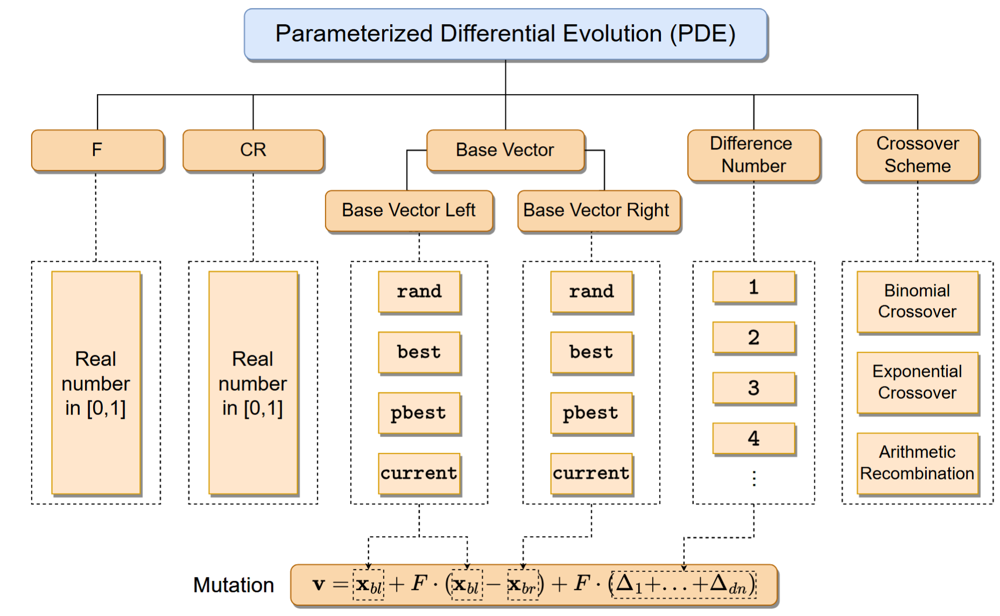
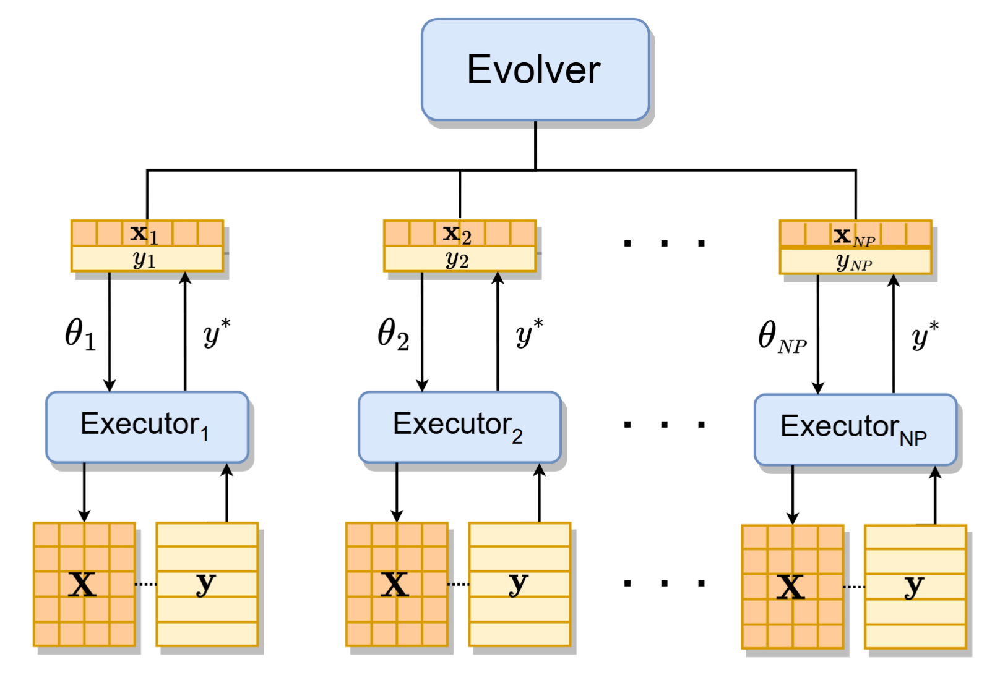
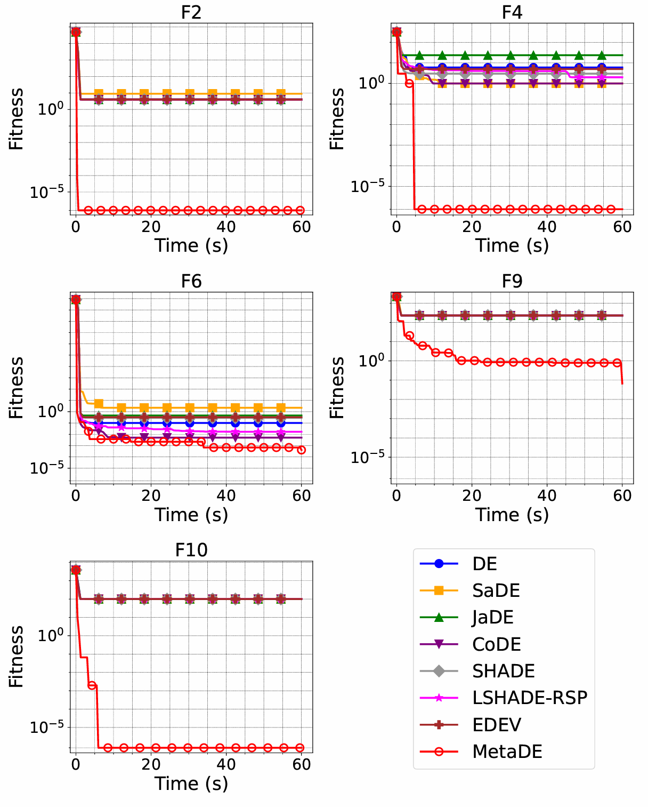
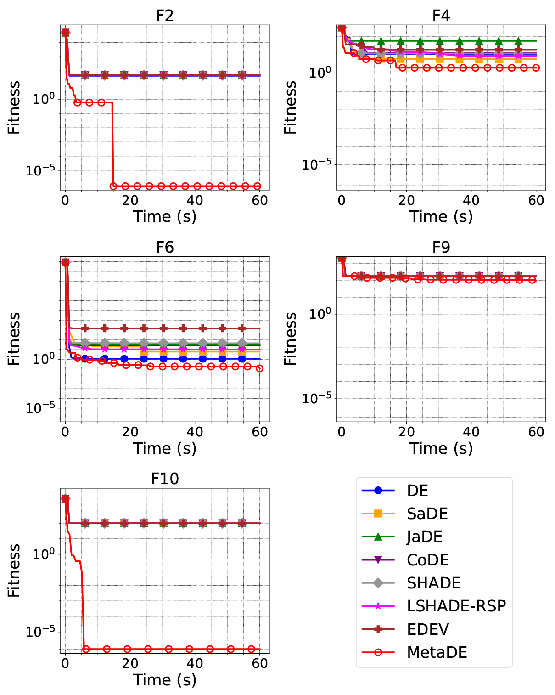
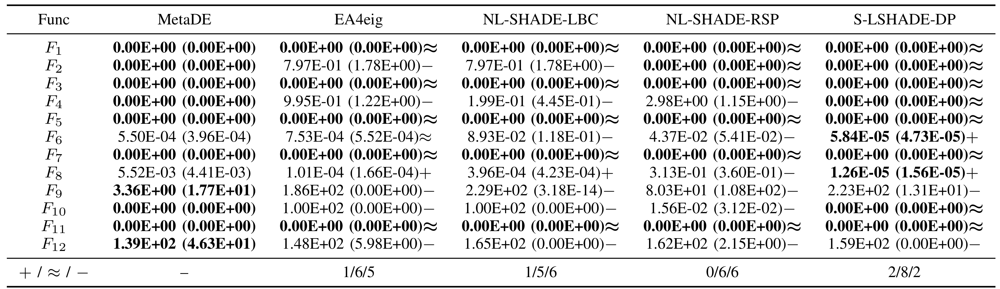
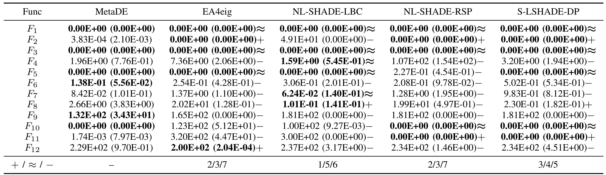
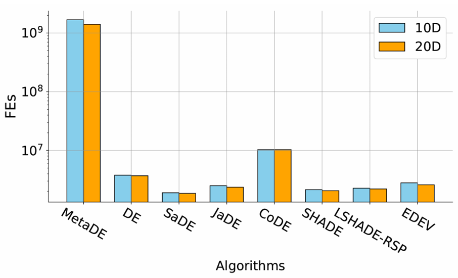
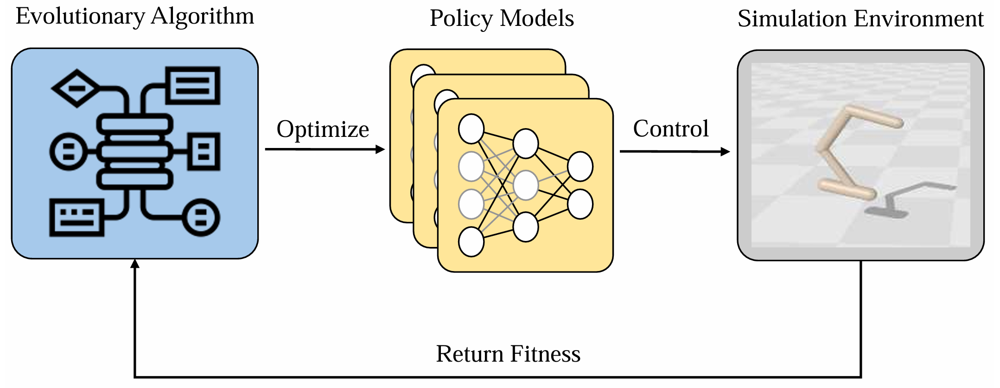
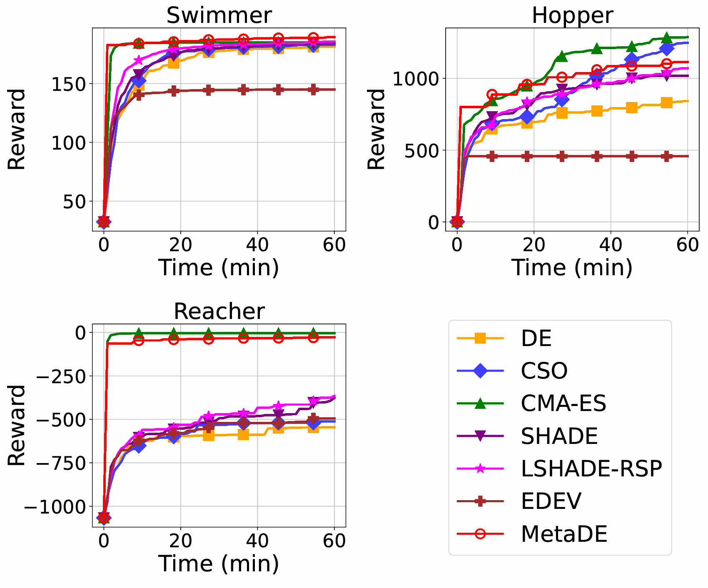

Differential Evolution (DE), einer der Kernalgorithmen in der evolutionären Berechnung, wird aufgrund seiner Einfachheit und hohen Effizienz häufig bei Black-Box-Optimierungsproblemen eingesetzt. Dennoch hängt seine Leistung stark von der Wahl der Hyperparameter und Strategien ab, was für Forscher ein ständiges Problem darstellt. Um dieser Herausforderung zu begegnen, veröffentlichte das EvoX-Team kürzlich eine Studie in *IEEE Transactions on Evolutionary Computation (IEEE TEVC)* mit dem Titel „MetaDE: Evolving Differential Evolution by Differential Evolution“. Als meta-evolutionäre Methode, die DE nutzt, um ihre eigenen Hyperparameter und Strategien zu entwickeln, ermöglicht MetaDE die dynamische Anpassung von Parametern und Strategien unter Einbeziehung von GPU-beschleunigtem parallelem Rechnen. Dieses Design verbessert sowohl die Recheneffizienz als auch die Optimierungsleistung erheblich. Experimentelle Ergebnisse zeigen, dass MetaDE sowohl bei der CEC2022-Benchmark-Suite als auch bei Robotersteuerungsaufgaben eine hervorragende Leistung erbringt. Der Quellcode für MetaDE ist als Open Source auf GitHub unter [https://github.com/EMI-Group/metade](https://github.com/EMI-Group/metade "https://github.com/EMI-Group/metade") verfügbar.

## Hintergrund

Im Bereich der evolutionären Berechnung wird die Leistung von Algorithmen oft maßgeblich durch die Wahl der Hyperparameter beeinflusst. Die Bestimmung der geeignetsten Parametereinstellungen für ein spezifisches Problem ist seit langem eine Herausforderung in der Forschung. Differential Evolution (DE) ist als klassischer evolutionärer Algorithmus wegen seiner Einfachheit und robusten globalen Suchfähigkeit sehr beliebt; dennoch ist seine Leistung sehr empfindlich gegenüber der Wahl der Hyperparameter. Konventionelle Methoden verlassen sich typischerweise entweder auf erfahrungsbasierte Abstimmung oder adaptive Mechanismen, um die Leistung zu verbessern. Angesichts diverser Problemszenarien haben diese Ansätze jedoch häufig Schwierigkeiten, ein Gleichgewicht zwischen Effizienz und breiter Anwendbarkeit zu finden.

Das Konzept der „Meta-Evolution“ wurde bereits im letzten Jahrhundert eingeführt, mit dem Ziel, evolutionäre Algorithmen selbst zu nutzen, um die Hyperparameter-Konfigurationen dieser Algorithmen zu optimieren. Obwohl Meta-Evolution schon seit vielen Jahren existiert, war ihre praktische Anwendung durch den hohen Rechenaufwand begrenzt. Jüngste Fortschritte im GPU-Computing haben diese Einschränkungen gelockert und bieten starke Hardware-Unterstützung für evolutionäre Algorithmen. Insbesondere die Einführung des verteilten, GPU-beschleunigten EvoX-Frameworks hat die Entwicklung GPU-basierter evolutionärer Algorithmen stark erleichtert. Vor diesem Hintergrund schlug unser Forschungsteam einen neuartigen Meta-Evolutionsansatz vor, der DE nutzt, um seine eigenen Hyperparameter und Strategien zu entwickeln, und damit einen neuen Weg zur Lösung des langjährigen Problems der Parameterabstimmung in evolutionären Algorithmen bietet.

## Was ist Meta-Evolution?

Die Kernidee hinter der Meta-Evolution lässt sich zusammenfassen als „**Verwendung eines evolutionären Algorithmus zur Weiterentwicklung seiner selbst**“ (Evolving an Evolutionary Algorithm by an Evolutionary Algorithm). Dieses Konzept geht über traditionelle Methoden der evolutionären Berechnung hinaus, indem es nicht nur evolutionäre Algorithmen einsetzt, um optimale Lösungen für ein Problem zu suchen, sondern auch die Hyperparameter und Strategien der Algorithmen durch deren eigene evolutionäre Prozesse anpasst.

Mit anderen Worten führt die Meta-Evolution ein Paradigma der „**Selbst-Evolution**“ ein, das es Algorithmen ermöglicht, sich selbst zu optimieren, während sie den Suchraum nach Problemlösungen erkunden. Durch die kontinuierliche Verfeinerung während des evolutionären Prozesses werden die Algorithmen anpassungsfähiger und können in verschiedenen Problemszenarien eine hohe Effizienz aufrechterhalten.

Am Beispiel von MetaDE zeigt sich, dass dessen Design in dieser Philosophie verwurzelt ist. In einer zweischichtigen Struktur löst die untere Schicht (der „**Executor**“) das gegebene Optimierungsproblem unter Verwendung eines parametrisierten DE. Die obere Schicht (der „**Evolver**“) verwendet gleichzeitig DE, um die Hyperparameter-Konfigurationen des Executors zu optimieren. Dieses Framework lässt DE nicht nur als Löser fungieren, sondern auch „erforschen“, wie die eigenen Parameter und Strategien am besten angepasst werden können, um verschiedene Probleme effektiver zu lösen. Ein solcher Prozess ähnelt einem System, das sich schrittweise selbst versteht und verfeinert – eine Transformation vom **„passiven Lösen eines Problems“ zur „aktiven Selbst-Evolution“.** Folglich kann es sich besser an diverse Aufgaben anpassen. **Wenn wir DE als komplexes System betrachten, ermöglicht MetaDE effektiv eine „rekursive“ Art des Selbstverständnisses und der Selbstverbesserung innerhalb dieses Systems.**

Der Begriff „**Rekursion**“ in der Informatik beschreibt typischerweise eine Funktion oder Prozedur, die sich selbst aufruft. Innerhalb von MetaDE erhält dieses Konzept eine neue Bedeutung: Es ist ein **intern rekursiver** Optimierungsmechanismus, der DE verwendet, um die Hyperparameter von DE zu entwickeln. Dieses selbstreferenzielle Schema verkörpert nicht nur eine starke Anpassungsfähigkeit, sondern bietet auch eine neue Perspektive auf das „No Free Lunch“-Theorem. Da es keinen einzelnen, universell optimalen Parametersatz für alle Probleme gibt, ist die autonome Selbstentwicklung des Algorithmus der Schlüssel zum Finden der besten Parameterkonfigurationen für eine gegebene Aufgabe.

Durch diesen rekursiven meta-evolutionären Ansatz erzielt MetaDE mehrere Vorteile:

**1. Automatisierte Parameterabstimmung**

     Der arbeitsintensive manuelle Abstimmungsprozess entfällt. Der Algorithmus lernt selbst, wie er seine Hyperparameter anpasst, was menschliche Eingriffe reduziert und die Effizienz verbessert.

**2. Verbesserte Anpassungsfähigkeit**

     MetaDE reagiert dynamisch auf sich ändernde Problemeigenschaften und Bedingungen und modifiziert Strategien in Echtzeit, um die Leistung zu verbessern. Dies erhöht die Flexibilität des Algorithmus erheblich.

**3. Effiziente Suche**
      Durch die Nutzung inhärenter Parallelität beschleunigt MetaDE die Suche in groß angelegten Optimierungsproblemen erheblich. Es liefert machbare Lösungen für hochdimensionale, komplexe Probleme innerhalb angemessener Zeitrahmen.

## Algorithmische Implementierung

MetaDE verwendet tensorbasierte Techniken und GPU-Beschleunigung, um effizientes paralleles Rechnen zu ermöglichen. Durch die gleichzeitige Verarbeitung vieler Individuen einer Population wird die gesamte Recheneffizienz deutlich verbessert, was besonders bei der einzieligen Black-Box-Optimierung und groß angelegten Optimierungsproblemen vorteilhaft ist. Durch die Tensorisierung von Schlüsselparametern und Datenstrukturen (z. B. Population, Fitness, Strategieparameter) erreicht MetaDE nicht nur eine höhere Recheneffizienz, sondern verbessert auch seine Fähigkeit, komplexe Optimierungsherausforderungen zu bewältigen. Im Vergleich zu klassischem DE und anderen evolutionären Algorithmen (EAs) zeigt MetaDE eine überlegene Leistung bei der Lösung groß angelegter Probleme. Dank des tensorbasierten Ansatzes nutzt MetaDE Rechenressourcen effektiver und liefert schnellere Lösungen und präzisere Optimierungsergebnisse als traditionelle Methoden.

PDE-Architektur

Das Forschungsteam schlug zunächst ein parametrisiertes DE-Algorithmus-Framework (PDE) vor, das Modifikationen von Parametern und Strategien vollständig unterstützt. In diesem Framework sind F und CR kontinuierliche Parameter, während andere Parameter diskret sind. Die gestrichelten Kästen zeigen den Bereich der zulässigen Parameterwerte an. Die Mutationsfunktion wird aus den linken und rechten Basisvektoren sowie dem Parameter abgeleitet, der die Anzahl der Differenzvektoren steuert.

MetaDE-Architektur

MetaDE verwendet eine zweischichtige Struktur, bestehend aus **einem Evolver** (obere Schicht) und **mehreren Executoren** (untere Schicht). Der Evolver ist ein DE (oder potenziell ein anderer evolutionärer Algorithmus), der für die Optimierung der Parameter von PDE verantwortlich ist. Jedes Individuum  x_i in der Population des Evolvers entspricht einer eindeutigen Parameterkonfiguration θ_i. Diese Konfigurationen werden an das PDE übergeben, um verschiedene DE-Varianten zu instanziieren, die jeweils von einem Executor verwaltet werden, der unabhängig an der gegebenen Optimierungsaufgabe arbeitet. Jeder Executor gibt seinen besten Fitnesswert y^* an den Evolver zurück, der diesen Fitnesswert y_i dem entsprechenden Individuum x_i zuweist.

## Experimentelle Leistung

Um die Wirksamkeit von MetaDE umfassend zu bewerten, führte das Forschungsteam systematische Experimente durch, die mehrere Benchmark-Tests und reale Szenarien umfassten. Jedes Experiment verwendete einen Evolver (DE mit rand/1/bin-Strategie) und Executoren (PDE mit einer Populationsgröße von 100). Zu den wichtigsten experimentellen Komponenten gehören:

### CEC2022 Benchmark
 Vergleich von MetaDE mit verschiedenen DE-Varianten in Aufgaben der einzieligen Optimierung.

### Vergleich mit den Top-Vier CEC2022-Algorithmen
 Bewertung von MetaDE im Vergleich zu den vier leistungsstärksten Algorithmen des CEC2022-Wettbewerbs unter identischen Budgets für Funktionsauswertungen (FEs).

### Funktionsauswertungen (FEs) bei fester Wall-Clock-Zeit
 Analyse der Recheneffizienz von MetaDE unter GPU-Beschleunigung.

### Robotersteuerungsaufgaben
 Anwendung von MetaDE auf Robotersteuerungsaufgaben in einer Brax-Plattformumgebung zur Validierung des praktischen Nutzens.

## CEC2022 Benchmark: Vergleich mit gängigen DE-Varianten

Das Team verglich MetaDE mit mehreren repräsentativen DE-Varianten auf der CEC2022-Benchmark-Suite, darunter:

* **Standard DE (rand/1/bin)**
* **SaDE und JaDE (adaptive DE-Algorithmen)**
* **CoDE (DE mit Strategieintegration)**
* **SHADE und LSHADE-RSP (erfolgsbasierte adaptive DE)**
* **EDEV (integrierte DE-Varianten)**

Alle Algorithmen wurden auf der EvoX-Plattform implementiert, wobei GPU-Beschleunigung mit einer Populationsgröße von 100 aus Fairnessgründen genutzt wurde. Die Experimente wurden bei unterschiedlichen Dimensionalitäten (10D und 20D) unter **der gleichen Rechenzeitbeschränkung (60 Sekunden)** durchgeführt.

10D CEC2022 Optimierungsergebnisse

20D CEC2022 Optimierungsergebnisse

MetaDE erreicht im Allgemeinen eine schnellere und stabilere Konvergenz bei den meisten Testfunktionen. Sein parametrisiertes DE (PDE) in Verbindung mit der Optimierung auf der oberen Ebene ermöglicht eine dynamische Anpassung an verschiedene Problemräume, was die allgemeine Robustheit und Suchleistung verbessert.

## Vergleich mit den Top-Vier CEC2022-Algorithmen (Unter identischen FEs)

Um die Optimierungsfähigkeit von MetaDE weiter zu bewerten, verglichen wir es mit den vier besten Algorithmen des CEC2022-Wettbewerbs innerhalb **des gleichen Budgets für Funktionsauswertungen**:

* **EA4eig**: Eine hybride Methode, die mehrere EAs integriert
* **NL-SHADE-LBC**: Ein verbessertes adaptives DE
* **NL-SHADE-RSP-MID**: Ein erweitertes SHADE mit Mittelpunktschätzung
* **S-LSHADE-DP**: Eine DE-Variante, die die Populationsvielfalt durch dynamische Störung aufrechterhält

Jeder dieser Algorithmen wurde mit seinen offiziellen Parametereinstellungen und Quellcode unter **den gleichen FE-Beschränkungen** ausgeführt. Statistische Vergleiche (Wilcoxon-Rangsummentest, Signifikanzniveau 0,05)

wurden zwischen MetaDE und jeder Baseline auf der CEC2022-Testsuite durchgeführt. Die letzte Zeile der Tabelle zeigt die Leistung jedes Algorithmus im Vergleich zu MetaDE bei den verschiedenen Testfunktionen: + (signifikant besser), ≈ (kein signifikanter Unterschied) und − (signifikant schlechter).

Vergleich der 10D CEC2022 Wettbewerbsalgorithmen (Gleiche FEs)

Vergleich der 20D CEC2022 Wettbewerbsalgorithmen (Gleiche FEs)

MetaDE zeigt durchweg eine starke Leistung, insbesondere bei komplexen Problemen, die eine robuste Konvergenz erfordern. Dank seines **selbstadaptiven Mechanismus** passt MetaDE seine Strategie effektiv an verschiedene Suchlandschaften an und verbessert so die Sucheffizienz und die globale Optimierungsfähigkeit. Diese Ergebnisse zeigen, dass MetaDE nicht nur gängige DE-Varianten übertrifft, sondern auch eine starke Wettbewerbsfähigkeit gegenüber erstklassigen Wettbewerbsalgorithmen aufweist.

## Recheneffizienz: FEs innerhalb einer festen Zeit (60 Sekunden)

Das Forschungsteam erfasste außerdem **die Anzahl der Funktionsauswertungen (FEs), die von verschiedenen Algorithmen innerhalb derselben festen Laufzeit (60 Sekunden) durchgeführt wurden**.

           Erreichte FEs von jedem Algorithmus in 60 Sekunden

Unter demselben EvoX-Framework mit GPU-beschleunigter paralleler Berechnung erreichte MetaDE im Durchschnitt FEs im Bereich von **10****⁹**, während traditionelle DE-Varianten nur etwa ***10^6*** FEs erreichten. Dieser Vorteil ergibt sich aus dem parametrisierten Ansatz von MetaDE, der **groß angelegte parallele Auswertungen** von Individuen durchführt und so eine **effizientere Nutzung der Hardware-Ressourcen** ermöglicht. Folglich erkundet der Algorithmus mehr Lösungen innerhalb desselben Zeitfensters, was sowohl die Lösungsqualität als auch die Stabilität verbessert.

## Evolutionäres Reinforcement Learning: Robotersteuerungsaufgaben

Im Reinforcement Learning (RL) sind die Effizienz und Stabilität der Policy-Optimierung entscheidend. Gradientenbasierte Methoden wie PPO und SAC können in hochdimensionalen Umgebungen unter Gradientenverschwinden oder -explosion leiden. Im Gegensatz dazu umgeht Evolutionary Reinforcement Learning (EvoRL) diese Probleme, indem es **gradientenfreie Suchen** verwendet, um Policy-Parameter direkt zu optimieren.

Prozess des evolutionären Reinforcement Learning

Innerhalb des EvoRL-Frameworks:

* **Optimiert MetaDE automatisch neuronale Netzwerkparameter**, was die Anpassungsfähigkeit von Policy-Modellen erhöht.
* **Passt MetaDE Hyperparameter dynamisch an**, was die Trainingsstabilität verbessert.
* **Nutzt MetaDE GPU-Beschleunigung**, um die Policy-Optimierung zu beschleunigen.

Um die Leistung von MetaDE bei komplexen Optimierungsaufgaben zu bewerten, wendeten wir es auf **Robotersteuerungsaufgaben** unter Verwendung von GPU-beschleunigter Optimierung in der **Brax-Simulationsplattform** an. Die Studie umfasste drei Aufgaben – **Swimmer**, **Hopper** und **Reacher** –, die jeweils durch ein dreischichtiges vollständig verbundenes neuronales Netzwerk (MLP) modelliert wurden, mit dem Ziel, **die Belohnung zu maximieren**. Bemerkenswert ist, dass jedes MLP etwa **1.500 Parameter** enthält, was eine **1.500-dimensionale Optimierungsherausforderung** für evolutionäre Algorithmen (EAs) darstellt. Dies stellt strenge Anforderungen an sowohl die Suchfähigkeit als auch die Recheneffizienz.

Konvergenzkurven für drei Brax-Umgebungen

Wie in der Abbildung gezeigt, demonstriert MetaDE eine starke Leistung bei Brax-basierten Robotersteuerungsaufgaben und erzielt die besten Ergebnisse bei der Swimmer-Aufgabe sowie nahezu optimale Ergebnisse bei Hopper und Reacher. Sein Hauptvorteil liegt in der hohen Qualität der Anfangspopulation, die eine schnelle Konvergenz in der frühen Phase ermöglicht und qualitativ hochwertige Lösungen produziert. Diese Ergebnisse legen nahe, dass MetaDE **neuronale Netzwerk-Policies effizient optimieren** kann, was es **gut geeignet für Robotersteuerungsaufgaben mit komplexen physikalischen Simulationen** macht und **breites Potenzial für praktische Anwendungen bietet**.

## Fazit und zukünftige Richtungen

MetaDE ist ein innovativer Meta-Evolutionsansatz, der nicht nur bei der Lösung von Optimierungsaufgaben hervorragt, sondern auch seine eigenen Strategien autonom abstimmt und verfeinert. Durch die Nutzung der Stärken von Differential Evolution zeigt MetaDE ein starkes Potenzial bei der adaptiven Parameterkonfiguration und Strategieentwicklung. Experimentelle Ergebnisse zeigen eine überlegene Robustheit in einer Reihe von Benchmark-Tests, und seine Anwendbarkeit in der realen Welt wird durch den Erfolg bei Robotersteuerungsaufgaben mittels evolutionärem Reinforcement Learning unterstrichen. Eine zentrale Herausforderung besteht darin, ein optimales Gleichgewicht zwischen Generalisierung und Spezialisierung aufrechtzuerhalten – sicherzustellen, dass sich der Algorithmus an diverse Aufgaben anpassen kann, während er gleichzeitig effektiv für spezifische Probleme optimiert. Diese Forschung bietet neue Perspektiven für selbstadaptive evolutionäre Algorithmen und könnte weitere Fortschritte in der Meta-Evolution für komplexe Systeme anregen.

## Open-Source-Code und Community

**Paper**: [https://arxiv.org/abs/2502.10470](https://arxiv.org/abs/2502.10470 "https://arxiv.org/abs/2502.10470")

**GitHub**: [https://github.com/EMI-Group/metade](https://github.com/EMI-Group/metade "https://github.com/EMI-Group/metade")

**Upstream-Projekt (EvoX)**: [https://github.com/EMI-Group/evox](https://github.com/EMI-Group/evox "https://github.com/EMI-Group/evox")

**QQ-Gruppe**: 297969717

  QQ-Gruppe | Evolving Machine Intelligence

MetaDE baut auf dem EvoX-Framework auf. Wenn Sie an EvoX interessiert sind, lesen Sie bitte den Artikel zu EvoX 1.0 für weitere Details.

 ([https://mp.weixin.qq.com/s/uT6qSqiWiqevPRRTAVIusQ](https://mp.weixin.qq.com/s/uT6qSqiWiqevPRRTAVIusQ "https://mp.weixin.qq.com/s/uT6qSqiWiqevPRRTAVIusQ"))

