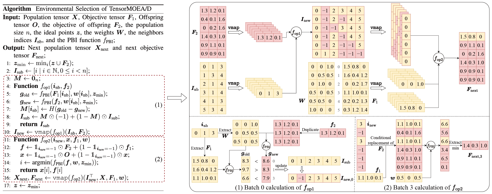

**Cosa è cambiato**

- Aggiornata la documentazione con note d'uso e indicazioni per la regolazione dei parametri

- Aggiunte nuove funzionalità relative a `vmap` e all'ottimizzazione degli iperparametri (HPO), insieme a correzioni di bug

- Corretti vari problemi nella documentazione

- Risolti diversi bug nel codice di benchmarking

- Introdotto il supporto iniziale per i workflow distribuiti!

- Changelog completo: [https://github.com/EMI-Group/evox/compare/v1.1.1...v1.1.2](https://github.com/EMI-Group/evox/compare/v1.1.1...v1.1.2 "https://github.com/EMI-Group/evox/compare/v1.1.1...v1.1.2")

**Codice open source e comunità**

**Paper**: [https://arxiv.org/abs/2502.10470](https://arxiv.org/abs/2502.10470 "https://arxiv.org/abs/2502.10470")

**GitHub**: [https://github.com/EMI-Group/metade](https://github.com/EMI-Group/metade "https://github.com/EMI-Group/metade")

**Progetto upstream (EvoX)**: [https://github.com/EMI-Group/evox](https://github.com/EMI-Group/evox "https://github.com/EMI-Group/evox")

**Gruppo QQ**: 297969717

Gruppo QQ | Evolving Machine Intelligence
