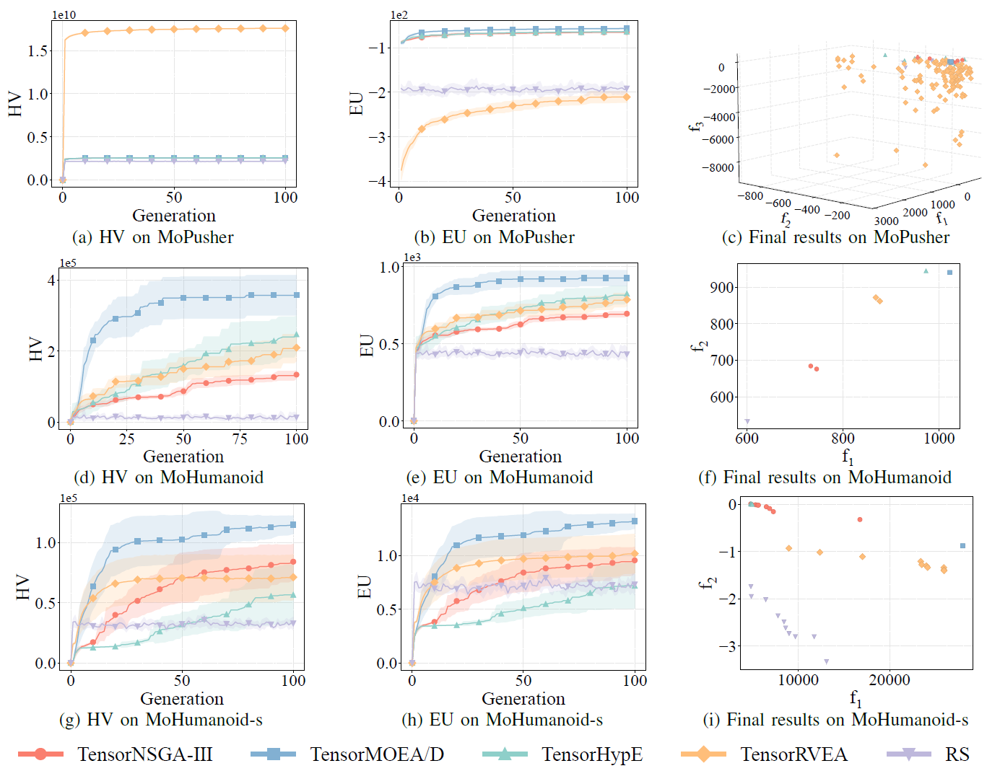

Esta é uma versão secundária focada na melhoria da estabilidade e na resolução de erros, com algumas melhorias de qualidade de vida.

**Novas Funcionalidades**

Novas Funções de Benchmark: Adicionadas funções numéricas de objetivo único: `Ellipsoid` e `Griewank`.

**Correções de Erros**

* Corrigido um problema em que o `StdWorkflow` não funcionava com algoritmos que herdam de outros algoritmos.

* Corrigido um erro na função `latin_hypercube_sampling_standard`.

* Resolvido um problema com a falha de `non_dominate` sob `torch.compile`.

* Corrigido um problema em que o `PSO` não utilizava o default device corretamente em certos casos.

**Refatoração e Manutenção**

* Reexportação de utilitários comummente utilizados para o nível superior por conveniência, por exemplo:

* `evox.compile` em vez de `evox.core.compile`

* `evox.vmap` em vez de `evox.core.vmap`.

* Removido código obsoleto ou redundante.

Changelog Completo: [https://github.com/EMI-Group/evox/compare/v1.2.0...v1.2.1](https://github.com/EMI-Group/evox/compare/v1.2.0...v1.2.1 "https://github.com/EMI-Group/evox/compare/v1.2.0...v1.2.1")

**Código Open Source / Recursos da Comunidade**

Artigo:

[https://arxiv.org/abs/2503.20286](https://arxiv.org/abs/2503.20286 "https://arxiv.org/abs/2503.20286")

GitHub:

[https://github.com/EMI-Group/evomo](https://github.com/EMI-Group/evomo "https://github.com/EMI-Group/evomo")

Projeto Upstream (EvoX):

[https://github.com/EMI-Group/evox](https://github.com/EMI-Group/evox "https://github.com/EMI-Group/evox")

Grupo QQ: 297969717

Grupo QQ | Evolving Machine Intelligence